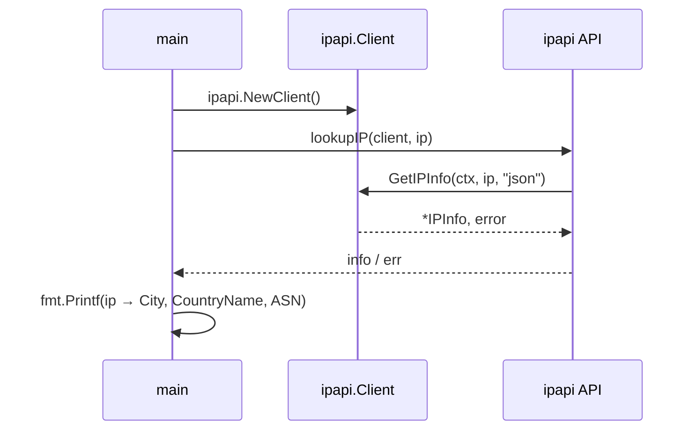
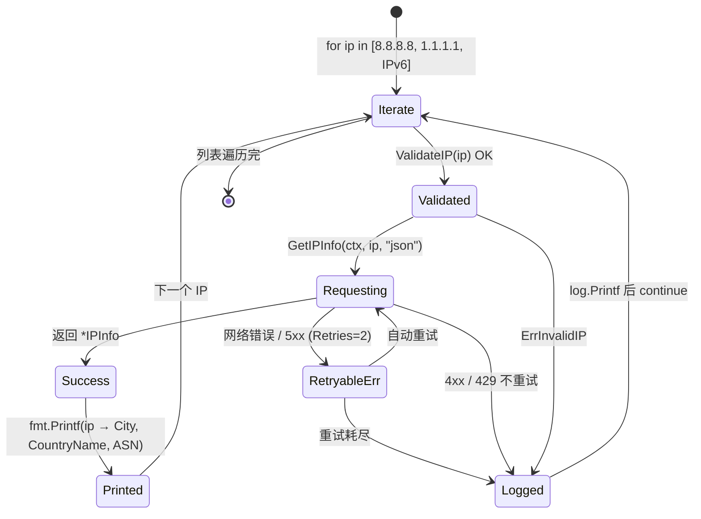

# 💡 查询指定 IP

> 查询任意 IPv4/IPv6 地址的完整地理信息。

## 场景

需要根据用户提供的 IP 地址（如日志、请求头）查其地理位置。

::: tip 🎨 一图抵千言
查询指定 IP 的调用结构：`main` 构造客户端后，对每个 IP 调用 [`GetIPInfo`](/api/get-ip-info) 取回结构化结果，再交给上层打印。


:::

## 代码

```go
func lookupIP(client *ipapi.Client, ip string) (*ipapi.IPInfo, error) {
	ctx, cancel := context.WithTimeout(context.Background(), 5*time.Second)
	defer cancel()
	return client.GetIPInfo(ctx, ip, "json")
}

func main() {
	client := ipapi.NewClient()

	for _, ip := range []string{"8.8.8.8", "1.1.1.1", "2001:4860:4860::8888"} {
		info, err := lookupIP(client, ip)
		if err != nil {
			log.Printf("%s: %v", ip, err)
			continue
		}
		fmt.Printf("%s → %s, %s (%s)\n", ip, info.City, info.CountryName, info.ASN)
	}
}
```

## 输出

```
8.8.8.8 → Mountain View, United States (AS15169)
1.1.1.1 → Los Angeles, United States (AS13335)
2001:4860:4860::8888 → Mountain View, United States (AS15169)
```

::: tip 🎨 一图抵千言
上面看的是单次调用的时序，下面换个视角：在 `main` 的循环里，每个 IP 的处理其实是一条状态流转——校验、请求、结果或错误各自落到不同分支。


:::

## 要点

- ✅ 用 [`GetIPInfo`](/api/get-ip-info)
- ✅ IPv4/IPv6 都支持
- ✅ 每次单独设超时 ctx
- ✅ 复用同一 `client`

::: details 运行预期输出与常见问题
**预期输出**

```
8.8.8.8 → Mountain View, United States (AS15169)
1.1.1.1 → Los Angeles, United States (AS13335)
2001:4860:4860::8888 → Mountain View, United States (AS15169)
```

**常见问题**

- IPv6 形如 `2001:4860:4860::8888` 直接传入即可，[`GetIPInfo`](/api/get-ip-info) 内部走 [`ValidateIP`](/api/validate-ip) 校验；校验失败返回 [`ErrInvalidIP`](/api/errors#errinvalidip)。
- 命中免费额度上限时返回 [`ErrRateLimited`](/api/errors#errratelimited)，属于可重试错误（[`IsRetryableError`](/api/errors#isretryableerror) 为真），客户端默认 [`Retries`](/api/client) 为 2，仅对网络错误与 5xx 重试，4xx（含 429）不重试。
- 想拿原始 JSON/JSONP/CSV 字节？改用 [`GetIPInfoRaw`](/api/get-ip-info-raw)，`format` 传 `json`/`jsonp`/`csv`/`xml`/`yaml`，须先用 [`ValidateFormat`](/api/validate-format) 校验。
- 只关心单个字段（如 `city`）时用 [`GetField`](/api/get-field) 更省流量，字段名可用 [`IsValidField`](/api/validate-format) 自检，全集见 [`ValidFields`](/api/fields)。
- 需要 API Key 提升额度时，用 [`WithAPIKey`](/api/options#withapikey) 注入，Bearer 会在内部 [`applyAuth`](/api/methods) 自动写入请求头。
:::

## 下一步

- 📡 看 [获取客户端 IP](./lookup-client-ip)
- 🎯 看 [单字段查询](./single-field)
- 🌍 学 [IPv4](/guide/ipv4) / [IPv6](/guide/ipv6)
