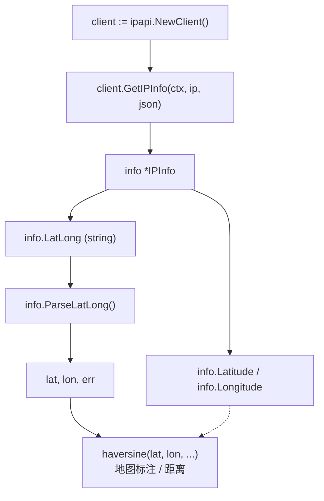
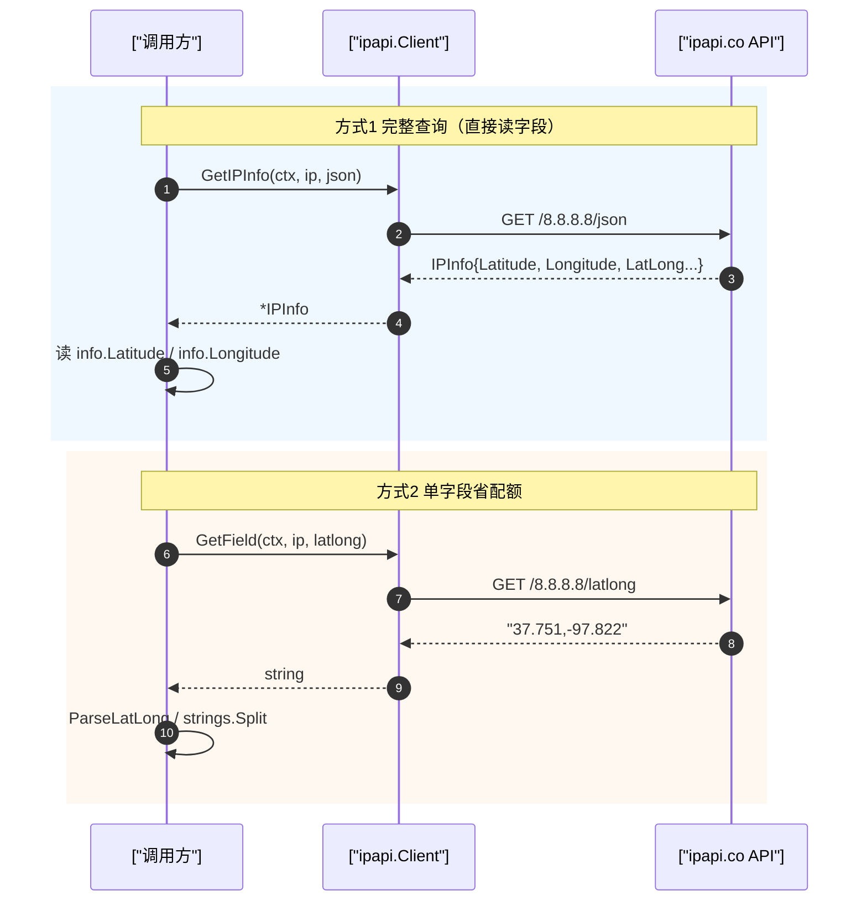

# 💡 经纬度解析

> 用 `ParseLatLong` 解析坐标字符串，并用于地图/距离计算。

## 场景

拿到 IP 坐标后，标注地图、计算距离、查天气。

::: tip 🎨 一图抵千言
调用结构如下：从 [`NewClient`](../api/client#newclient) 获取 `*Client`，调用 [`GetIPInfo`](\.\./api/methods#getipinfo) 拿到 `IPInfo`，再用 [`ParseLatLong`](../api/models#parselatlong) 解析坐标字符串得到 `lat/lon`。


:::

## 代码

```go
func main() {
	client := ipapi.NewClient()
	ctx, cancel := context.WithTimeout(context.Background(), 5*time.Second)
	defer cancel()

	info, _ := client.GetIPInfo(ctx, "8.8.8.8", "json")

	// 方式1：直接用 Latitude / Longitude 字段
	fmt.Printf("直接: lat=%f lon=%f\n", info.Latitude, info.Longitude)

	// 方式2：解析 LatLong 字符串
	lat, lon, err := info.ParseLatLong()
	if err != nil {
		log.Fatal(err)
	}
	fmt.Printf("解析: lat=%f lon=%f\n", lat, lon)

	// 计算两点距离（Haversine）
	_ = haversine(lat, lon, 40.7128, -74.0060) // 到纽约
}

func haversine(lat1, lon1, lat2, lon2 float64) float64 {
	const R = 6371 // km
	dLat := (lat2 - lat1) * math.Pi / 180
	dLon := (lon2 - lon1) * math.Pi / 180
	a := math.Sin(dLat/2)*math.Sin(dLat/2) +
		math.Cos(lat1*math.Pi/180)*math.Cos(lat2*math.Pi/180)*
			math.Sin(dLon/2)*math.Sin(dLon/2)
	c := 2 * math.Atan2(math.Sqrt(a), math.Sqrt(1-a))
	return R * c
}
```

## Latitude/Longitude vs LatLong

| 方式 | 类型 | 何时用 |
|------|------|--------|
| `Latitude` / `Longitude` | `float64` | 已有完整 `IPInfo`，直接取值 |
| `LatLong` | `string` | 单字段查询省配额，再 `ParseLatLong` |

```go
// 省配额：单查 latlong 再解析
s, _ := client.GetField(ctx, "8.8.8.8", "latlong")
// 需自己 split 解析，或构造临时 IPInfo
```

::: tip 🎨 一图抵千言
两条路径在调用时序上的对比：完整查询一次拿回 `IPInfo` 后直接读字段；省配额路径则拆成「单字段请求 + 自行解析」两步，用一次往返换更低配额消耗。


:::

## 单字段查坐标

```go
lat, _ := client.GetField(ctx, "8.8.8.8", "latitude")
lon, _ := client.GetField(ctx, "8.8.8.8", "longitude")
```

返回字符串，需 `strconv.ParseFloat`。

## 地图标注（前端）

```go
// 返回给前端
result := map[string]float64{"lat": info.Latitude, "lon": info.Longitude}
json.NewEncoder(w).Encode(result)
```

前端用 Google Maps / Leaflet 标注。

::: details 运行预期输出与常见问题
预期输出（以 `8.8.8.8` 为例）：

```txt
直接: lat=37.751000 lon=-97.822000
解析: lat=37.751000 lon=-97.822000
```

常见问题：

- **`ParseLatLong` 返回错误**：`LatLong` 为空字符串时解析失败，常见于保留 IP 或网络错误。请先判断 [`ErrReservedIP`](../api/errors#errreservedip) 与 [`ErrInvalidIP`](../api/errors#errinvalidip)。
- **字段返回的字符串带空格**：[`GetField`](\.\./api/methods#getfield) 返回 `string`，使用 `strconv.ParseFloat` 前请 `strings.TrimSpace`。
- **省配额只查坐标**：用 `latlong` 单字段再解析，或分别查 `latitude`/`longitude`，无需拉取完整 `IPInfo`。
- **坐标为 0,0**：多见于国外 DNS 解析回退到地理中心点，结合 [`hostname`](../api/field-network#hostname) 二次校验。
:::

## 下一步

- 📖 看 [`ParseLatLong`](/api/models#parselatlong)
- 🧭 看 [坐标字段](/api/field-coord)
- 📋 回 [字段总览](/api/fields)
