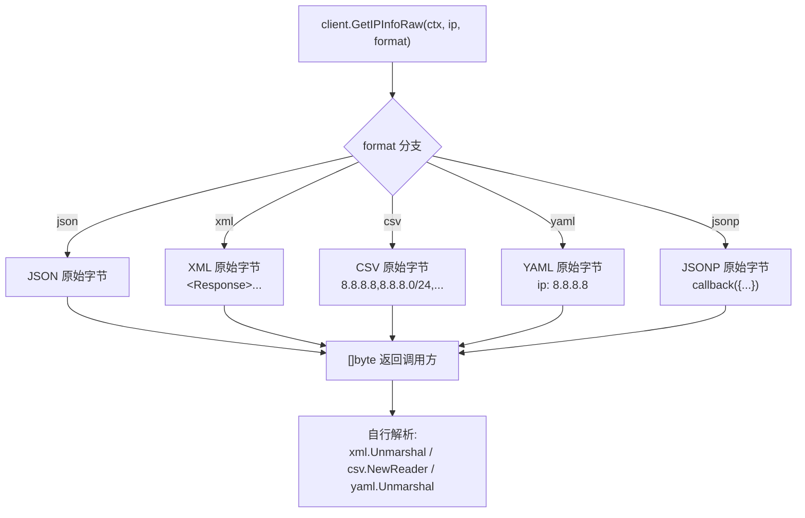
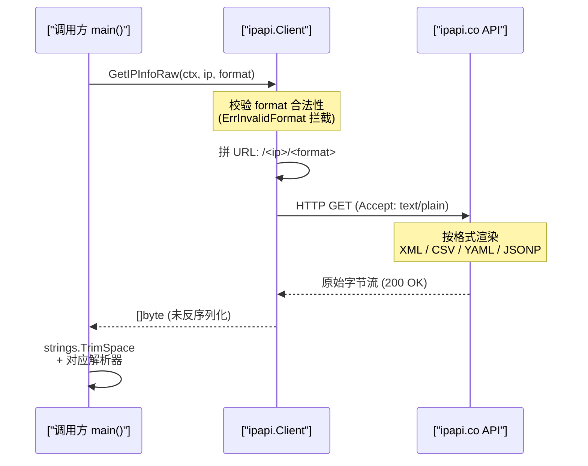

# 💡 XML/CSV/YAML 响应

> 用 `GetIPInfoRaw` 获取非 JSON 格式的原始响应。

::: tip 🎨 一图抵千言
`GetIPInfoRaw` 按 `format` 参数走不同分支，统一返回原始字节，由调用方自行解析。


:::

## 场景

- XML 系统集成
- 数据管道灌 CSV
- 配置文件用 YAML

## 代码

下面这张时序图展示了 `GetIPInfoRaw` 一次调用背后，调用方、SDK 与远端服务之间的协作顺序——从拼装请求到拿到 `[]byte` 自行解析。



```go
func main() {
	client := ipapi.NewClient()
	ctx, cancel := context.WithTimeout(context.Background(), 5*time.Second)
	defer cancel()

	ip := "8.8.8.8"

	xmlData, _ := client.GetIPInfoRaw(ctx, ip, string(ipapi.FormatXML))
	fmt.Println("=== XML ===")
	fmt.Println(string(xmlData))

	csvData, _ := client.GetIPInfoRaw(ctx, ip, string(ipapi.FormatCSV))
	fmt.Println("\n=== CSV ===")
	fmt.Println(string(csvData))

	yamlData, _ := client.GetIPInfoRaw(ctx, ip, string(ipapi.FormatYAML))
	fmt.Println("\n=== YAML ===")
	fmt.Println(string(yamlData))
}
```

## 输出（节选）

```
=== XML ===
<?xml version="1.0" encoding="utf-8"?>
<Response>
  <Ip>8.8.8.8</Ip>
  <City>Mountain View</City>
  ...
</Response>

=== CSV ===
8.8.8.8,8.8.8.0/24,IPv4,Mountain View,California,CA,...

=== YAML ===
ip: 8.8.8.8
city: Mountain View
country: US
...
```

## 解析 CSV

```go
reader := csv.NewReader(strings.NewReader(string(csvData)))
rows, _ := reader.ReadAll()
fmt.Println("字段数:", len(rows[0]))
```

## 解析 XML

```go
type Resp struct {
	XMLName xml.Name `xml:"Response"`
	IP      string   `xml:"Ip"`
	City    string   `xml:"City"`
}
var r Resp
xml.Unmarshal(xmlData, &r)
```

## 客户端 IP 的多格式

```go
data, _ := client.GetClientIPInfoRaw(ctx, string(ipapi.FormatYAML))
```

::: details 📋 运行预期输出与常见问题
**预期输出（节选）：**

```txt
=== XML ===
<?xml version="1.0" encoding="utf-8"?>
<Response>
  <Ip>8.8.8.8</Ip>
  <City>Mountain View</City>
</Response>

=== CSV ===
8.8.8.8,8.8.8.0/24,IPv4,Mountain View,California,CA,...

=== YAML ===
ip: 8.8.8.8
city: Mountain View
country: US
```

**常见问题：**

- **`[]byte` 直接当字符串打印出现乱码？** XML/YAML 头部含 BOM 或换行符，建议先 `strings.TrimSpace(string(data))`，参考 [`GetIPInfoRaw`](/api/get-ip-info-raw)。
- **CSV 首行没有表头？** ipapi.co 的 CSV 不带表头，字段顺序与 [`ValidFields`](/api/fields) 中的字段分组一致，按列索引取值。
- **JSONP 必须传 callback？** 是，JSONP 格式依赖前端回调函数名，参考 [JSONP 示例](./jsonp)。
- **格式拼写错误报 `ErrInvalidFormat`？** 用 [`ValidateFormat`](/api/validate-format) 预校验，合法值见 [`ValidFormats`](/api/validate-format)。
- **拿到的字段想转结构体？** XML 用 `xml.Unmarshal`，YAML 需引入第三方 `gopkg.in/yaml.v3`，CSV 用标准库 `encoding/csv`。
:::

## 下一步

- 📖 看 [`GetIPInfoRaw`](/api/get-ip-info-raw)
- 🎨 学 [多格式响应](/guide/formats)
- 📞 看 [JSONP 示例](./jsonp)
