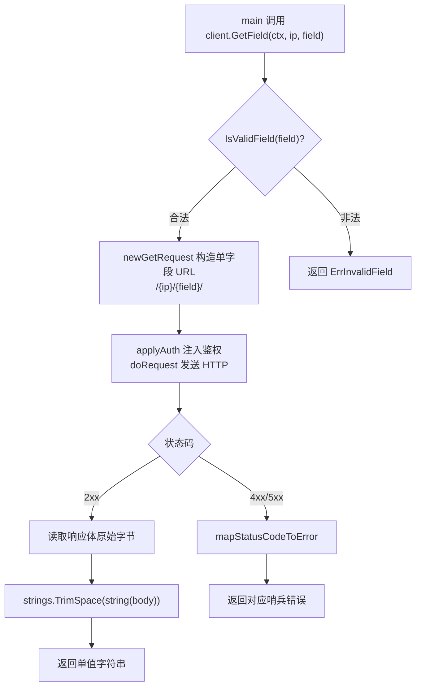
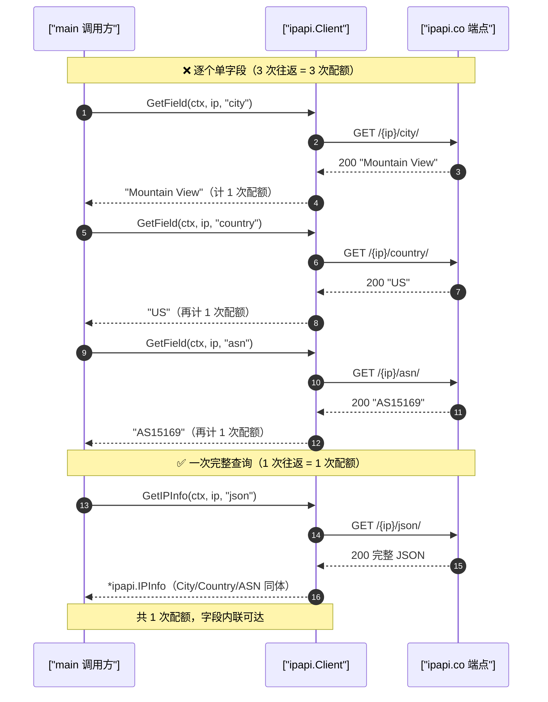

# 💡 单字段查询

> 只需要某个字段，用单字段端点省流量。

## 场景

只需国家代码、ASN 等单个字段，无需拉全量 JSON。

::: tip 🎨 一图抵千言
单字段查询的调用结构：[`GetField`](/api/get-field) 按 `field` 名取单值，返回值经 `TrimSpace` 去除首尾空白后交给调用方；客户端会在发请求前用 [`IsValidField`](/api/validate-format) 校验字段名，非法字段直接返回 [`ErrInvalidField`](/api/errors)。


:::

## 代码

```go
func main() {
	client := ipapi.NewClient()
	ctx, cancel := context.WithTimeout(context.Background(), 5*time.Second)
	defer cancel()

	ip := "8.8.8.8"

	country, _ := client.GetField(ctx, ip, "country_code")
	city, _ := client.GetField(ctx, ip, "city")
	asn, _ := client.GetField(ctx, ip, "asn")
	org, _ := client.GetField(ctx, ip, "org")

	fmt.Printf("%s: %s, %s, %s (%s)\n", ip, country, city, asn, org)
}
```

## 输出

```
8.8.8.8: US, Mountain View, AS15169 (Google LLC)
```

## 客户端 IP 单字段

```go
myCity, _ := client.GetClientField(ctx, "city")
myTZ, _ := client.GetClientField(ctx, "timezone")
```

## 合法字段

28 个合法字段，详见 [字段总览](/api/fields)。非法字段返回 `ErrInvalidField`（客户端校验）。

## ⚠ 配额权衡

每次 `GetField` 都消耗 **1 次配额**。需要 ≥3 个字段时，用 [`GetIPInfo`](/api/get-ip-info) 一次拿全更划算：

```go
// 不推荐：3 次单字段 = 3 次配额
a, _ := client.GetField(ctx, ip, "city")
b, _ := client.GetField(ctx, ip, "country")
c, _ := client.GetField(ctx, ip, "asn")

// 推荐：1 次完整 = 1 次配额
info, _ := client.GetIPInfo(ctx, ip, "json")
// info.City / info.Country / info.ASN
```

详见 [字段概念](/guide/field-concept)。

::: tip 🎨 一图抵千言
下面的时序图对比两种调用的网络往返与配额消耗：左侧逐个单字段查询触发多次 HTTP 往返、累计多次配额；右侧一次完整查询只走一次往返、只计一次配额。


:::

::: details 运行预期输出与常见问题
**预期输出**

```txt
8.8.8.8: US, Mountain View, AS15169 (Google LLC)
```

**常见问题**

- **返回值带换行/空格？** SDK 已对原始响应体执行 `strings.TrimSpace`，正常无需再处理；若你拼接后仍有空白，检查是否自己又包了一层字符串。
- **拿到空字符串？** 多半是该 IP 此字段确实为空（如未分配 ASN 的内网段），而非失败。需要区分"空值"与"错误"时，务必检查 `err` 而非判断空串。
- **字段名写错？** 单字段端点在客户端用 [`IsValidField`](/api/validate-format) 预校验，非法字段返回 [`ErrInvalidField`](/api/errors)，**不会**消耗请求。
- **频繁 429？** 每次 [`GetField`](/api/get-field) 都计 1 次配额；连续多字段请改用 [`GetIPInfo`](/api/get-ip-info) 一次拿全。
:::

## 下一步

- 📖 看 [`GetField`](/api/get-field) / [`GetClientField`](/api/get-client-field)
- 📋 看 [字段总览](/api/fields)
- 🧭 学 [字段查询概念](/guide/field-concept)
