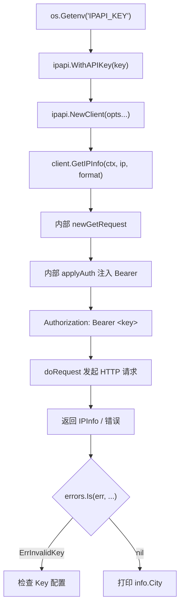

# 💡 带 API Key 认证

> 配置 API Key 提升配额与稳定性。

::: tip 🎨 一图抵千言
调用结构如下：环境变量注入 Key → 函数式选项注入 Client → 每次请求由内部 [`applyAuth`](../api/methods) 注入 `Authorization: Bearer` → 发起请求。


:::

## 场景

生产环境、高流量服务需要认证。

## Header 模式（默认推荐）

```go
func main() {
	client := ipapi.NewClient(
		ipapi.WithAPIKey(os.Getenv("IPAPI_KEY")),
	)
	ctx, cancel := context.WithTimeout(context.Background(), 5*time.Second)
	defer cancel()

	info, err := client.GetIPInfo(ctx, "8.8.8.8", "json")
	if err != nil {
		if errors.Is(err, ipapi.ErrInvalidKey) {
			log.Fatal("API Key 无效，请检查")
		}
		log.Fatal(err)
	}
	fmt.Println(info.City)
}
```

内部发送 `Authorization: Bearer <key>`。

::: tip 🎨 一图抵千言
从时序视角看一次带 Key 请求的往返：调用方、SDK 内部、ipapi.co 服务三者之间的交互如下。

```mermaid
sequenceDiagram
    autonumber
    participant Caller as ["调用方 main()"]
    participant SDK as ["SDK 内部 Client"]
    participant API as ["ipapi.co 服务"]

    Caller->>SDK: ["GetIPInfo(ctx, 8.8.8.8, json)"]
    Note over SDK: newGetRequest 组装 URL
    SDK->>SDK: ["applyAuth 读取 APIKeyMode"]
    alt Header 模式（默认）
        SDK->>API: ["GET /8.8.8.8/json<br/>Authorization: Bearer &lt;key&gt;"]
    else Query 模式
        SDK->>API: ["GET /8.8.8.8/json?key=&lt;key&gt;"]
    end
    API-->>SDK: ["200 OK + JSON / 403 ErrInvalidKey"]
    alt 成功
        SDK-->>Caller: ["IPInfo{City: ...}"]
        Caller->>Caller: ["fmt.Println(info.City)"]
    else 403 / ErrInvalidKey
        SDK-->>Caller: ["ErrInvalidKey"]
        Caller->>Caller: ["log.Fatal 检查 Key 配置"]
    end
```
:::

## Query 模式

```go
client := ipapi.NewClient(
	ipapi.WithAPIKey(os.Getenv("IPAPI_KEY")),
	ipapi.WithAPIKeyQuery(), // ?key=...
)
```

用于 JSONP 等无法设 Header 的场景。

## 安全最佳实践

::: danger 🔐 勿硬编码
```go
// ❌ 危险
client := ipapi.NewClient(ipapi.WithAPIKey("sk-xxx-hardcoded"))

// ✅ 安全
client := ipapi.NewClient(ipapi.WithAPIKey(os.Getenv("IPAPI_KEY")))
```
:::

- 用环境变量 / 密钥管理
- `.env` 加入 `.gitignore`
- 定期轮换 Key
- 403 时检查 Key（`ErrInvalidKey`）

## 运行

```bash
export IPAPI_KEY="your_key_here"
go run main.go
```

::: details 📋 运行预期输出与常见问题
**预期输出（Header 模式，Key 有效）：**

```txt
Mountain View
```

**常见问题：**

- `403 Forbidden` / [`ErrInvalidKey`](../api/errors)：环境变量未设置或 Key 失效，检查 `IPAPI_KEY` 是否正确导出。
- 仍被限流（[`ErrRateLimited`](../api/errors)）：即使带 Key 也可能触发，确认套餐配额；可重试，详见 [错误处理](../guide/error-concept)。
- Query 模式仍走 Header：确认同时传了 [`WithAPIKeyQuery`](../api/with-api-key-query)，它将 [`APIKeyMode`](../api/client) 切换为 Query 模式。
- JSONP 场景建议用 Query 模式，因为浏览器无法附带自定义 Header。
:::

## 下一步

- 🔒 学 [认证机制](/guide/auth-concept)
- 📖 看 [`WithAPIKey`](/api/with-api-key) / [`WithAPIKeyQuery`](/api/with-api-key-query)
- 🛡 学 [错误处理](/guide/error-concept)
