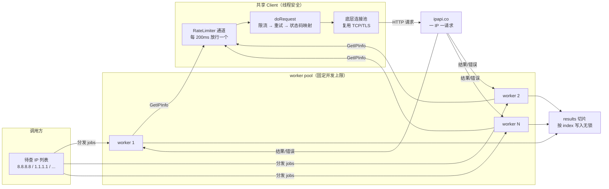

# ❓ 有批量端点吗

## 问题

ipapi.co-skills 有没有批量查询端点？想一次性查几百上千个 IP，能不能一个请求搞定？

## 简答

**没有。** ipapi.co 不提供原生批量端点，每次请求只查一个 IP；「批量」= 多次单查 + 并发提速 + 限流防封。

## 详解

ipapi.co 的 API 设计是 **一 IP 一请求**：`GET https://ipapi.co/{ip}/{format}/` 每次只返回单个 IP 的归属信息。官方没有提供「提交一个 IP 列表、一次返回全部结果」的批量接口，因此 SDK 也未封装 `BatchLookup` 之类的方法。

要查多个 IP，正确做法是 **在客户端做并发 + 限流**：

::: tip 🎨 一图抵千言
下图是批量查询的并发 + 限流架构：所有 worker 共享同一个 `Client` 与全局 `RateLimiter`，限流阀是整条管线的节流点。
:::



- 🚀 **并发提速**：用 goroutine 同时发起多个单查，把总耗时从 `N × 单次延迟` 压到接近 `单次延迟`。
- 🛡️ **限流防封**：用 `Client.RateLimiter` 给整条并发管线套一个全局节流阀，避免瞬间打爆 ipapi.co 配额触发 `429`。
- ♻️ **复用 Client**：所有 goroutine 共享同一个 `*ipapi.Client`，复用底层连接池，避免每次新建 TCP/TLS 连接的开销。

### 三种模式速览

| 模式 | 适用规模 | 并发控制 | 是否限流 | 复杂度 |
|------|----------|----------|----------|--------|
| 串行 for 循环 | < 100 | 无 | 否 | ⭐ |
| goroutine + WaitGroup | 100–1000 | 裸并发（瞬时引爆） | 是 | ⭐⭐ |
| worker pool（固定 worker） | > 1000 | 固定上限 | 是 | ⭐⭐⭐ |

### 基础串行（少量 IP）

几十个 IP 以内，串行就够用，简单直观：

```go
package main

import (
	"context"
	"fmt"
	"log"

	"github.com/cyberspacesec/ipapi.co-skills/pkg/ipapi"
)

func main() {
	client := ipapi.NewClient() // 无 Key，走免费额度

	ips := []string{"8.8.8.8", "1.1.1.1", "9.9.9.9"}
	for _, ip := range ips {
		info, err := client.GetIPInfo(context.Background(), ip, "json")
		if err != nil {
			log.Printf("查询 %s 失败: %v", ip, err)
			continue
		}
		fmt.Printf("%s | %s | %s\n", info.IP, info.CountryCode, info.ASN)
	}
}
```

简单但慢——N 个 IP 就要 N 次串行网络往返。

### 并发 + 限流（推荐）

数量上来后，用 goroutine + WaitGroup 并发，配合 `RateLimiter` 控速：

```go
package main

import (
	"context"
	"errors"
	"fmt"
	"log"
	"sync"
	"time"

	"github.com/cyberspacesec/ipapi.co-skills/pkg/ipapi"
)

func batchLookup(client *ipapi.Client, ips []string) []*ipapi.IPInfo {
	// 限流：每 200ms 放行一个，约 5 QPS，保护 ipapi.co 配额
	client.RateLimiter = time.Tick(200 * time.Millisecond)

	var wg sync.WaitGroup
	// 预分配结果切片，按 index 写入，无需加锁
	results := make([]*ipapi.IPInfo, len(ips))

	for i, ip := range ips {
		wg.Add(1)
		go func(idx int, addr string) {
			defer wg.Done()
			info, err := client.GetIPInfo(context.Background(), addr, "json")
			if err != nil {
				// 批量场景对单条失败要容忍
				if errors.Is(err, ipapi.ErrRateLimited) {
					log.Printf("%s 被限流，建议整体退避", addr)
				}
				return
			}
			results[idx] = info
		}(i, ip)
	}
	wg.Wait()
	return results
}

func main() {
	client := ipapi.NewClient(
		ipapi.WithAPIKey("YOUR_API_KEY"),
		ipapi.WithCustomHTTPClient(nil), // 实际可注入自定义连接池
	)

	ips := []string{"8.8.8.8", "1.1.1.1", "9.9.9.9", "208.67.222.222"}
	results := batchLookup(client, ips)

	for _, info := range results {
		if info != nil {
			fmt.Printf("%s | %s | %s\n", info.IP, info.CountryCode, info.ASN)
		}
	}
}
```

关键点：

- ✅ **复用同一个 Client**：共享连接池，省去握手开销。
- ✅ **设 `RateLimiter`**：`doRequest` 发请求前会 `<-c.RateLimiter` 阻塞放行，全局限速。
- ✅ **goroutine + WaitGroup** 并发，总耗时逼近单次延迟。
- ✅ **预分配 `results` 切片**，按 index 写，无锁。
- ✅ **单条失败容忍**：用 `errors.Is` 区分 `ErrRateLimited`（整体退避）与 `ErrReservedIP`（私有地址跳过）。

### worker pool 模式（千级 IP）

大量 IP 时，裸 goroutine 会瞬时引爆并发数。改用固定 worker pool 控制并发上限：

::: details 🧠 为什么裸 goroutine 在千级 IP 下会出问题？
当你对 1000 个 IP 各起一个 goroutine，会有三个隐患：

1. **瞬时并发爆炸**：1000 个 goroutine 同时调用 `GetIPInfo`，几乎同时打到 ipapi.co，瞬时 QPS 远超免费层 5 QPS 限额，几乎必然触发 `429`。
2. **内存抖动**：每个 goroutine 独立持有栈与请求缓冲，1000 个并发的内存峰值远高于分批处理。
3. **失败雪崩**：一旦被限流，1000 个请求同时失败、同时重试，进一步加剧拥塞（thundering herd）。

worker pool 用固定数量的 worker 消费 jobs 通道，**并发上限 = worker 数**，从源头切断瞬时爆炸；再叠加 `RateLimiter` 做全局限速，双保险。
:::

```go
func batchLookupPool(client *ipapi.Client, ips []string, workers int) []*ipapi.IPInfo {
	client.RateLimiter = time.Tick(200 * time.Millisecond)

	jobs := make(chan string, len(ips))
	out := make(chan *ipapi.IPInfo, len(ips))

	// 固定数量的 worker，并发度有上限
	for w := 0; w < workers; w++ {
		go func() {
			for ip := range jobs {
				if info, err := client.GetIPInfo(context.Background(), ip, "json"); err == nil {
					out <- info
				}
			}
		}()
	}
	for _, ip := range ips {
		jobs <- ip
	}
	close(jobs)

	var results []*ipapi.IPInfo
	for i := 0; i < len(ips); i++ {
		select {
		case info := <-out:
			results = append(results, info)
		default:
			// 当批未产出结果的槽位，按需补查或跳过
		}
	}
	return results
}
```

### 配额规划

免费额度约 1000 次/天。批量查询前先估算规模，再决定是否申请 Key：

| 数量 | 建议配置 |
|------|----------|
| < 100 | 默认配置，串行即可 |
| 100–1000 | 限流 + 申请 API Key |
| > 1000 | 必须付费 Key，用 worker pool 控并发 |

::: tip 💡 想要真正减少请求数？
ipapi.co 没有批量端点，但可以用 `golang.org/x/sync/singleflight` 对**重复 IP 做单飞合并**——同一 IP 的 N 次请求只打一次 API，配额省 N 倍。配合结果缓存（TTL 1 小时），批量场景的 API 调用量能再降一个数量级。
:::

::: warning ⚠️ 限流是批量的生命线
不开 `RateLimiter` 直接并发 N 个请求，几乎必然触发 `429 Too Many Requests`，SDK 会映射为 `ipapi.ErrRateLimited`。限流速率请按你的套餐配额反推（免费层保守按 5 QPS 以内）。
:::

## 相关

- 🔄 [批量查询指南](../guide/batch) — 串行、并发、worker pool 三种模式完整对比
- 🚀 [快速开始](../guide/getting-started) — 跑通第一次单 IP 查询
- 🛡️ [重试与限流](../guide/retry-concept) — `RateLimiter` 与 `Retries` 的工作机制
- ⏱️ [上下文与超时](../guide/context) — 批量场景每任务独立超时
- 🔧 [`GetIPInfo`](../api/get-ip-info) — 单次查询的入口方法
- 🔧 [`NewClient`](../api/new-client) — 构造可复用 Client
- 🔧 [客户端选项](../api/options) — 含 `RateLimiter`、`Retries` 等批量必调项
- ⚡ [`ErrRateLimited`](../reference/errors/err-rate-limited) — 触发 429 时的错误映射与重试
- 🍳 [异步查询食谱](../cookbook/async-lookup) — worker pool + channel 的生产级异步管线
- 📅 [定时批量食谱](../cookbook/scheduled-batch) — 定时跑批的完整实现
