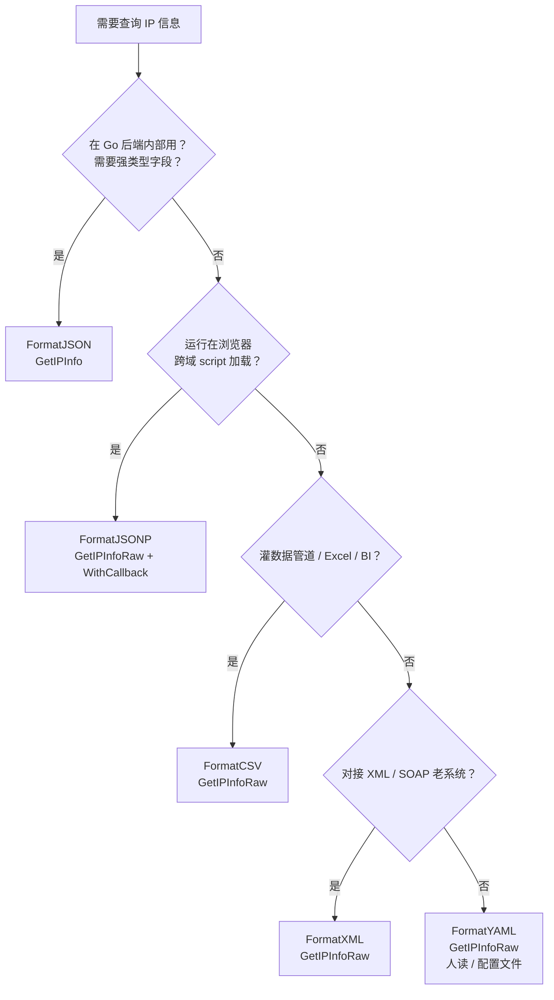

# ❓ 用哪种格式

> 一句话：Go 内部用 `json`，跨域用 `jsonp`，数据管道用 `csv`。

## 问题

ipapi.co 支持 5 种响应格式（`json` / `jsonp` / `xml` / `csv` / `yaml`），本 SDK 用 `Format` 常量统一管理。面对不同场景，我该选哪一种？

## 简答

🟢 **Go 内部用 `json`**（直接解码成 `IPInfo` 结构体，强类型字段最省心）；🔵 **跨域前端用 `jsonp`**（`<script>` 加载、绕过同源限制）；🟠 **数据管道/Excel 用 `csv`**（行式结构、易灌库）。

## 详解

ipapi.co-skills 把 5 种格式分成两条调用路径：只有 `json` 能被 SDK 直接解码进 [`IPInfo`](../api/models) 结构体，其余 4 种（`jsonp` / `xml` / `csv` / `yaml`）统一走 raw 方法返回 `[]byte`，由你自行解析。

### 📋 决策表

| 你的场景 | 选什么 | 调用方法 | 为什么 |
|---------|--------|---------|--------|
| 🟢 Go 后端、要强类型字段 | `FormatJSON` | `GetIPInfo` | SDK 自动 `json.Decode`，字段带类型 |
| 🔵 浏览器跨域 `<script>` | `FormatJSONP` | `GetIPInfoRaw` + `WithCallback` | 包进回调函数、绕过同源策略 |
| 🟠 灌数据管道 / Excel / BI | `FormatCSV` | `GetIPInfoRaw` | 行式结构、`encoding/csv` 直读 |
| 🟣 老旧 SOAP / XML 系统 | `FormatXML` | `GetIPInfoRaw` | `encoding/xml` 解析 |
| 🟡 配置文件、人读可读性 | `FormatYAML` | `GetIPInfoRaw` | 缩进友好、需引 `yaml.v3` |

### 🟢 场景一：Go 内部用 JSON

JSON 是唯一能被 SDK 直接解码的格式。`GetIPInfo` 内部完成 `json.Decode`，返回带类型的 `IPInfo`，字段安全、无需手动解析：

```go
package main

import (
	"context"
	"fmt"
	"log"

	"github.com/cyberspacesec/ipapi-co-skills/pkg/ipapi"
)

func main() {
	client := ipapi.NewClient()
	ctx := context.Background()

	// ✅ 推荐：Go 内部一律用 json + GetIPInfo
	info, err := client.GetIPInfo(ctx, "8.8.8.8", string(ipapi.FormatJSON))
	if err != nil {
		log.Fatal(err)
	}
	fmt.Println(info.City, info.CountryName) // 强类型字段
}
```

::: tip 💡 为什么 Go 内部首选 JSON
`GetIPInfo` 走完整流程（`ValidateIP` → `ValidateFormat` → 请求 → `json.Decode` → `handleError`），返回强类型 `IPInfo`，字段有编译期检查，省掉手写解析代码。
:::

### 🔵 场景二：跨域前端用 JSONP

浏览器用 `<script src>` 加载时受同源策略限制，JSONP 把 JSON 包进回调函数调用以绕过限制。需用 [`WithCallback`](../api/with-callback) 设回调名，配合 `GetIPInfoRaw`：

```go
package main

import (
	"fmt"
	"net/http"

	"github.com/cyberspacesec/ipapi-co-skills/pkg/ipapi"
)

func jsonpHandler(w http.ResponseWriter, r *http.Request) {
	callback := r.URL.Query().Get("callback") // 前端传 ?callback=handleIP
	client := ipapi.NewClient(ipapi.WithCallback(callback))

	// ✅ 跨域：jsonp + GetIPInfoRaw + WithCallback
	data, _ := client.GetClientIPInfoRaw(r.Context(), string(ipapi.FormatJSONP))
	w.Header().Set("Content-Type", "application/javascript")
	w.Write(data)
	// 返回: handleIP({"ip":"8.8.8.8","city":"Mountain View",...})
}
```

前端：

```html
<script>
function handleIP(data) { console.log(data.ip, data.city); }
</script>
<script src="https://your-api.com/jsonp?callback=handleIP"></script>
```

::: warning ⚠️ JSONP 带不上 Header
`<script>` 无法设自定义 Header，若需带 API Key 必须用 [`WithAPIKeyQuery`](../api/with-api-key-query)（Key 走 query 参数，前端可见，仅限受限环境）。
:::

### 🟠 场景三：数据管道用 CSV

CSV 是行式结构，适合灌进数据库、Excel、数仓或 BI 工具。用 `GetIPInfoRaw` 拿原始字节，再用标准库 `encoding/csv` 解析：

```go
package main

import (
	"context"
	"encoding/csv"
	"fmt"
	"log"
	"strings"

	"github.com/cyberspacesec/ipapi-co-skills/pkg/ipapi"
)

func main() {
	client := ipapi.NewClient()
	ctx := context.Background()

	// ✅ 数据管道：csv + GetIPInfoRaw
	data, err := client.GetIPInfoRaw(ctx, "8.8.8.8", string(ipapi.FormatCSV))
	if err != nil {
		log.Fatal(err)
	}
	// 8.8.8.8,8.8.8.8/32,IPv4,Mountain View,...,US,United States,...

	reader := csv.NewReader(strings.NewReader(string(data)))
	rows, err := reader.ReadAll()
	if err != nil {
		log.Fatal(err)
	}
	fmt.Println(rows[0]) // 第一行字段切片
}
```

::: tip 💡 CSV 的优势
单行即一条记录，无嵌套，`csv.NewReader` 一次 `ReadAll` 拿到二维切片，天然贴合数据库 `INSERT`、Excel 导入、Spark 等行式处理工具。
:::

### 🧭 选择流程图

::: tip 🎨 一图抵千言
把上表压缩成一棵决策树，自顶向下按场景逐步缩小选择范围。
:::



以下是决策树的文字版速查：

```
你的需求
│
├─ Go 内部用、要强类型字段 ─────→ FormatJSON  + GetIPInfo
│
├─ 浏览器跨域 <script> ─────────→ FormatJSONP + GetIPInfoRaw + WithCallback
│
├─ 灌入数据管道 / Excel / 数仓 ──→ FormatCSV  + GetIPInfoRaw
│
├─ 与 XML / SOAP 系统集成 ──────→ FormatXML  + GetIPInfoRaw
│
└─ 需要人读 / 配置文件 ─────────→ FormatYAML + GetIPInfoRaw
```

### 🛡 别手写格式字符串

无论选哪种，优先用 [`Format` 常量](../api/client#格式常量)（`ipapi.FormatJSON` 等）而非裸字符串 `"json"`，避免拼错。SDK 在请求前会用 [`ValidateFormat`](../api/validate-format) 前置校验，非法格式直接返回 [`ErrInvalidFormat`](../api/errors)，不会发出错误请求：

```go
// ✅ 推荐：用常量
client.GetIPInfo(ctx, ip, string(ipapi.FormatJSON))

// ❌ 不推荐：手写字符串易拼错
client.GetIPInfo(ctx, ip, "josn") // → ErrInvalidFormat，请求被拦截
```

::: details 🔍 五种格式的方法分流总览
只有 `json` 能被 SDK 直接解码进 `IPInfo`，其余四种统一走 raw 方法返回 `[]byte`。下表把格式、调用方法、返回类型、解析方式一并列出：

| 格式 | 常量 | 调用方法 | 返回类型 | 解析方式 |
|------|------|----------|----------|----------|
| JSON | `FormatJSON` | `GetIPInfo` / `GetClientIPInfo` | `*IPInfo` | SDK 内部 `json.Decode` |
| JSONP | `FormatJSONP` | `GetIPInfoRaw` / `GetClientIPInfoRaw` | `[]byte` | 前端 `<script>` 回调 |
| XML | `FormatXML` | `GetIPInfoRaw` / `GetClientIPInfoRaw` | `[]byte` | `encoding/xml` |
| CSV | `FormatCSV` | `GetIPInfoRaw` / `GetClientIPInfoRaw` | `[]byte` | `encoding/csv` |
| YAML | `FormatYAML` | `GetIPInfoRaw` / `GetClientIPInfoRaw` | `[]byte` | `gopkg.in/yaml.v3` |

记忆诀窍：**带 `Raw` 后缀的方法返回原始字节，不带 `Raw` 的返回结构体**——而结构体只有 `json` 这一条路。
:::

## 相关

- 🎨 [响应格式概念](../guide/format-concept) — `Format` 类型与 5 种常量总览
- 🌐 [多格式响应用法](../guide/formats) — 各格式的实际调用示例
- 📞 [JSONP 回调指南](../guide/jsonp) — `WithCallback` 与跨域的完整说明
- 📖 [`GetIPInfo`](../api/get-ip-info) — JSON 格式的结构化解码方法
- 📖 [`GetIPInfoRaw`](../api/get-ip-info-raw) — 非 JSON 格式的原始字节方法
- 📖 [`Format` 常量](../api/client#格式常量) — `FormatJSON` / `FormatJSONP` / `FormatCSV` 等
- 📖 [`WithCallback`](../api/with-callback) — 启用 JSONP 的选项
- 📖 [`ValidateFormat`](../api/validate-format) — 格式合法性校验
- 🛡 [`ErrInvalidFormat`](../api/errors) — 非法格式的错误类型
- 🧪 [多格式示例](../examples/raw-formats) — XML/CSV/YAML/JSONP 的可运行示例
