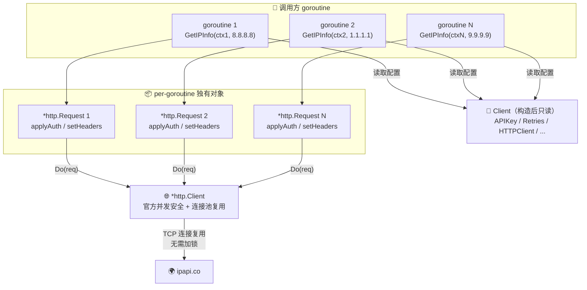
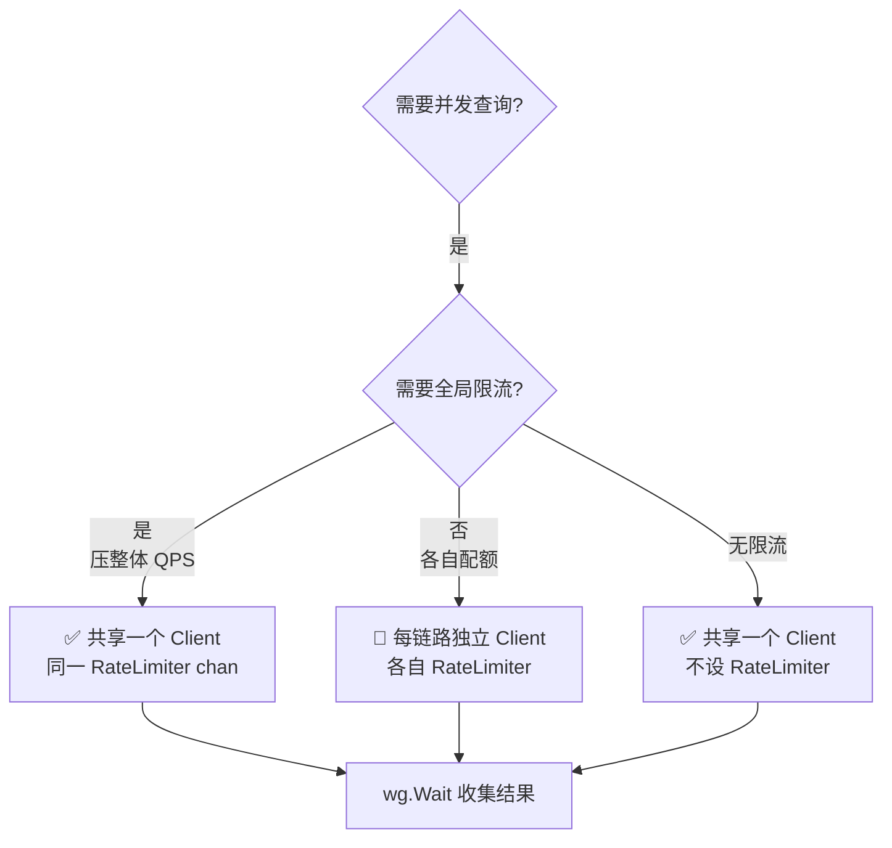

# ❓ 并发安全吗

## 问题

ipapi.co-skills 的 `Client` 可以在多个 goroutine 之间共享、并发调用吗？需要自己加锁吗？

## 简答

✅ 安全。`Client` 在请求过程中不修改任何自身字段，多个 goroutine 可安全复用同一个实例，无需额外加锁。

::: tip 🎨 一图抵千言
下面的流程图展示了多个 goroutine 共享同一个 `Client` 时，如何借助标准库 `*http.Client` 的连接池实现并发安全。
:::



## 详解

Go SDK 的 `Client` 被设计为 **构造后不可变（construct-once）** 的值对象。一旦通过 `NewClient(...)` 创建完成，它的所有配置字段（`BaseURL`、`APIKey`、`APIKeyMode`、`UserAgent`、`Retries`、`HTTPClient`、`Callback`、`errorHandler`）就固定下来，后续每次请求只 **读取** 这些字段，不再写入。

每次发起请求时，SDK 都会通过 `http.NewRequestWithContext(...)` 创建一个 **全新的 `*http.Request`**，鉴权（`applyAuth`）和设置请求头（`setHeaders`）都作用在这个 **per-goroutine 独有** 的请求对象上，绝不会回写 `Client` 本身。因此不存在多个 goroutine 抢改同一块内存的竞态。

::: info 📋 Client 字段可复用性一览
| 字段 | 并发可读 | 并发可写 | 说明 |
| --- | --- | --- | --- |
| `BaseURL` | ✅ | ❌ | 构造后固定 |
| `APIKey` / `APIKeyMode` | ✅ | ❌ | `applyAuth` 只读取 |
| `UserAgent` | ✅ | ❌ | `setHeaders` 只读取 |
| `Retries` | ✅ | ❌ | `doRequest` 重试只读取 |
| `HTTPClient` | ✅ | ❌ | 标准库本身并发安全 |
| `RateLimiter` | ✅ | ❌ | 通道本身并发安全 |
| `errorHandler` | ✅ | ❌ | 哨兵映射只读 |
:::

::: tip 🧠 为什么不需要锁？
并发的两个前提都不成立：
1. **没有可变共享状态** —— `Client` 字段构造后只读。
2. **依赖的底层对象本身并发安全** —— 标准库 `*http.Client` 官方文档明确说明可被多个 goroutine 并发使用，其内部的连接池、Transport 都已做了同步。
:::

### 多 goroutine 并发查询示例

下面这段代码用同一个 `Client` 在 5 个 goroutine 里并发查询不同 IP，安全无锁：

```go
package main

import (
	"context"
	"fmt"
	"sync"

	"github.com/cyberspacesec/ipapi.co-skills/pkg/ipapi"
)

func main() {
	// 一个 Client 全局复用，多 goroutine 安全
	client := ipapi.NewClient(
		ipapi.WithAPIKey("YOUR_API_KEY"),
	)

	ips := []string{
		"8.8.8.8",
		"1.1.1.1",
		"9.9.9.9",
		"208.67.222.222",
		"4.2.2.2",
	}

	var wg sync.WaitGroup
	results := make([]string, len(ips))

	for i, ip := range ips {
		wg.Add(1)
		go func(idx int, addr string) {
			defer wg.Done()

			// 每个 goroutine 用自己的 context，互不影响
			ctx := context.Background()
			info, err := client.GetIPInfo(ctx, addr)
			if err != nil {
				results[idx] = fmt.Sprintf("%s: 查询失败 -> %v", addr, err)
				return
			}
			results[idx] = fmt.Sprintf("%s -> %s (%s)", addr, info.CountryName, info.CountryCode)
		}(i, ip)
	}

	wg.Wait()
	for _, r := range results {
		fmt.Println(r)
	}
}
```

### 推荐：全局单例 + 并发复用

最佳实践是 **只创建一次 `Client`，整个进程共享**，而不是每次请求都 `NewClient`。这样能复用底层 HTTP 连接池、TLS 握手结果，显著降低延迟和资源开销：

```go
var (
	clientOnce sync.Once
	sharedClient *ipapi.Client
)

func getClient() *ipapi.Client {
	clientOnce.Do(func() {
		sharedClient = ipapi.NewClient(
			ipapi.WithAPIKey("YOUR_API_KEY"),
		)
	})
	return sharedClient
}

// 在任意 goroutine 中调用 getClient().GetIPInfo(ctx, ip) 都是安全的
```

### 并发与限流（RateLimiter）的交互

`Client` 提供了一个 `RateLimiter <-chan time.Time` 字段，用于客户端侧的速率控制。这里需要区分两种情况：

| 限流策略 | 是否共享 Client | 行为 | 适用场景 |
| --- | --- | --- | --- |
| 🔁 共享 RateLimiter | ✅ 共同一个 Client | 所有 goroutine 共享令牌桶，整体压到设定值 | 全局限流 |
| 🚦 独立 RateLimiter | ❌ 每条链路独立 Client | 各 goroutine 各自配额，互不影响 | 按租户/任务独立配额 |

- 🔁 **复用同一个 `RateLimiter` 通道**：多个 goroutine 从同一个 `chan` 接收是安全的（Go 通道本身并发安全），效果是所有 goroutine **共享** 这个令牌桶，整体速率被压到设定值。如果你希望全局限流，这正是想要的行为。
- 🚦 **每个 goroutine 独立限流**：若希望各 goroutine 各自拥有独立配额，则不应共享同一个 `Client`，而要为每条并发链路创建带各自 `RateLimiter` 的独立 `Client`。

::: details 🧪 共享 vs 独立 Client 决策树

:::

::: warning ⚠️ 不要在并发后修改 Client
虽然 `Client` 字段都是导出的（可直接赋值），但在任何 goroutine 已经开始调用查询方法后，**再异步修改 `client.APIKey`、`client.Retries` 等字段会产生数据竞争**。正确做法是：所有配置在 `NewClient` 阶段一次性确定，并发期间只读不写。如需切换配置，请新建一个 `Client` 实例替换旧实例。
:::

::: tip ✅ 一句话总结
**一个 `Client`，到处复用，并发安全，无需加锁；要改配置就重建实例，别边用边改。**
:::

## 相关

- 🧩 [`Client` 结构体概念](../guide/client-concept) — 为什么 `Client` 设计成构造后不可变
- 🔄 [`NewClient` 构造函数](../api/new-client) — 一次性完成所有配置
- 🧱 [`Client` API 参考](../api/client) — 各字段含义与可复用性说明
- ⚙️ [客户端选项 `WithXxx`](../api/options) — `WithAPIKey` / `WithCustomHTTPClient` 等配置项
- 🌐 [自定义 HTTP Client](../guide/custom-http) — 注入自带连接池/Transport 的 `*http.Client`
- ⏱ [`context` 与超时](../guide/context) — 每个 goroutine 应使用独立的 `context`
- 🔁 [重试机制](../guide/retry-concept) — 并发下重试不会相互干扰的原因
- 🚦 [限流与 429](../reference/errors/err-rate-limited) — `RateLimiter` 通道在并发下的共享行为
- 🍳 [并发批量查询 Cookbook](../cookbook/ — 更完整的并发查询模式
