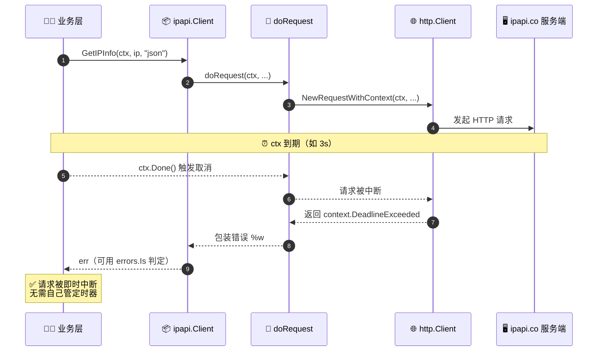

# ❓ 超时怎么设

> 控制单次 IP 查询请求的最长等待时间。

## 问题

调用 `GetIPInfo` 等方法时，请求可能因网络抖动或服务端响应慢而长时间挂起。超时该怎么设？

## 简答

用 `context.WithTimeout` 创建带超时的 `ctx`，传给每次请求的第一个参数，**每次请求单独设**。

::: tip 🎨 一图抵千言
这张时序图展示 `ctx` 超时如何从业务层一路传播到底层 HTTP 请求并触发取消。
:::



## 详解

ipapi.co-skills 的所有查询方法（`GetIPInfo`、`GetIPInfoRaw`、`GetField`、`GetClientIPInfo` 等）第一个参数都是 `context.Context`。内部通过 `http.NewRequestWithContext(ctx, ...)` 把 ctx 透传给底层 HTTP 请求，因此 **ctx 超时或取消会立即中断请求**，无需自行管理定时器。

### ⏱ 基本用法

```go
package main

import (
    "context"
    "fmt"
    "log"
    "time"

    "github.com/cyberspacesec/ipapi"
)

func main() {
    client := ipapi.NewClient(ipapi.WithAPIKey("your_api_key"))

    // ① 为这次查询设置 3 秒超时
    ctx, cancel := context.WithTimeout(context.Background(), 3*time.Second)
    defer cancel() // ② 别忘了释放，否则泄漏计时器

    // ③ 超时随 ctx 传进去
    info, err := client.GetIPInfo(ctx, "8.8.8.8", "json")
    if err != nil {
        // 超时会返回 context.DeadlineExceeded 包装的错误
        log.Printf("查询失败: %v", err)
        return
    }
    fmt.Println(info.City)
}
```

> 📌 **要点**：`WithTimeout` 返回的 ctx 必须调用 `cancel()`，习惯上用 `defer cancel()`。即使请求已提前返回，`cancel` 也是安全的，它只是释放 ctx 占用的资源。

### 🎯 为什么「每次请求单独设」

| 方式 | 问题 |
|------|------|
| ❌ 在 `NewClient` 时设一个固定超时，所有请求共用 | 慢请求拖累快请求；不同业务（详情查询 vs 单字段）合理超时不同 |
| ✅ 每次调用 `context.WithTimeout` 按需生成 ctx | 灵活、可按调用方语义差异化；与 HTTP handler 的 `r.Context()` 天然衔接 |

不同业务用不同超时，互不影响：

```go
// 详情查询：给宽一点
ctx1, cancel1 := context.WithTimeout(context.Background(), 5*time.Second)
defer cancel1()
client.GetIPInfo(ctx1, "8.8.8.8", "json")

// 单字段查询：快速失败
ctx2, cancel2 := context.WithTimeout(context.Background(), 800*time.Millisecond)
defer cancel2()
client.GetField(ctx2, "8.8.8.8", "country")
```

### 🧬 两层超时：Context + HTTP Client

SDK 默认 HTTP 客户端有 `10 * time.Second` 的兜底超时（见 `defaultTimeout`）。两者并存时，**先到期的先生效**：

```go
// HTTP 层兜底 30s
client := ipapi.NewClient(
    ipapi.WithCustomHTTPClient(&http.Client{
        Timeout: 30 * time.Second,
    }),
)

// Context 层 3s 先触发 → 请求在 3s 被取消
ctx, cancel := context.WithTimeout(context.Background(), 3*time.Second)
defer cancel()
client.GetIPInfo(ctx, "8.8.8.8", "json")
```

- 🧱 `http.Client.Timeout`（30s）：覆盖「建连 + 发请求 + 读 body」全过程，作兜底。
- ⚡ `context.WithTimeout`（3s）：更细粒度，可按每次调用调整，**推荐作为主控**。

::: details 🔬 两层超时谁先生效？
两者并存时**先到期的先生效**，互不冲突，构成双重保护：

| 层级 | 设置方式 | 覆盖范围 | 粒度 | 角色 |
| --- | --- | --- | --- | --- |
| 🧱 HTTP 层 | `http.Client.Timeout` | 建连+发请求+读 body | 客户端级（粗） | 兜底防线 |
| ⚡ Context 层 | `context.WithTimeout` | 整个请求生命周期 | 单次调用级（细） | 主控推荐 |

示例：HTTP 层 30s + Context 层 3s → 3s 先到，请求被取消。反之若只设 HTTP 层 30s 而 ctx 不限，则按 30s 兜底。
:::

### 🌐 在 HTTP 服务中：从 `r.Context()` 派生

Web 服务里应从请求的 `r.Context()` 派生子 ctx，客户端断开时自动取消上游查询：

```go
func lookupHandler(w http.ResponseWriter, r *http.Request) {
    // 客户端断开 → r.Context() 取消 → ipapi 请求取消
    // 再叠加 2s 上限，避免无限等待
    ctx, cancel := context.WithTimeout(r.Context(), 2*time.Second)
    defer cancel()

    ip := r.URL.Query().Get("ip")
    info, err := client.GetIPInfo(ctx, ip, "json")
    if err != nil {
        if errors.Is(err, context.DeadlineExceeded) {
            http.Error(w, "query timed out", http.StatusGatewayTimeout)
            return
        }
        http.Error(w, err.Error(), http.StatusInternalServerError)
        return
    }
    json.NewEncoder(w).Encode(info)
}
```

### 🚫 主动取消

除超时外，`WithCancel` 支持业务侧主动中断：

```go
ctx, cancel := context.WithCancel(context.Background())
go func() {
    time.Sleep(100 * time.Millisecond)
    cancel() // 主动取消
}()
client.GetIPInfo(ctx, "8.8.8.8", "json") // 因 ctx 取消而中断
```

### ⚠️ 常见坑

- **忘记 `defer cancel()`** → ctx 及其父链上的计时器/ goroutine 泄漏，长期运行的服务会内存增长。
- **ctx 超时 < 重试间隔** → 默认 `Retries=2`、`defaultRetryDelay=500ms`，若 ctx 只有 300ms，重试可能还没发起就被取消。短超时场景请把 `client.Retries` 调小，或用更宽松的 ctx。
- **超时后忽略错误** → ctx 超时返回的是 `context.DeadlineExceeded`（可能被 `fmt.Errorf("%w", ...)` 包装），用 `errors.Is(err, context.DeadlineExceeded)` 判断而非字符串匹配。

## 相关

- 📖 [Context 指南](../guide/context) —— 上下文的完整概念与传播机制
- 🛠 [自定义 HTTP 客户端](../guide/custom-http) —— `http.Client.Timeout` 兜底超时配置
- 🧩 [`WithCustomHTTPClient`](../api/with-custom-http-client) —— 替换底层 `*http.Client` 的选项
- 📋 [Options 选项](../api/options) —— 函数式选项总览
- 🔧 [`GetIPInfo`](../api/get-ip-info) / [`GetField`](../api/get-field) —— 带 `ctx` 参数的方法签名
- 📚 [常量 `defaultTimeout`](../reference/internal/default-timeout) —— 默认 10s 超时常量
- 🛡 [`defaultRetryDelay`](../reference/internal/default-retry-delay) —— 重试间隔常量（影响短超时）
