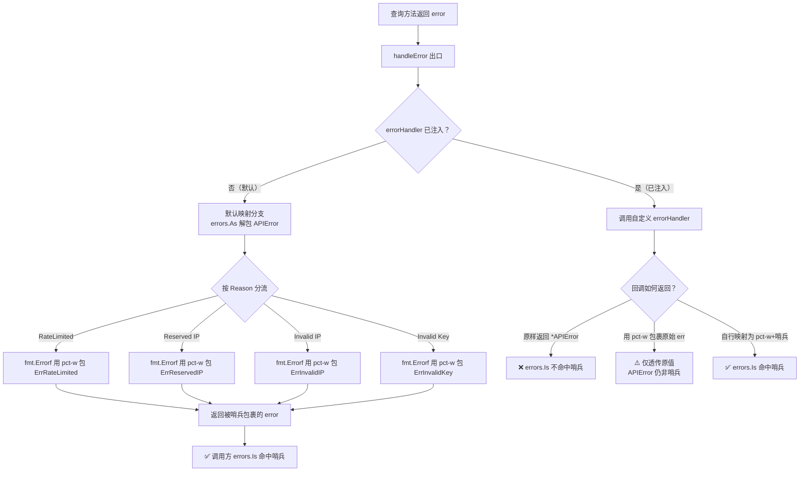

# ❓ 自定义错误处理后还能 errors.Is 吗

## 问题

我通过 [`WithErrorHandler`](../api/with-error-handler) 注入了一个自定义错误处理回调。之后我还能像默认行为那样用 `errors.Is(err, ipapi.ErrRateLimited)` 这样的哨兵匹配来判断错误类型吗？

## 简答

⚠️ 不能自动命中。设置 `errorHandler` 后，`handleError` 会**完全让位**给自定义回调，不再执行 `APIError.Reason → 哨兵` 的映射，因此 `errors.Is` 默认无法命中哨兵错误——需要你在回调内自行用 `%w` 包裹或映射。

::: danger 🚨 注入 handler 是「接管」不是「增强」
`errorHandler` 一旦设置，`handleError` 的默认 Reason→哨兵映射**整体被旁路**，不是「先做映射再调你的回调」。这意味着：默认行为下 `errors.Is(err, ErrRateLimited)` 能命中；注入后就不命中了，除非你在回调里手动复刻映射。这是一个**全有或全无**的开关，没有「只加副作用、保留映射」的中间态——想要中间态，就在你的回调里显式调用映射逻辑。
:::

## 详解

::: tip 🎨 一图抵千言
下图展示注入 `errorHandler` 后，错误流如何从「默认 Reason→哨兵映射」切换为「自定义回调」，以及调用方判别能力的得失。
:::



### 🔀 默认行为：handleError 做哨兵映射

SDK 所有查询方法的错误都经过统一出口 `handleError`。在**未注入** `errorHandler` 时，它会用 `errors.As` 解包 `*APIError`，按 `Reason` 映射到哨兵错误，并用 `fmt.Errorf("%w: %s", sentinel, detail)` 包裹：

```go
// handleError 默认分支（未设 errorHandler）
var apiErr *APIError
if errors.As(err, &apiErr) {
	switch apiErr.Reason {
	case "RateLimited":
		return fmt.Errorf("%w: %s", ErrRateLimited, apiErr.Message)
	case "Reserved IP Address":
		return fmt.Errorf("%w: %s", ErrReservedIP, apiErr.IP)
	case "Invalid IP Address":
		return fmt.Errorf("%w: %s", ErrInvalidIP, apiErr.IP)
	case "Invalid Key":
		return fmt.Errorf("%w: %s", ErrInvalidKey, apiErr.Message)
	}
}
return err
```

`%w` 包装保留了哨兵，所以调用方可以这样稳定判别：

```go
if errors.Is(err, ipapi.ErrRateLimited) {
	time.Sleep(time.Minute) // 退避重试
}
```

### 🚫 注入 handler 后：映射被旁路

一旦设置了 `errorHandler`，`handleError` 的逻辑变成：

```go
func (c *Client) handleError(err error) error {
	if c.errorHandler != nil {
		return c.errorHandler(err) // 直接返回，不再做 Reason 映射
	}
	// ... 默认映射分支被跳过
}
```

此时回调拿到的 `err` 通常是**原始的** `*APIError`（或 `ErrInvalidIP` 等参数校验错误）。如果你只是简单地记录日志后原样返回，调用方拿到的就是 `*APIError`，而不是被哨兵包裹的错误：

```go
// ❌ 反例：handler 原样返回，哨兵匹配失效
client := ipapi.NewClient(
	ipapi.WithErrorHandler(func(err error) error {
		log.Printf("ipapi error: %v", err)
		return err // 返回的是原始 *APIError，没有被哨兵包裹
	}),
)

_, err := client.GetIPInfo(ctx, "8.8.8.8", "json") // 假设触发限流
errors.Is(err, ipapi.ErrRateLimited) // ❌ false！因为没经过 Reason 映射
```

::: warning ⚠️ handler 优先级
设了 handler 后，`handleError` **不再**做 `Reason → 哨兵` 映射。若你仍想用 `errors.Is` 命中哨兵，必须在 handler 内自行处理。
:::

### ✅ 解决方案一：在 handler 内自行映射哨兵

如果你既想接管错误出口，又想保留 `errors.Is` 的可判别性，可以在回调里手动复刻 `handleError` 的映射逻辑：

```go
package main

import (
	"errors"
	"fmt"
	"log"

	"example.com/ipapi"
)

func main() {
	handler := func(err error) error {
		// 先做监控/日志等副作用
		log.Printf("[trace] ipapi error: %v", err)

		// 再自行映射哨兵，与 handleError 默认逻辑一致
		var apiErr *ipapi.APIError
		if errors.As(err, &apiErr) {
			switch apiErr.Reason {
			case "RateLimited":
				return fmt.Errorf("[trace] %w: %s", ipapi.ErrRateLimited, apiErr.Message)
			case "Reserved IP Address":
				return fmt.Errorf("[trace] %w: %s", ipapi.ErrReservedIP, apiErr.IP)
			case "Invalid IP Address":
				return fmt.Errorf("[trace] %w: %s", ipapi.ErrInvalidIP, apiErr.IP)
			case "Invalid Key":
				return fmt.Errorf("[trace] %w: %s", ipapi.ErrInvalidKey, apiErr.Message)
			}
		}
		// 非业务错误原样返回（保留原始可判别性）
		return err
	}

	client := ipapi.NewClient(ipapi.WithErrorHandler(handler))
	_, err := client.GetIPInfo(ctx, "8.8.8.8", "json")

	// ✅ 现在既带 trace，又能用哨兵命中
	if errors.Is(err, ipapi.ErrRateLimited) {
		fmt.Println("命中 ErrRateLimited，开始退避：", err)
	}
}
```

关键点：用 `fmt.Errorf("%w: ...", sentinel, ...)` 而非 `%s` 或 `%v`，`%w` 才能让 `errors.Is` 沿包装链向上匹配。

### ✅ 解决方案二：用 errors.As 取结构化细节

如果你的 handler 不做映射、原样返回 `*APIError`，调用方可以用 `errors.As` 直接读取 `Reason` 字段来判别，绕开哨兵：

```go
var apiErr *ipapi.APIError
if errors.As(err, &apiErr) {
	switch apiErr.Reason {
	case "RateLimited":
		fmt.Println("触发限流：", apiErr.Message)
	case "Invalid Key":
		fmt.Println("Key 无效：", apiErr.Message)
	}
}
```

这种方式不依赖哨兵错误，但要依赖 `Reason` 的字符串值（属于魔法字符串，需自行维护常量）。

### ✅ 解决方案三：用 %w 透传，让 errors.Is 仍可命中

如果你的 handler 只是想加 trace / 包装一层，不想改写错误语义，**务必用 `%w`** 而非 `%v`：

```go
ipapi.WithErrorHandler(func(err error) error {
	return fmt.Errorf("[trace-abc123] %w", err) // ✅ %w 保留可判别性
})
```

这样原始错误若是哨兵（如 `ErrInvalidIP` 这类参数校验错误，本就被 `handleError` 原样传入），`errors.Is(err, ipapi.ErrInvalidIP)` 仍能命中。但注意：`*APIError` 本身**不是**哨兵错误值，用 `%w` 包裹它只会让 `errors.As(err, &apiErr)` 仍能命中，而 `errors.Is(err, ErrRateLimited)` 仍然为 `false`——因为 `ErrRateLimited` 与 `*APIError` 是两个不同的错误值。

### 📋 一张表理清三种场景

| 场景 | `errors.Is(err, ErrRateLimited)` | `errors.As(err, &apiErr)` |
| --- | --- | --- |
| 不设 handler（默认映射） | ✅ 命中（被 `%w` 包裹） | ✅ 命中（`*APIError` 在链中） |
| 设 handler，原样返回 `*APIError` | ❌ 不命中 | ✅ 命中 |
| 设 handler，返回 `fmt.Errorf("%w", err)` | ❌ 不命中（`*APIError` ≠ `ErrRateLimited`） | ✅ 命中 |
| 设 handler，自行映射为 `fmt.Errorf("%w", ErrRateLimited)` | ✅ 命中 | ❌ 不命中（除非也保留 `*APIError`） |

> 💡 简单记忆：**`%w` 只透传它包裹的那个错误值**。想让 `errors.Is` 命中 `ErrRateLimited`，就必须在链中真正放入 `ErrRateLimited` 这个哨兵值——这正是默认 `handleError` 映射分支做的事。

::: details 🎯 三秒决策口诀
面对 `WithErrorHandler` 后「能不能 `errors.Is`」的疑问，按你的真实意图选一条：

- **只想加日志/trace，不改语义** → 回调里 `return fmt.Errorf("[trace] %w", err)`，但只对哨兵错误（如 `ErrInvalidIP`）有效，对 `*APIError` 无效。
- **既要 trace 又要保留哨兵判别** → 回调里复刻 `handleError` 的 `switch apiErr.Reason` 映射，每个分支用 `%w` 包对应哨兵。
- **不在意哨兵，只想看结构化细节** → 回调原样返回，调用方改用 `errors.As(err, &apiErr)` 读 `Reason` 字段。
- **完全替换错误体系** → 回调里返回你自己的错误类型，调用方按你的体系判别，彻底脱离 SDK 哨兵。
:::

## 相关

- 🧭 [错误处理概念](../guide/error-concept) — 哨兵错误体系与 `errors.Is` / `errors.As` 基础用法
- 📖 [错误类型参考](../api/errors) — 10 个哨兵错误与 `handleError` 默认映射逻辑
- 🔧 [WithErrorHandler](../api/with-error-handler) — 注入自定义错误回调的选项签名与示例
- 🛡 [`handleError` 内部参考](../reference/internal/handle-error) — 统一错误出口的两段式分流与源码解析
- 🚨 [哨兵错误速查](../reference/errors/err-rate-limited) — 各 `ErrXxx` 错误的触发场景
- 🧪 [自定义错误处理示例](../cookbook/ — 在真实场景中接管错误出口的完整用法
