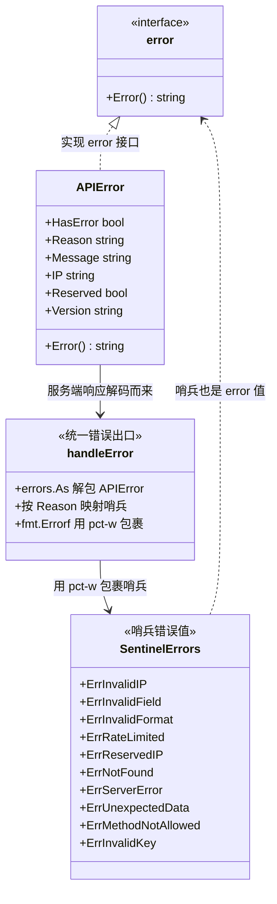

# ❓ ErrXxx 和 APIError 是什么关系

## 问题

SDK 里既有 `ErrInvalidIP`、`ErrRateLimited` 这类 `ErrXxx` 哨兵错误，又有一个 `APIError` 结构体。它们到底是什么关系？我该用 `errors.Is` 还是 `errors.As`？拿到一个 `error` 时到底怎么判别？

## 简答

`ErrXxx` 是**哨兵值**，用于 `errors.Is` 做类型无关的分支判断；`APIError` 是**结构化错误**，携带 `Reason` / `Message` / `IP` 等细节，用 `errors.As` 取出。

## 详解

::: tip 🎨 一图抵千言
下图用类图描绘 `error` 接口、`APIError` 结构体与 10 个哨兵错误值之间的关系，重点展示 `handleError` 的映射桥接作用。
:::



### 🧱 两套并存的错误模型

SDK 的错误体系由两部分组成，定义在不同文件里：

- **哨兵错误值**（`ErrXxx`）：用 `errors.New` 创建的包级变量，代表“发生了哪一类错误”，是稳定的**判别锚点**。
- **结构化错误**（`APIError`）：实现了 `error` 接口的结构体，代表“服务端返回了什么”，携带可读细节。

二者并非二选一，而是**串联**的：服务端的 `APIError` 会在 `handleError` 中被映射并包裹到对应的哨兵错误上，调用方因此既能 `errors.Is` 分流，又能 `errors.As` 取细节。

### 📋 哨兵错误一览

定义在 `client.go`：

```go
var (
    ErrInvalidIP        = errors.New("invalid IP address")
    ErrInvalidField     = errors.New("invalid field name")
    ErrInvalidFormat    = errors.New("invalid response format")
    ErrRateLimited      = errors.New("API rate limit exceeded")
    ErrReservedIP       = errors.New("reserved IP address")
    ErrNotFound         = errors.New("resource not found")
    ErrServerError      = errors.New("server error")
    ErrUnexpectedData   = errors.New("unexpected response data")
    ErrMethodNotAllowed = errors.New("method not allowed")
    ErrInvalidKey       = errors.New("invalid API key")
)
```

它们都是**值错误**（sentinel），不需要关心底层类型，只要“是不是这个值”即可。

### 🗃 APIError 携带的细节

`APIError` 定义在 `models.go`，直接实现 `error` 接口：

```go
type APIError struct {
    HasError bool   `json:"error"`
    Reason   string `json:"reason"`   // 如 "RateLimited"、"Reserved IP Address"
    Message  string `json:"message"`  // 人类可读说明
    IP       string `json:"ip"`       // 触发错误的 IP
    Reserved bool   `json:"reserved"` // 是否保留地址
    Version  string `json:"version"`
}

func (e *APIError) Error() string {
    if e.Reserved {
        return fmt.Sprintf("ipapi error: %s (reason: %s, ip: %s, reserved: %v)",
            e.Message, e.Reason, e.IP, e.Reserved)
    }
    return fmt.Sprintf("ipapi error: %s (reason: %s)", e.Message, e.Reason)
}
```

当 HTTP 状态码 ≥ 400 且响应体能解码为 `{"error": true, ...}` 时，`doRequest` 直接返回这个 `*APIError` 实例。

### 🔗 它们怎么串起来：handleError

所有查询方法的错误都经过统一出口 `handleError`。它用 `errors.As` 解包 `*APIError`，按 `Reason` 映射到哨兵，再用 `%w` 包裹——既保留哨兵身份，又保留细节文本：

```go
var apiErr *APIError
if errors.As(err, &apiErr) {
    switch apiErr.Reason {
    case "RateLimited":
        return fmt.Errorf("%w: %s", ErrRateLimited, apiErr.Message)
    case "Reserved IP Address":
        return fmt.Errorf("%w: %s", ErrReservedIP, apiErr.IP)
    case "Invalid IP Address":
        return fmt.Errorf("%w: %s", ErrInvalidIP, apiErr.IP)
    case "Invalid Key":
        return fmt.Errorf("%w: %s", ErrInvalidKey, apiErr.Message)
    }
}
return err
```

关键点：`fmt.Errorf("%w: ...", sentinel, detail)` 中的 `%w` 让 `errors.Is` 能穿透包裹层命中哨兵。这就是“哨兵用于 `errors.Is`，`APIError` 携带细节用 `errors.As`”的实现根源。

### 🧪 推荐用法：先 Is 后 As

调用方拿到 `error` 后，**先用 `errors.Is` 做控制流分支，再用 `errors.As` 取细节**：

```go
info, err := client.GetIPInfo(ctx, "8.8.8.8", "json")
if err != nil {
    // 1️⃣ 控制流：用 errors.Is 命中哨兵
    switch {
    case errors.Is(err, ipapi.ErrRateLimited):
        log.Printf("限流，稍后重试: %v", err)
        time.Sleep(time.Minute)
        return // 重试逻辑
    case errors.Is(err, ipapi.ErrReservedIP):
        log.Printf("保留地址，无地理信息: %v", err)
        return
    case errors.Is(err, ipapi.ErrInvalidKey):
        log.Printf("API Key 无效，检查配置: %v", err)
        return
    }

    // 2️⃣ 细节：用 errors.As 取出 APIError
    var apiErr *ipapi.APIError
    if errors.As(err, &apiErr) {
        log.Printf("reason=%s message=%s ip=%s reserved=%v",
            apiErr.Reason, apiErr.Message, apiErr.IP, apiErr.Reserved)
    }
    return
}
```

::: tip 💡 为什么顺序是先 Is 后 As
`errors.Is` 回答“这是哪一类错误”，决定**走哪个分支**；`errors.As` 回答“错误里带了什么数据”，用于**日志、埋点、给用户看**。先分类、再取细节，逻辑最清晰，也避免在未命中时做空转的类型断言。
:::

### ⚠️ 一个常见误区：用 == 比较错误

不要用 `==` 比较错误：

```go
// ❌ 错误：handleError 用 %w 包裹过，err != ErrRateLimited
if err == ipapi.ErrRateLimited {
    // 永远进不来
}
```

因为 `handleError` 返回的是 `fmt.Errorf("%w: %s", ErrRateLimited, msg)`，**外层是一个 `*fmt.wrapError`，不是哨兵本身**。`==` 比较的是指针，必然不等。正确的做法是 `errors.Is`，它会沿着 `Unwrap` 链逐层解包，直到找到哨兵值：

```go
// ✅ 正确：errors.Is 会沿 Unwrap 链命中
if errors.Is(err, ipapi.ErrRateLimited) {
    // 命中，即使被 %w 包了一层
}
```

::: details 🔬 errors.Is 是如何沿 Unwrap 链穿透的？
`fmt.Errorf("%w", sentinel, ...)` 会返回一个内部类型 `*fmt.wrapError`，它同时持有 `err`（哨兵）和 `msg`（细节字符串），并实现了 `Unwrap() error` 方法返回内层的哨兵。

`errors.Is(err, target)` 的算法大致是：

1. 若 `err == target`，直接命中（指针相等）。
2. 否则若 `err` 实现了 `Unwrap`，调用 `Unwrap()` 拿到内层错误，递归回到第 1 步。
3. 链到底仍未命中则返回 `false`。

所以即使被 `%w` 包了一层或多层，只要链上某个节点等于哨兵值，`errors.Is` 就能命中。而 `==` 只做第 1 步的指针比较，必然失败。这也是 Go 错误处理「永远用 `errors.Is` 而非 `==` 比较哨兵」的根本原因。
:::

### 🧩 一张对照表

| 维度 | `ErrXxx` 哨兵 | `APIError` 结构体 |
|------|---------------|-------------------|
| 本质 | `errors.New` 的值 | 实现了 `error` 的结构体 |
| 用途 | 判别“哪一类错误” | 携带“具体细节” |
| 判别方式 | `errors.Is(err, sentinel)` | `errors.As(err, &apiErr)` |
| 来源 | 本地定义的包级变量 | 服务端 JSON 响应解码而来 |
| 字段 | 无（仅字符串） | `Reason` / `Message` / `IP` / `Reserved` / `Version` |
| 是否可重试 | 配合 `IsRetryableError` 判定 | 不直接判定，需先映射到哨兵 |

::: warning ⚠️ 两者不互斥
经过 `handleError` 后，**同一个错误既能在 `errors.Is` 命中哨兵，也能在 `errors.As` 取出 `APIError`**——因为哨兵是用 `%w` 包在 `APIError` 的外层（或反之被映射）。所以“用 Is 还是用 As”不是二选一，而是看你要**分流**还是要**细节**。
:::

## 相关

- 🛡 [错误处理概念](../guide/error-concept) — 哨兵体系与 `APIError` 的整体设计
- 🛡 [错误类型 API](../api/errors) — `handleError` / `IsRetryableError` / `WrapError`
- 🗃 [数据模型 `APIError`](../api/models) — `APIError` 结构体字段与 `Error()` 实现
- 📚 [哨兵错误参考](../reference/ — 每个 `ErrXxx` 的定义与触发条件
- 🔄 [`IsRetryableError`](../api/is-retryable) — 哪些哨兵错误值得重试
- ❓ [自定义错误处理器](./custom-error-handler) — 注入 handler 后 `errors.Is` 还能用吗
