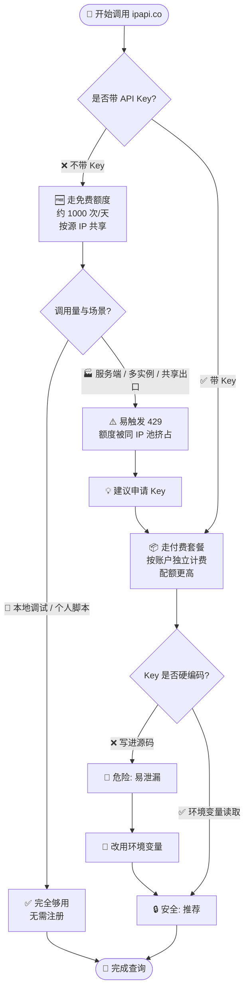

# ❓ 免费额度是多少

## 问题

ipapi.co-skills 调用 ipapi.co 时，免费额度是多少？不申请 API Key 能用吗？

## 简答

未认证（不带 API Key）约 **1000 次/天**，按请求源 IP 共享计算；生产环境强烈建议申请 API Key 以获得更高、更稳定的配额。

::: tip 🎨 一图抵千言
下面这张决策图帮你快速判断当前场景该走免费额度还是申请 Key。
:::



## 详解

ipapi.co 对未携带 API Key 的请求提供免费层（free tier），额度大致为 **每天约 1000 次请求**。几个要点：

- 🧮 **按源 IP 共享**：免费额度绑定在调用方的出口 IP 上，而不是某个账户。同一公网 IP 上发起的所有未认证请求会**共用**这 1000 次/天，容易在多人/多服务共享出口时被迅速打满。
- 🌐 **无需注册即可使用**：申请 Key 不是必要条件，SDK 不传 `WithAPIKey` 也能正常发起查询。
- 📈 **认证后配额更高**：在 [ipapi.co](https://ipapi.co) 注册并申请 API Key 后，配额随套餐提升，且按账户独立计费，不再与他人共享 IP 池。
- ⚡ **超限返回 429**：超额后服务端返回 `429 Too Many Requests`，SDK 会映射为 `ipapi.ErrRateLimited`，属于可重试错误。
- 🧪 **本地开发够用**：日常调试、示例运行一般远低于 1000 次/天，无需 Key 即可跑通示例。

### 📊 免费 vs 付费对照

| 维度 | 🆓 未认证（免费层） | 📦 带 API Key（付费套餐） |
| --- | --- | --- |
| 额度 | 约 1000 次/天 | 随套餐提升，更高 |
| 计费维度 | 按调用方出口 IP 共享 | 按账户独立计费 |
| 注册要求 | 无需注册 | 需在 ipapi.co 注册 |
| 稳定性 | 易被共享 IP 池挤占 | 独立配额，互不影响 |
| 超额表现 | 返回 429 → `ErrRateLimited` | 依套餐上限，超额同样 429 |
| 适用场景 | 调试 / 示例 / 个人脚本 | 生产 / 高并发 / 多实例 |

::: details 📖 免费额度为什么是「按源 IP 共享」？
ipapi.co 的免费层没有账户概念，无法按"谁"计费，只能按请求来源的公网 IP 限额。这意味着：

- 同一台机器上的多个进程共用同一额度。
- 同一 NAT / 容器集群出口的所有匿名请求互相挤占。
- 云厂商共享出口 IP 时，你可能被"邻居"拖累。

带 Key 后改为按账户计费，从根上避开这个问题。
:::

### 未认证调用（走免费额度）

```go
package main

import (
	"context"
	"fmt"
	"log"

	"github.com/cyberspacesec/ipapi.co-skills/pkg/ipapi"
)

func main() {
	// 不传 WithAPIKey，走免费额度（约 1000 次/天，按源 IP 共享）
	client := ipapi.NewClient()

	info, err := client.GetIPInfo(context.Background(), "8.8.8.8")
	if err != nil {
		log.Fatalf("查询失败: %v", err)
	}

	fmt.Printf("IP: %s\n国家: %s (%s)\n", info.IP, info.CountryName, info.CountryCode)
}
```

### 生产环境：申请 Key 并从环境变量读取（推荐）

```go
package main

import (
	"context"
	"fmt"
	"log"
	"os"

	"github.com/cyberspacesec/ipapi.co-skills/pkg/ipapi"
)

func main() {
	key := os.Getenv("IPAPI_KEY")
	if key == "" {
		log.Fatal("请先设置 IPAPI_KEY 环境变量")
	}

	// 带 API Key：配额更高、按账户独立计费、不与他人共享 IP 池
	client := ipapi.NewClient(
		ipapi.WithAPIKey(key),
	)

	info, err := client.GetIPInfo(context.Background(), "8.8.8.8")
	if err != nil {
		log.Fatalf("查询失败: %v", err)
	}

	fmt.Printf("IP: %s\n国家: %s (%s)\n", info.IP, info.CountryName, info.CountryCode)
}
```

::: tip 💡 免费额度够用吗？
- 个人开发 / 调试示例 → ✅ 够用，无需 Key。
- 服务端高频查询 / 多实例部署 / 共享出口 IP → ❌ 建议 Key，否则极易触发 429。
:::

::: warning ⚠️ 额度仅供参考
具体免费额度与限额可能随 ipapi.co 官方策略调整而变化，请以 [ipapi.co](https://ipapi.co) 官网公布的最新套餐为准。
:::

## 相关

- 🚀 [快速开始](../guide/getting-started) — 无需 Key 即可跑通第一次查询
- 🔒 [认证机制](../guide/auth-concept) — 为什么要申请 Key、两种认证方式对比
- 🔑 [`WithAPIKey`](../api/with-api-key) — 设置 API Key（Bearer Header 模式）
- 🔗 [`WithAPIKeyQuery`](../api/with-api-key-query) — 改用 query 参数模式带 Key（JSONP 场景）
- ⚡ [`ErrRateLimited`](../reference/errors/err-rate-limited) — 超额后服务端返回 429 时的错误映射与重试
- 📖 [字段参考](../reference/ — 一次请求能拿回哪些字段
