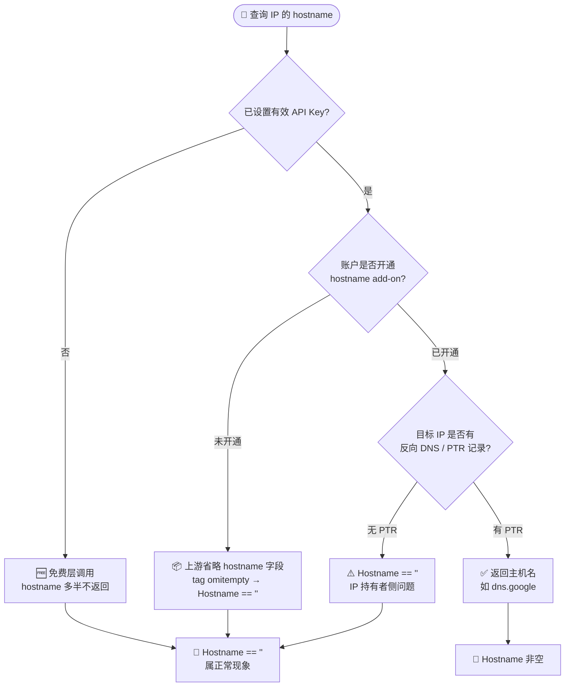

# ❓ hostname 为什么空

## 问题

调用 `GetIPInfo` / `GetField` 查询某个 IP 时，返回的 `IPInfo.Hostname` 是空字符串，或者单字段查询 `hostname` 得到空结果——这是为什么？是 SDK 的 bug 吗？

## 简答

`hostname` 是 ipapi.co 的 **可选付费 add-on**，需要在账户后台单独开通才会返回；未开通时该字段为空，属正常现象，不是 SDK bug。

::: tip 🎨 一图抵千言
下面的流程图展示了 `hostname` 字段从"是否开通 add-on"到"是否返回非空值"的决策链，覆盖了账户侧与 IP 侧两层原因。
:::



## 详解

`hostname`（反向 DNS / PTR 主机名）在 ipapi.co 并**不属于免费/默认字段集**，而是作为付费 add-on 提供。这意味着：

- 🔐 **需在 ipapi.co 账户后台开通** add-on 后，`hostname` 才会出现在响应里；未开通时，上游接口会**省略**该字段（这正是 Go 结构体 tag 上 `omitempty` 的语义来源）。
- 💰 **与 API Key 套餐绑定**：即使申请了 API Key，若当前套餐未包含 hostname add-on，字段同样为空。
- 🧩 **同属 ASN 类别**：`asn`、`org` 默认就有数据，唯独 `hostname` 可能空——因为前者在免费层就返回，后者需要额外开通。
- ✅ **空值是合法返回**：SDK 拿不到值是因为上游就没下发，并非解析失败，也不会报错。

::: info 📊 ASN 类字段可用性对照
| 字段 | JSON key | 免费层 | 需 add-on | 类型 | 空值零值 |
| --- | --- | --- | --- | --- | --- |
| `asn` | `asn` | ✅ 有数据 | ❌ | `string` | `""` |
| `org` | `org` | ✅ 有数据 | ❌ | `string` | `""` |
| `hostname` | `hostname,omitempty` | ❌ 通常为空 | ✅ 需开通 | `string` | `""` |
:::

### 字段定义回顾

```go
// IPInfo 中的字段定义
type IPInfo struct {
    // ...
    ASN      string `json:"asn"`
    Org      string `json:"org"`
    Hostname string `json:"hostname,omitempty"` // ← 付费 add-on，可能不返回
    // ...
}
```

`Hostname` 是普通 `string`（非指针），未返回时为空字符串 `""`，可直接读取、无需判空。

### 未开通时：字段为空（正常）

```go
package main

import (
	"context"
	"fmt"
	"log"

	"github.com/cyberspacesec/ipapi.co-skills/pkg/ipapi"
)

func main() {
	client := ipapi.NewClient(
		ipapi.WithAPIKey("YOUR_KEY"), // 即便带 Key，未开通 add-on 仍为空
	)

	info, err := client.GetIPInfo(context.Background(), "8.8.8.8")
	if err != nil {
		log.Fatalf("查询失败: %v", err)
	}

	// 未开通 hostname add-on 时：info.Hostname == ""
	fmt.Printf("ASN=%s Org=%s Hostname=%q\n",
		info.ASN, info.Org, info.Hostname)
	// 输出类似: ASN=AS15169 Org="Google LLC" Hostname=""
}
```

### 判断是否已开通

```go
info, err := client.GetIPInfo(ctx, "8.8.8.8")
if err != nil {
	log.Fatal(err)
}

if info.Hostname == "" {
	fmt.Println("⚠️ hostname 为空：当前账户/套餐可能未开通 hostname add-on")
	fmt.Println("   请到 ipapi.co 后台开启该 add-on 后重试")
} else {
	fmt.Println("✅ hostname:", info.Hostname)
}
```

### 单字段查询同理为空

```go
// 即便只查单字段，未开通 add-on 也拿不到值
host, err := client.GetField(ctx, "8.8.8.8", "hostname")
if err != nil {
	log.Fatal(err)
}
fmt.Printf("hostname 单字段结果: %q\n", host) // 未开通时为 ""
```

::: tip 💡 怎么解决？
1. 登录 [ipapi.co](https://ipapi.co) 控制台。
2. 在账户 / 套餐设置中开通 **hostname** add-on（部分套餐需付费升级）。
3. 开通后重新调用，`info.Hostname` 即可正常返回，如 `8.8.8.8 → dns.google`。
:::

::: warning ⚠️ 不是所有 IP 都有 PTR
即便已开通 add-on，**目标 IP 本身未配置反向 DNS（PTR 记录）时**，`hostname` 也会为空——这是 IP 持有者侧的问题，与账户无关。
:::

::: details 🔍 hostname 为空的两大根因排查
| 根因层级 | 触发条件 | 现象 | 解决方向 |
| --- | --- | --- | --- |
| 账户侧 | 未开通 hostname add-on | 所有 IP 查询 `Hostname` 都为空 | 到 ipapi.co 后台开通/升级套餐 |
| 套餐侧 | 有 Key 但套餐不含 add-on | 同上 | 升级到含 add-on 的套餐 |
| IP 侧 | 已开通但目标 IP 无 PTR | 单个/部分 IP 为空 | 无需处理，属 IP 持有者未配反向 DNS |
| 调用侧 | 查询了不支持 hostname 的格式 | 字段缺失 | 确认使用 `json`/`jsonp` 等含全字段格式 |
:::


## 相关

- 🖧 [`hostname` 字段详解](../reference/fields/hostname) — 类型说明、`omitempty` 语义与访问方式
- 📡 [ASN 字段](../api/field-asn) — `asn`/`org`/`hostname` 同属 ASN 类别，对比默认可用与付费差异
- 🔑 [`WithAPIKey`](../api/with-api-key) — 设置 API Key（开通 add-on 后需配合 Key 调用）
- 🚀 [快速开始](../guide/getting-started) — 首次查询的基本流程
- 📖 [字段概念](../guide/field-concept) — 字段分类与可用性说明
- 📋 [字段总览](../api/fields) — `IPInfo` 全部 28 个字段一览
- 🔎 [`GetField`](../api/get-field) — 单字段查询接口（含 `hostname`）
