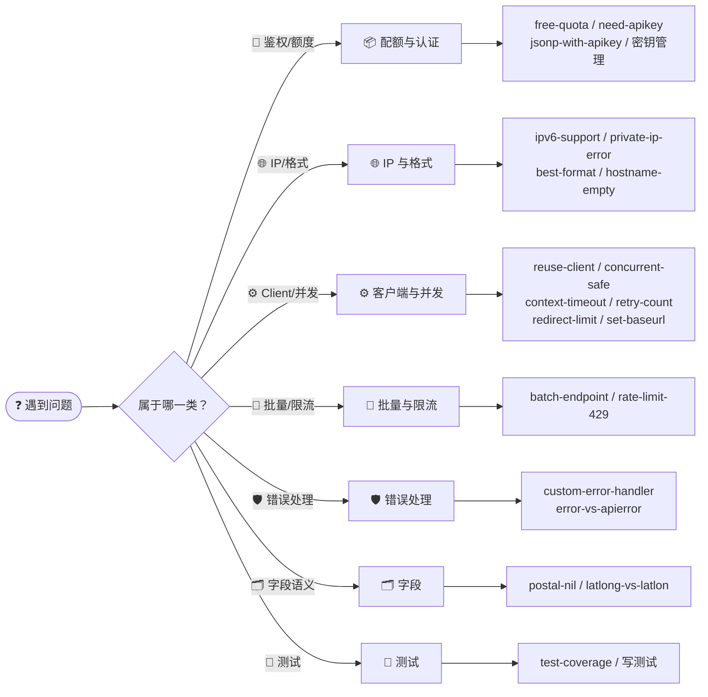
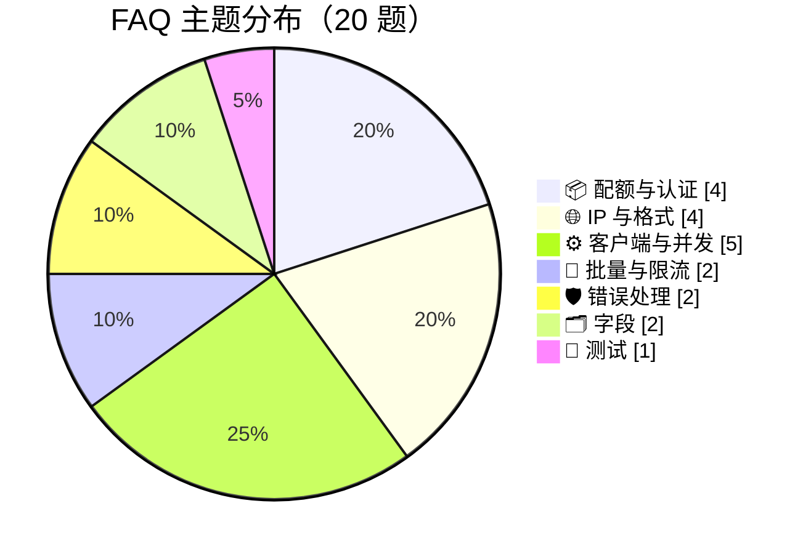

# ❓ 常见问题 FAQ

> 使用 ipapi.co-skills 时的常见疑问。

::: tip 🎨 一图抵千言
按问题类型快速定位你要的答案。
:::

::: info 📊 FAQ 主题分布
共收录 20 个高频问题，按主题占比一览——客户端并发与鉴权是问得最多的两类。
:::

## 📦 配额与认证

- [免费额度是多少？](./free-quota)
- [必须用 API Key 吗？](./need-apikey)
- [JSONP 怎么带 Key？](./jsonp-with-apikey)
- [密钥如何管理？](../best-practices/secret-management)

## 🌐 IP 与格式

- [支持 IPv6 吗？](./ipv6-support)
- [查 192.168 报错？](./private-ip-error)
- [用哪种格式？](./best-format)
- [hostname 为什么空？](./hostname-empty)

## ⚙️ 客户端与并发

- [能复用 Client 吗？](./reuse-client)
- [并发安全吗？](./concurrent-safe)
- [超时怎么设？](./context-timeout)
- [重试几次？](./retry-count)
- [跳转限制？](./redirect-limit)
- [能改基地址吗？](./set-baseurl)

## 🔄 批量与限流

- [有批量端点吗？](./batch-endpoint)
- [触发 429 怎么办？](./rate-limit-429)

## 🛡 错误处理

- [自定义错误处理后还能 errors.Is 吗？](./custom-error-handler)
- [ErrXxx 和 APIError 关系？](./error-vs-apierror)

## 🗂 字段

- [postal 字段类型？](./postal-nil)
- [LatLong 和 Latitude 区别？](./latlong-vs-latlon)

## 🧪 测试

- [测试覆盖如何？](./test-coverage)
- [怎么写测试？](../best-practices/testing)

## 🚀 下一步

::: info 🧭 没找到答案？
若以上 FAQ 都没覆盖你的问题，可以：
- 📖 翻 [指南](../guide/intro) 系统学习概念
- 🍳 看 [Cookbook](../cookbook/) 找场景化示例
- 🐛 在 [GitHub Issues](https://github.com/cyberspacesec/ipapi.co-skills/issues) 提问
:::

::: details 📋 全部 FAQ 速查清单
按分类汇总，方便 Ctrl+F 检索：

**📦 配额与认证**：[免费额度](./free-quota) · [必须用 Key](./need-apikey) · [JSONP 带 Key](./jsonp-with-apikey) · [密钥管理](../best-practices/secret-management)

**🌐 IP 与格式**：[IPv6 支持](./ipv6-support) · [私有 IP 报错](./private-ip-error) · [格式选择](./best-format) · [hostname 为空](./hostname-empty)

**⚙️ 客户端与并发**：[复用 Client](./reuse-client) · [并发安全](./concurrent-safe) · [超时设置](./context-timeout) · [重试次数](./retry-count) · [跳转限制](./redirect-limit) · [改基地址](./set-baseurl)

**🔄 批量与限流**：[批量端点](./batch-endpoint) · [429 处理](./rate-limit-429)

**🛡 错误处理**：[自定义错误处理器](./custom-error-handler) · [ErrXxx 与 APIError](./error-vs-apierror)

**🗂 字段**：[postal 类型](./postal-nil) · [LatLong 与 Latitude](./latlong-vs-latlon)

**🧪 测试**：[测试覆盖](./test-coverage) · [怎么写测试](../best-practices/testing)
:::

- 📖 看 [指南](../guide/intro)
- 🍳 看 [Cookbook](../cookbook/
