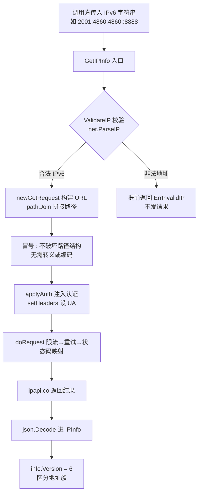

# ❓ 支持 IPv6 吗

## 问题

ipapi.co-skills Go SDK 支持查询 IPv6 地址吗？

## 简答

完全支持 —— `GetIPInfo` 接受任意合法的 IPv6 字符串，无需额外配置。

## 详解

::: tip 🎨 一图抵千言
下图展示了一个 IPv6 字符串从进入 `GetIPInfo` 到发出 HTTP 请求的完整路径，重点突出「冒号无需转义」这一关键事实。
:::



🌐 IPv6 是 128 位地址，形如 `2001:4860:4860::8888`，旨在解决 IPv4 枯竭问题。ipapi.co-skills 对 IPv4 与 IPv6 一视同仁，所有查询接口（`GetIPInfo`、`GetIPInfoRaw`、`GetField`）都接受 IPv6 字符串。

### ✅ 基本查询

直接把 IPv6 字符串传给 `GetIPInfo` 即可，返回结构与 IPv4 完全一致：

```go
package main

import (
	"context"
	"fmt"
	"log"

	"github.com/cyberspacesec/ipapi.co-skills/pkg/ipapi"
)

func main() {
	client := ipapi.NewClient()
	ctx := context.Background()

	// 查询 Google Public DNS 的 IPv6 地址
	info, err := client.GetIPInfo(ctx, "2001:4860:4860::8888", "json")
	if err != nil {
		log.Fatal(err)
	}

	fmt.Printf("IP        : %s\n", info.IP)
	fmt.Printf("Version   : %s\n", info.Version) // "6"
	fmt.Printf("City      : %s\n", info.City)
	fmt.Printf("Country   : %s (%s)\n", info.CountryName, info.CountryCode)
	fmt.Printf("Org       : %s\n", info.Org)
	fmt.Printf("ASN       : %s\n", info.ASN)
}
```

> 💡 `info.Version` 字段会返回 `"6"`（IPv6）或 `"4"`（IPv4），可在运行时区分地址族。

### 🔍 IPv6 校验

`ValidateIP` 内部调用标准库 `net.ParseIP`，同时识别 IPv4 与 IPv6：

```go
err := ipapi.ValidateIP("2001:4860:4860::8888") // nil，合法 IPv6
err  = ipapi.ValidateIP("2606:4700:4700::1111") // nil，合法 IPv6
err  = ipapi.ValidateIP("::1")                   // nil，合法（但为保留地址，查询会返回 ErrReservedIP）
err  = ipapi.ValidateIP("not::an::ipv6")         // ErrInvalidIP
```

::: warning ⚠️ 合法 ≠ 可查询
`ValidateIP` 只判断地址是否符合 IPv6 语法规范，不区分保留地址。`::1`（回环）、`fe80::`（链路本地）等地址虽语法合法，但 ipapi.co 会返回 `ErrReservedIP`——它们没有真实的地理归属信息。
:::

### 🧪 常见 IPv6 示例

| IP | 说明 |
|----|------|
| `2001:4860:4860::8888` | Google Public DNS (IPv6) |
| `2606:4700:4700::1111` | Cloudflare DNS (IPv6) |
| `::1` | 本地回环（保留地址，查询返回 `ErrReservedIP`） |

### 📡 原理

URL 构建由内部的 `newGetRequest` 用 `path.Join` 处理，IPv6 的冒号 `:` 不会破坏路径结构，因此无需对 IPv6 做任何转义或特殊处理即可直接拼入请求路径。`GetIPInfo` 在调用前会先做 `ValidateIP` 校验，非法地址会提前返回 `ErrInvalidIP`，不会发出无效请求。

::: details 🔬 为什么 IPv6 冒号不需要 URL 编码？
IPv6 地址里的 `:` 出现在 URL 的 **path 段**（`https://ipapi.co/{ip}/{format}/`），而非 host 或 query 段。根据 RFC 3986，path 段允许出现 `:` 字符而不需 percent-encode。`newGetRequest` 用 `path.Join` 拼接，会原样保留冒号，因此 `2001:4860:4860::8888` 直接拼成 `https://ipapi.co/2001:4860:4860::8888/json/` 即可被服务端正确解析。

对比之下，若把 IPv6 放在 URL 的 **host 段**（如 `https://[2001:db8::1]:8080/`），则需要用方括号 `[]` 包裹——但本 SDK 从不把查询 IP 放进 host，所以无需关心此规则。
:::

## 相关

- 📖 [IPv6 查询指南](../guide/ipv6) —— IPv6 查询的完整说明与示例
- 📖 [IPv4 查询指南](../guide/ipv4) —— IPv4 查询对照
- 📖 [快速开始](../guide/getting-started) —— 客户端初始化与首次查询
- 📖 [保留地址](../guide/reserved-ip) —— `::1` 等保留地址的返回行为
- 🔌 [`GetIPInfo` API](../api/get-ip-info) —— 接口签名与参数
- 🔌 [`ValidateIP` API](../api/validate-ip) —— IP 合法性校验
- 🔌 [`IPInfo` 模型](../api/models) —— 返回结构定义（含 `Version` 字段）
- 📘 [`ErrInvalidIP` 错误](../reference/errors/err-invalid-ip)
- 📘 [`ErrReservedIP` 错误](../reference/errors/err-reserved-ip)
- 📘 [`version` 字段](../reference/fields/version) —— 区分 IPv4 / IPv6
