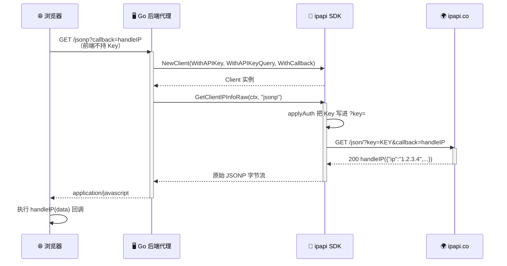

# ❓ JSONP 怎么带 Key

## 问题

在浏览器里用 `<script>` 标签发起 JSONP 请求时，无法设置自定义 HTTP Header，这种场景下怎么把 API Key 传给 ipapi.co？

## 简答

用 `WithAPIKeyQuery()`，把 Key 以 `?key=` 查询参数发送，绕开 `<script>` 无法设 Header 的限制。

::: tip 🎨 一图抵千言
下面的时序图展示了 JSONP + APIKey 共存的完整请求链路：浏览器 `<script>` → 后端代理 → ipapi.co（Key 走 query，Callback 也走 query）。
:::



## 详解

JSONP（JSON with Padding）依赖 `<script src="...">` 标签加载数据，而浏览器原生的 `<script>` 标签**只能发起 GET，且无法附加自定义请求头**。这意味着 SDK 默认的 `Authorization: Bearer <key>` Header 模式在 JSONP 场景下根本无法送达服务端，Key 会丢失，请求会被当成未认证调用，受免费额度限制。

ipapi.co-skills 提供了 `WithAPIKeyQuery()` 选项，它会把 `APIKeyMode` 从默认的 `APIKeyHeader` 切换为 `APIKeyQuery`，让内部 `applyAuth` 把 Key 写进 URL 查询参数 `?key=<key>`，从而与 `<script>` 标签的请求方式兼容。

### 两种认证模式对照

| 维度 | `APIKeyHeader`（默认） | `APIKeyQuery` |
| --- | --- | --- |
| 传输位置 | `Authorization: Bearer <key>` | `?key=<key>` URL 查询参数 |
| `<script>` 兼容 | ❌ 无法设置 Header | ✅ 天然支持 |
| Key 暴露面 | Header，相对隐蔽 | URL，易进日志/历史 |
| 设置方式 | `WithAPIKey()` 即默认 | `WithAPIKey()` + `WithAPIKeyQuery()` |
| 适用场景 | 后端直连、fetch+CORS | JSONP、受限前端直连 |

### 为什么 Header 模式不奏效

SDK 默认行为（`applyAuth` 内部）：

```go
// 默认 APIKeyHeader 模式：Key 走 Header
req.Header.Set("Authorization", "Bearer "+c.APIKey)
```

浏览器 `<script>` 标签无法设置 `Authorization` 头，所以这条 Header 永远不会被发出。服务端收不到 Key，请求按未认证处理。

切换为 query 模式后：

```go
// APIKeyQuery 模式：Key 走 URL，<script> 能带出去
q := req.URL.Query()
q.Set("key", c.APIKey)
req.URL.RawQuery = q.Encode()
```

### 完整示例：Go 后端代理 JSONP 并带 Key

推荐做法是 **后端持有 Key、前端只调自家接口**，避免 Key 暴露到浏览器：

```go
package main

import (
	"net/http"
	"os"

	"github.com/cyberspacesec/ipapi.co-skills/pkg/ipapi"
)

func jsonpHandler(w http.ResponseWriter, r *http.Request) {
	// 前端通过 ?callback=xxx 指定回调名
	callback := r.URL.Query().Get("callback")
	if callback == "" {
		callback = "handleIP"
	}

	// 后端持有 Key，并用 WithAPIKeyQuery 让其走 ?key= 参数，
	// 这样 ipapi.co 收到的 JSONP 请求本身就带上了认证
	client := ipapi.NewClient(
		ipapi.WithAPIKey(os.Getenv("IPAPI_KEY")),
		ipapi.WithAPIKeyQuery(), // 🔑 关键：Key 走 query，适配 <script>
		ipapi.WithCallback(callback),
	)

	data, err := client.GetClientIPInfoRaw(r.Context(), string(ipapi.FormatJSONP))
	if err != nil {
		http.Error(w, err.Error(), http.StatusInternalServerError)
		return
	}

	w.Header().Set("Content-Type", "application/javascript")
	w.Write(data)
}

func main() {
	http.HandleFunc("/jsonp", jsonpHandler)
	http.ListenAndServe(":8080", nil)
}
```

前端页面直接用 `<script>` 调用自家后端：

```html
<script>
function handleIP(data) {
  console.log("IP:", data.ip, "城市:", data.city);
}
</script>
<!-- 后端把 Key 拼进对 ipapi.co 的请求，前端不接触 Key -->
<script src="http://localhost:8080/jsonp?callback=handleIP"></script>
```

### 配合 `WithCallback`

JSONP 还需要回调函数名，由 `WithCallback` 设置，内部同样以 `?callback=<name>` 查询参数发出。两者可同时使用：

::: details 🔧 最终 URL 拼接过程
`applyAuth` 与 `newGetRequest` 共同把 Key 和 Callback 拼进同一个查询串，最终 URL 形如：`https://ipapi.co/8.8.8.8/jsonp?key=<key>&callback=cb`。
:::

```go
client := ipapi.NewClient(
  ipapi.WithAPIKey(os.Getenv("IPAPI_KEY")),
  ipapi.WithAPIKeyQuery(),  // ?key=<key>
  ipapi.WithCallback("cb"), // ?callback=cb
)
data, _ := client.GetIPInfoRaw(ctx, "8.8.8.8", string(ipapi.FormatJSONP))
// 最终 URL 形如: https://ipapi.co/8.8.8.8/jsonp?key=<key>&callback=cb
fmt.Println(string(data))
// 输出: cb({"ip":"8.8.8.8",...})
```

### ⚠️ 安全提示

::: danger 🔑 Query 模式 Key 会出现在 URL 中
- URL 里的 Key 可能被浏览器历史、代理日志、Referer 头记录。
- **绝对不要把真实 Key 直接放给前端**。上例后端代理模式才是正确姿势：Key 留在服务端，前端只请求自家 `/jsonp` 接口。
- 若确需前端直连 ipapi.co 的 JSONP，请使用可公开暴露的受限 Key，并配合 Referer 白名单、配额限制、定期轮换。
:::

::: tip 💡 能用 CORS 就别用 JSONP
JSONP 是 CORS 普及前的方案，只读且易受 XSS。若服务端已配置 CORS，用 `fetch` + Header 模式更安全，Key 可走 `Authorization` 头而不暴露在 URL。
:::

## 相关

- 📖 [JSONP 回调指南](../guide/jsonp) — `WithCallback` 与 JSONP 原理详解
- 🔒 [认证机制](../guide/auth-concept) — Header 与 Query 两种 Key 模式对比
- 📚 [`WithAPIKeyQuery` API](../api/with-api-key-query) — 切换为查询参数发送 Key
- 📚 [`WithAPIKey` API](../api/with-api-key) — 设置 API Key
- 📚 [`WithCallback` API](../api/with-callback) — 设置 JSONP 回调名
- 📚 [`applyAuth` 内部实现](../reference/internal/apply-auth) — Key 与 callback 如何写入请求
- 💡 [带 API Key 示例](../examples/with-api-key) — Header / Query 两种模式实战
- 💡 [JSONP 示例](../examples/jsonp) — 浏览器跨域调用完整示例
- 🛡 [`ErrInvalidKey` 参考](../reference/errors/err-invalid-key) — Key 无效时返回的错误
