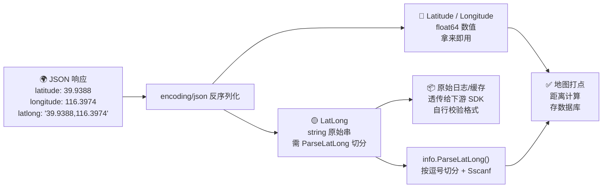

# ❓ LatLong 和 Latitude 有什么区别？

## 问题

在 `IPInfo` 结构体里同时存在 `LatLong` 和 `Latitude`（以及 `Longitude`）几个看起来都跟"经纬度"相关的字段，它们到底有什么区别？我该用哪一个？

## 简答

`LatLong` 是一个 **字符串**（原始的 `"lat,lon"` 文本），而 `Latitude` / `Longitude` 是已经解析好的 **`float64`** 数值——日常开发优先用后者，前者主要用于保留原始响应或需自行解析的场景。

::: tip 🎨 一图抵千言
下面的流程图展示了同一份 JSON 响应如何被反序列化成两种形态，以及各自适合的使用路径。
:::



## 详解

ipapi.co 返回的 JSON 里，经纬度信息以两种形态同时存在：

| 字段 | 类型 | JSON key | 示例值 |
| --- | --- | --- | --- |
| `Latitude` | `float64` | `latitude` | `39.9388` |
| `Longitude` | `float64` | `longitude` | `116.3974` |
| `LatLong` | `string` | `latlong` | `"39.9388,116.3974"` |

可以看到，`LatLong` 实际就是把 `Latitude` 和 `Longitude` 用逗号拼接起来的原始字符串。SDK 在反序列化时对它们做了不同的处理：

- `Latitude` / `Longitude` 直接由 `encoding/json` 反序列化成 `float64`，拿来即用，无需再解析；
- `LatLong` 保留为字符串，适合需要 **还原接口原始返回值** 或自己控制解析逻辑的场景。

### 何时用 Latitude / Longitude（推荐 ✅）

绝大多数业务场景（地图打点、距离计算、存数据库）都应该直接用 `Latitude` 和 `Longitude`，省去一次字符串切分与类型转换，也避免 `LatLong` 格式异常时带来的解析失败风险。

```go
package main

import (
    "fmt"
    "log"

    "github.com/cyberspacesec/ipapi.co-skills/pkg/ipapi"
)

func main() {
    client := ipapi.NewClient()
    info, err := client.GetIPInfo("8.8.8.8")
    if err != nil {
        log.Fatalf("查询失败: %v", err)
    }

    // ✅ 推荐：直接使用 float64 字段
    fmt.Printf("纬度: %f\n", info.Latitude)
    fmt.Printf("经度: %f\n", info.Longitude)

    // 直接参与数值运算，无需解析
    distance := info.Latitude * info.Longitude
    fmt.Printf("演示乘积（无实际地理意义）: %f\n", distance)
}
```

### 何时用 LatLong

- 需要 **完整保留接口返回的原始字符串**（例如做日志、缓存原始响应）；
- 需要把坐标作为一个整体字符串透传给下游（部分第三方地图 SDK 接受 `"lat,lon"` 形式的入参）；
- 需要自行校验或解析坐标格式时。

::: details 🔍 LatLong vs Latitude/Longitude 选型决策表
| 维度 | `Latitude` / `Longitude`（float64） | `LatLong`（string） |
| --- | --- | --- |
| 类型 | `float64` 数值 | `string` 原始串 |
| 是否需解析 | ❌ 拿来即用 | ✅ 需 `ParseLatLong()` 切分 |
| 数值运算 | ✅ 直接参与 | ❌ 需先解析 |
| 保留原始响应 | ❌ 受浮点精度影响 | ✅ 完整原样 |
| 缺失时零值 | `0` | `""` |
| 推荐 | ✅ 日常业务 | 原始日志/透传/校验 |
:::

SDK 也贴心地提供了 `ParseLatLong()` 方法，把 `LatLong` 字符串切分成两个 `float64`：

```go
package main

import (
    "fmt"
    "log"

    "github.com/cyberspacesec/ipapi.co-skills/pkg/ipapi"
)

func main() {
    client := ipapi.NewClient()
    info, err := client.GetIPInfo("8.8.8.8")
    if err != nil {
        log.Fatalf("查询失败: %v", err)
    }

    // 从 LatLong 字符串解析出数值
    lat, lon, err := info.ParseLatLong()
    if err != nil {
        log.Fatalf("解析 latlong 失败: %v", err)
    }
    fmt.Printf("由 LatLong 解析得到: lat=%f, lon=%f\n", lat, lon)

    // 对比：与直接读 Latitude / Longitude 应当一致
    fmt.Printf("直接读取字段:        lat=%f, lon=%f\n", info.Latitude, info.Longitude)
}
```

### ⚠️ 注意事项

1. **不要重复解析**：既然 `Latitude` / `Longitude` 已经是数值，就别再去切 `LatLong` 字符串，多此一举还可能引入解析错误。
2. **格式依赖**：`ParseLatLong()` 内部按 `","` 切分并用 `fmt.Sscanf` 解析，若 ipapi.co 未来调整 `latlong` 的分隔符或精度格式，可能需要同步调整；数值字段则更稳健。
3. **空值与零值**：当查询失败或字段缺失时，`Latitude` / `Longitude` 会是 `0`，`LatLong` 会是空字符串 `""`，此时 `ParseLatLong()` 会返回 `"invalid latlong format"` 错误，调用前最好做判空处理。

::: warning ⚠️ ParseLatLong 的失败陷阱
`ParseLatLong()` 在 `LatLong == ""`（字段缺失）时会返回 `"invalid latlong format"` 错误。如果你在 happy path 里直接 `lat, lon, _ := info.ParseLatLong()`，可能拿到 `0, 0` 仍以为成功——务必检查 `err`：

```go
lat, lon, err := info.ParseLatLong()
if err != nil {
    // LatLong 为空或格式异常，降级处理
    return errors.New("坐标缺失")
}
useCoords(lat, lon)
```
:::

::: tip 💡 一句话选型
**默认用 `Latitude` / `Longitude`（float64），只有在需要原样字符串或透传给下游时才动 `LatLong`。**
:::


## 相关

- 🧭 [指南 - 字段概念](../guide/field-concept)
- 🧭 [指南 - 入门](../guide/getting-started)
- 📦 [API - 坐标字段](../api/field-coord)
- 📦 [API - 数据模型 IPInfo](../api/models)
- 📚 [参考 - 字段列表](../reference/index)
