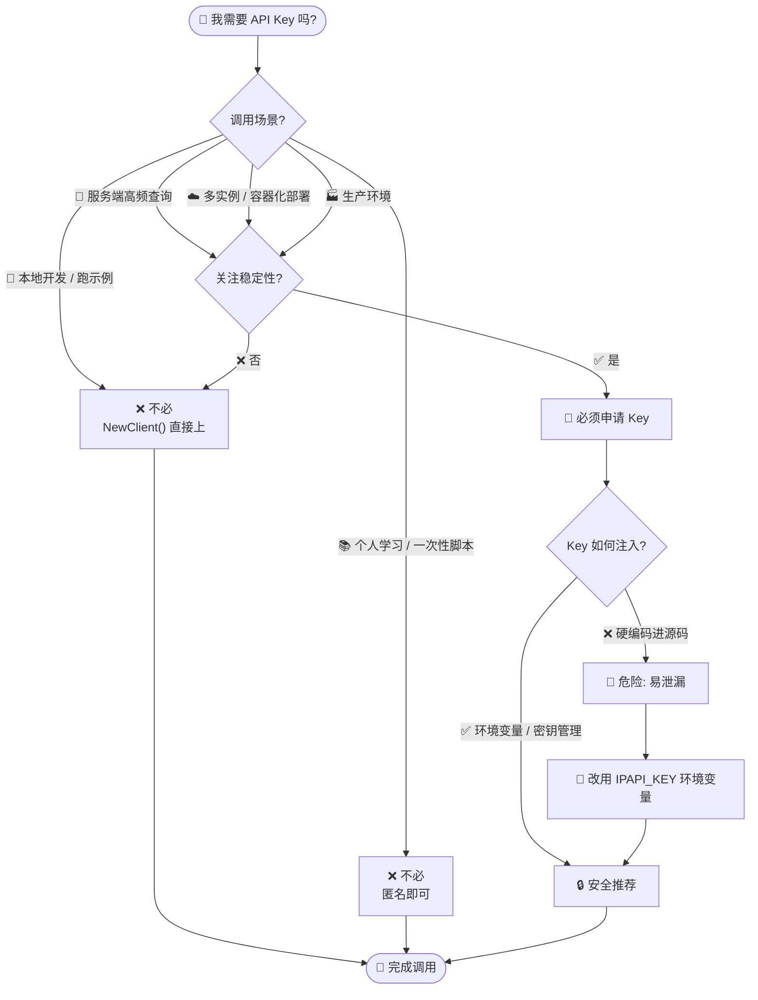

# ❓ 必须用 API Key 吗

## 问题

使用 ipapi.co-skills 时，必须先申请并配置 ipapi.co 的 API Key 才能调用吗？不配 Key 还能正常查询吗？

## 简答

🟢 不必。不传 [`WithAPIKey`](../api/with-api-key) 即可匿名调用，享受免费额度；但生产环境强烈建议申请 Key 以获得更高、更稳定的配额与可用性。

::: tip 🎨 一图抵千言
不确定自己是否需要 Key？顺着这张决策树走一遍即可。
:::



## 详解

ipapi.co 的查询接口**不强制要求认证**。SDK 的 [`NewClient`](../api/new-client) 在不传任何认证选项时即为匿名客户端，可直接发起查询：

```go
package main

import (
	"context"
	"fmt"
	"log"

	"github.com/cyberspacesec/ipapi.co-skills/pkg/ipapi"
)

func main() {
	// ✅ 不传 WithAPIKey，匿名调用，走免费额度（约 1000 次/天，按源 IP 共享）
	client := ipapi.NewClient()

	info, err := client.GetIPInfo(context.Background(), "8.8.8.8", "json")
	if err != nil {
		log.Fatalf("查询失败: %v", err)
	}

	fmt.Printf("IP: %s\n国家: %s (%s)\n", info.IP, info.CountryName, info.CountryCode)
}
```

### 🤔 什么时候不必用 Key

| 场景 | 是否必须 Key | 说明 |
| --- | --- | --- |
| 🧪 本地开发 / 跑示例 | ❌ 不必 | 调用量小，免费额度绰绰有余 |
| 📚 个人学习 / 一次性脚本 | ❌ 不必 | 匿名即可跑通 |
| 🔧 快速验证 SDK 接入 | ❌ 不必 | 先打通流程，再决定是否上 Key |
| 🚀 服务端高频查询 | ✅ 强烈建议 | 匿名配额低且共享 IP 池，极易 429 |
| ☁️ 多实例 / 容器化部署 | ✅ 强烈建议 | 共享出口 IP 会互相挤占免费额度 |
| 🏭 生产环境 | ✅ 强烈建议 | 配额、稳定性、独立计费都依赖 Key |

### ⚠️ 匿名调用的代价

匿名（不带 Key）并非“免费无限”，它有几个限制：

- 🧮 **按出口 IP 共享配额**：免费额度（约 1000 次/天）绑定在调用方公网 IP 上。同一 NAT / 同一容器集群出口的所有匿名请求**共用**这个额度，多服务并行时很快被打满。
- 📉 **配额偏低**：远低于带 Key 的套餐配额，高峰期容易被限流。
- 🚫 **超额触发 429**：超限后服务端返回 `429 Too Many Requests`，SDK 经 `handleError` 映射为 [`ErrRateLimited`](../reference/errors/err-rate-limited)。
- 🔐 **无独立计费与统计**：无法按账户查看用量、无法享受付费套餐的更高上限。

### 🔑 生产环境：申请 Key 并从环境变量读取（推荐）

```go
package main

import (
	"context"
	"fmt"
	"log"
	"os"

	"github.com/cyberspacesec/ipapi.co-skills/pkg/ipapi"
)

func main() {
	key := os.Getenv("IPAPI_KEY")
	if key == "" {
		log.Fatal("请先设置 IPAPI_KEY 环境变量")
	}

	// ✅ 带 API Key：配额更高、按账户独立计费、不与他人共享 IP 池
	client := ipapi.NewClient(
		ipapi.WithAPIKey(key), // 默认以 Bearer Header 注入
	)

	info, err := client.GetIPInfo(context.Background(), "8.8.8.8", "json")
	if err != nil {
		log.Fatalf("查询失败: %v", err)
	}

	fmt.Printf("IP: %s\n国家: %s (%s)\n", info.IP, info.CountryName, info.CountryCode)
}
```

::: danger 🔐 切勿硬编码 Key
**不要**把 Key 写进源码或提交进 Git。一律用环境变量或密钥管理服务读取，`.env` 等敏感文件加入 `.gitignore`。
:::

### 🔀 两种认证模式（仅在配了 Key 时才生效）

配了 [`WithAPIKey`](../api/with-api-key) 后，SDK 默认走 **Bearer Header** 模式（`Authorization: Bearer <key>`，更安全）。若场景无法设 Header（如前端 JSONP、某些 CDN/代理），可用 [`WithAPIKeyQuery`](../api/with-api-key-query) 切换为 `?key=` 查询参数模式：

```go
// Header 模式（默认，推荐）
client := ipapi.NewClient(ipapi.WithAPIKey(key))

// Query 模式（仅 Header 不可用时用）
client := ipapi.NewClient(
	ipapi.WithAPIKey(key),
	ipapi.WithAPIKeyQuery(), // ?key=...
)
```

::: details 🔧 两种模式如何选？
| 维度 | 🔑 Bearer Header（默认） | 🔗 ?key= Query |
| --- | --- | --- |
| 注入位置 | `Authorization: Bearer <key>` | URL 查询参数 `?key=<key>` |
| 安全性 | ✅ 高，Key 不落 URL/日志 | ⚠️ 中，可能出现在访问日志/Referer |
| 适用场景 | 服务端、可设 Header | JSONP、受限 CDN/代理、无法设 Header |
| 内部分支 | `applyAuth` Header 分支 | `applyAuth` Query 分支 |

默认走 Header；只有前端 JSONP 或代理无法设置 Header 时才退而求其次用 Query。
:::

::: tip 💡 结论
- 🧪 跑示例、本地调试 → **不必 Key**，`ipapi.NewClient()` 直接上。
- 🏭 上生产、要稳定、要高并发 → **必须 Key**，且从环境变量注入。
:::

## 相关

- 🚀 [快速开始](../guide/getting-started) — 无需 Key 即可跑通第一次查询
- 🔒 [认证机制](../guide/auth-concept) — 为什么要申请 Key、两种认证方式对比与内部实现
- 🔑 [`WithAPIKey`](../api/with-api-key) — 设置 API Key（Bearer Header 模式）的选项签名与示例
- 🔗 [`WithAPIKeyQuery`](../api/with-api-key-query) — 改用 query 参数模式带 Key（JSONP / 受限代理场景）
- 🆓 [免费额度是多少](./free-quota) — 匿名调用的配额上限与共享机制
- ⚡ [`ErrRateLimited`](../reference/errors/err-rate-limited) — 匿名超额触发 429 时的错误映射与可重试判定
- 🚫 [`ErrInvalidKey`](../reference/errors/err-invalid-key) — Key 无效（403）时的错误映射
- 📖 [字段参考](../reference/ — 一次查询能拿回哪些字段
