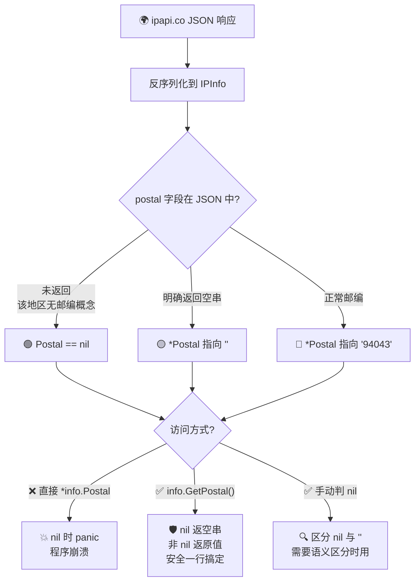

# ❓ postal 字段是什么类型

## 问题

`IPInfo.Postal` 字段为什么是 `*string` 指针类型？访问时要怎么处理 `nil`？

## 简答

📮 `Postal` 是 `*string` 指针，用 `GetPostal()` 方法安全访问——`nil` 时返回空字符串，无需手动判空。

::: tip 🎨 一图抵千言
下面的流程图展示了 `Postal *string` 的三种状态，以及 `GetPostal()` 如何统一兜底 `nil` 情况。
:::



## 详解

ipapi.co 返回的地理信息中，邮政编码（`postal`）是一个特殊字段：并非所有国家/地区都使用邮政编码（例如部分国家和地区没有邮编体系）。为了能区分“有邮编但为空”和“根本没返回邮编字段”这两种语义，SDK 在 [`IPInfo`](../api/models) 结构体里把 `Postal` 定义为**指针类型**：

```go
type IPInfo struct {
    // ... 其他字段
    Postal   *string `json:"postal"`   // 指针！
    // ...
}
```

如果它和 `City`、`Region` 一样是普通 `string`，那么当 JSON 里**没有** `postal` 键时，反序列化后会得到空字符串 `""`——这与“服务器明确返回了一个空邮编”无法区分。指针类型正好解决了这个问题：

- 🟢 `nil`：JSON 中**未返回** `postal` 字段（该地区无邮编概念）
- 🟡 指向 `""`：服务器**明确返回**了空邮编
- 🔵 指向 `"94043"`：正常的邮编值

::: info 📊 Postal 三态对照表
| JSON 内容 | `Postal` 指针值 | `GetPostal()` 返回 | 语义 |
| --- | --- | --- | --- |
| 无 `postal` 键 | `nil` | `""` | 该地区无邮编概念 |
| `"postal": ""` | 指向 `""` | `""` | 服务器明确返回空邮编 |
| `"postal": "94043"` | 指向 `"94043"` | `"94043"` | 正常邮编 |
:::

### 错误做法：直接解引用 ⚠️

直接对 `Postal` 解引用会在 `nil` 时触发 **panic**，导致程序崩溃：

```go
info, _ := client.GetIPInfo(ctx, "8.8.8.8", "json")

// ❌ 危险！如果 Postal 为 nil，下面这行会 panic
fmt.Println(*info.Postal)
```

### 正确做法一：用 GetPostal() ✅

SDK 提供了 [`GetPostal()`](../api/models#getpostal) 方法，内部已做 `nil` 判断，`nil` 时返回空字符串 `""`，安全且一行搞定：

```go
info, err := client.GetIPInfo(ctx, "8.8.8.8", "json")
if err != nil {
    panic(err)
}

// ✅ 安全：nil 时返回 ""
fmt.Println(info.GetPostal()) // 例如：94043
```

### 正确做法二：手动判空

如果你需要区分“无邮编”和“有邮编但为空”，可以手动判断指针：

```go
if info.Postal == nil {
    fmt.Println("该地区无邮政编码")
} else {
    fmt.Println("邮编:", *info.Postal)
}
```

### 完整示例

```go
package main

import (
    "fmt"
    "context"

    "github.com/cyberspacesec/ipapi-go/pkg/ipapi"
)

func main() {
    client := ipapi.NewClient()
    ctx := context.Background()

    info, err := client.GetIPInfo(ctx, "8.8.8.8", "json")
    if err != nil {
        panic(err)
    }

    // 推荐方式：GetPostal() 安全访问
    fmt.Printf("城市: %s, 邮编: %s\n", info.City, info.GetPostal())

    // 需要区分 nil 与空串时手动判空
    switch {
    case info.Postal == nil:
        fmt.Println("邮编: <无>")
    case *info.Postal == "":
        fmt.Println("邮编: <空>")
    default:
        fmt.Println("邮编:", *info.Postal)
    }
}
```

> 💡 小贴士：除了 `Postal`，`IPInfo` 中其他大多数字段（如 `City`、`Region`、`Country`）都是普通 `string`，无需判空。`Postal` 是少数使用指针的字段之一，使用时多留个心眼即可。

::: warning ⚠️ 指针字段的常见误用
- 不要在模板字符串里直接 `*info.Postal` —— `nil` 时直接 panic，进程崩溃。
- 不要把 `Postal == nil` 与 `*Postal == ""` 混为一谈：前者是"上游没返回"，后者是"上游返回了空"。
- 如果只想要"拿到邮编字符串"，永远优先用 `GetPostal()`，它把 `nil` 兜底成 `""`，最省心。
:::

::: details 🧪 需要区分"无邮编"与"空邮编"的场景
部分业务系统需要把"该地区无邮编概念"和"有邮编但为空"分开记录（前者可能是海外地址、后者可能是数据缺失）。此时必须手动判 `nil`，而不能用 `GetPostal()` 一刀切：

```go
switch {
case info.Postal == nil:
    log("无邮编字段（该地区无邮编体系）")
case *info.Postal == "":
    log("上游返回空邮编（疑似数据缺失）")
default:
    log("邮编: " + *info.Postal)
}
```
:::

## 相关

- 📖 [地理字段](../api/field-geo) — `Postal`、`City`、`Region` 等地理字段总览
- 🏠 [IPInfo 模型](../api/models) — `IPInfo` 结构体与 `GetPostal()` 方法定义
- 🗺 [字段概念](../guide/field-concept) — 字段设计与 `fields` 参数的概念说明
- 🔍 [单字段查询](../api/get-field) — 通过 `GetField` 单独获取 `postal` 字段
- 📋 [字段列表](../api/fields) — 所有可查询字段的完整清单
- 🚀 [快速开始](../guide/getting-started) — 入门示例，包含 `GetIPInfo` 基本用法
