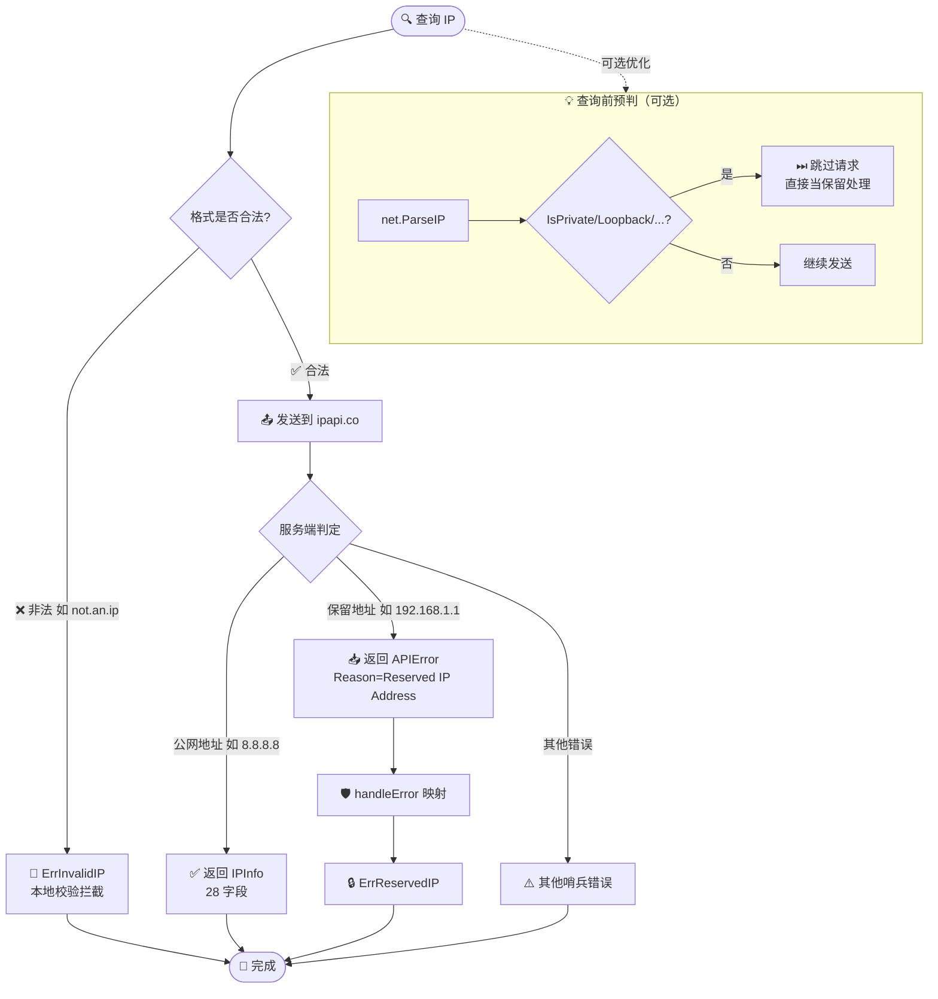

# ❓ 查 192.168 报错

## 问题

我用 `192.168.x.x` 这种内网地址调用 `GetIPInfo`，结果返回了错误，是不是库有 bug？

## 简答

`192.168.x.x` 属于保留地址，没有地理意义，本库会返回 `ErrReservedIP`，这是预期行为，不是 bug。

::: tip 🎨 一图抵千言
查到一个 IP 后，SDK 内部是如何判定它是不是保留地址的？顺着这张图走一遍。
:::



## 详解

### 🔒 为什么会报错

`192.168.0.0/16` 是 IANA 规定的**私有网络地址段**，和 `10.0.0.0/8`、`172.16.0.0/12`、`127.0.0.0/8`（回环）、`169.254.0.0/16`（链路本地）、`::1`（IPv6 回环）等一样，**不分配给公网设备**，因此没有真实的地理归属。

ipapi.co 对这类地址返回特殊错误响应，本库在 [`handleError`](../api/errors) 中按 `Reason == "Reserved IP Address"` 映射为哨兵错误 [`ErrReservedIP`](../reference/errors/err-reserved-ip)：

```go
case "Reserved IP Address":
    return fmt.Errorf("%w: %s", ErrReservedIP, apiErr.IP)
```

::: details 📖 常见保留地址段总表
IANA 规定的保留地址段都会触发 `ErrReservedIP`，对照如下：

| 段 | 范围 | 用途 | Go 判定方法 |
| --- | --- | --- | --- |
| 🏠 私有网络 A 类 | `10.0.0.0/8` | 内网 | `ip.IsPrivate()` |
| 🏠 私有网络 B 类 | `172.16.0.0/12` | 内网 | `ip.IsPrivate()` |
| 🏠 私有网络 C 类 | `192.168.0.0/16` | 内网（最常见） | `ip.IsPrivate()` |
| 🔁 回环 | `127.0.0.0/8` | localhost | `ip.IsLoopback()` |
| 🔗 链路本地 | `169.254.0.0/16` | 自动配置 | `ip.IsLinkLocalUnicast()` |
| ⭕ 未指定 | `0.0.0.0/8` | 默认路由 | `ip.IsUnspecified()` |
| 🟣 IPv6 回环 | `::1/128` | localhost v6 | `ip.IsLoopback()` |

查询前用标准库 `net.IP` 的这些方法可预判，省一次无谓的网络请求。
:::

### 🧪 复现示例

```go
package main

import (
    "context"
    "errors"
    "fmt"
    "log"

    "github.com/cyberspacesec/ipapi.co-skills/pkg/ipapi"
)

func main() {
    client := ipapi.NewClient()

    // 查询一个私有地址
    info, err := client.GetIPInfo(context.Background(), "192.168.1.1", "json")
    if err != nil {
        // 👉 命中这里：ErrReservedIP
        if errors.Is(err, ipapi.ErrReservedIP) {
            fmt.Println("192.168.1.1 是保留地址，无地理信息")
            return
        }
        log.Fatalf("其他错误: %v", err)
    }
    fmt.Printf("%+v\n", info)
}
```

运行输出：

```text
192.168.1.1 是保留地址，无地理信息
```

### 🧩 取出错误细节

服务端返回的 `APIError` 会带 `Reserved: true` 和 `IP` 字段，可以用 `errors.As` 取出：

```go
var apiErr *ipapi.APIError
if errors.As(err, &apiErr) {
    fmt.Printf("reason=%s ip=%s reserved=%v msg=%s\n",
        apiErr.Reason, apiErr.IP, apiErr.Reserved, apiErr.Message)
}
// reason=Reserved IP Address ip=192.168.1.1 reserved=true msg=...
```

### 🧠 排查清单

遇到保留地址报错时，对照下表确认：

| 你查的地址 | 是否保留 | 说明 |
|-----------|---------|------|
| `192.168.x.x` | ✅ 是 | 私有网络 |
| `10.x.x.x` | ✅ 是 | 私有网络 |
| `172.16~31.x.x` | ✅ 是 | 私有网络 |
| `127.x.x.x` | ✅ 是 | 回环 localhost |
| `169.254.x.x` | ✅ 是 | 链路本地 |
| `::1` | ✅ 是 | IPv6 回环 |
| `8.8.8.8` | ❌ 否 | 公网，正常返回 |

::: tip 💡 区分两种“无效”
- **格式非法**（如 `"not.an.ip"`）→ [`ErrInvalidIP`](../reference/errors/err-invalid-ip)，本地校验即拦截。
- **格式合法但是保留段**（如 `"192.168.1.1"`）→ `ErrReservedIP`，由服务端判定后返回。
:::

::: warning ⚠️ 不可重试
`ErrReservedIP` 不在 [`IsRetryableError`](../api/is-retryable) 的可重试列表里（只有 `ErrRateLimited`、`ErrServerError`、`ErrNotFound` 可重试）。**重试多少次结果都一样**，换一个公网地址才是正解。
:::

### ✅ 正确做法

- 想测库是否正常工作：用一个**公网地址**，如 `8.8.8.8`、`1.1.1.1`。
- 想处理内网请求：先判 `errors.Is(err, ipapi.ErrReservedIP)`，给用户一个友好提示，不要把它当故障告警。
- 想在查询前预判：可用标准库 `net.IP.IsPrivate()` 提前过滤，避免一次无谓的网络请求：

```go
func isReserved(ipStr string) bool {
    ip := net.ParseIP(ipStr)
    if ip == nil {
        return false
    }
    return ip.IsPrivate() || ip.IsLoopback() || ip.IsLinkLocalUnicast() || ip.IsUnspecified()
}
```

## 相关

- 📖 [保留 IP 地址](../guide/reserved-ip) — 完整保留段表与原理
- 🛡 [错误处理概念](../guide/error-concept) — 哨兵错误体系与 `APIError`
- 🛡 [错误类型](../api/errors) — `handleError` / `IsRetryableError` / `WrapError`
- 📚 [`ErrReservedIP` 参考](../reference/errors/err-reserved-ip) — 哨兵定义与触发条件
- 📚 [`APIError` 结构](../api/models) — `Reserved` / `IP` / `Reason` 字段
- 🔁 [`IsRetryableError`](../api/is-retryable) — 哪些错误值得重试
