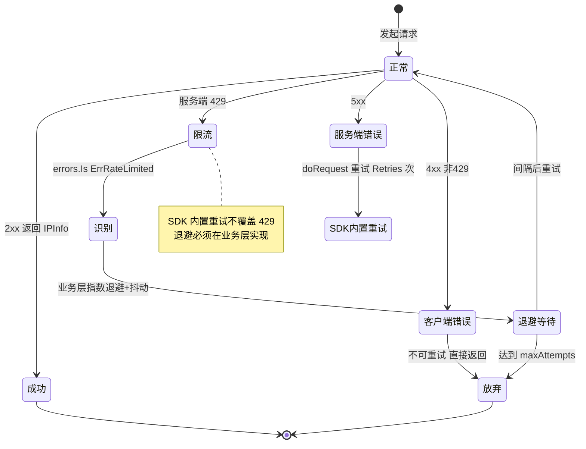

# ❓ 触发 429 怎么办

## 问题

我调用 `GetIPInfo` / `GetField` 时，请求返回了 HTTP `429 Too Many Requests`，SDK 抛出的错误是 `ErrRateLimited`，我该怎么处理？需要重试吗？怎么才能从源头避免？

## 简答

用 `errors.Is(err, ipapi.ErrRateLimited)` 精准识别，在业务层做**指数退避**重试，或直接给 `Client` 设一个 `RateLimiter` 从源头限速。

::: tip 🎨 一图抵千言
这张状态图展示了一次请求从「正常」到「被 429 限流」再到「退避重试/源头节流」的完整流转。
:::



## 详解

### 🧭 先认清：429 ≠ 失败

`429` 是**速率限制**（rate limit），不是请求本身有缺陷。它代表你的请求频率或日配额**超出了当前套餐允许的上限**，属于**瞬时性、可恢复**的错误。所以正确反应不是放弃，而是**降速 / 等待 / 重试**。

SDK 把服务端的 `429` 统一映射成哨兵错误 [`ErrRateLimited`](../reference/errors/err-rate-limited)：

```go
// pkg/ipapi/client.go
var ErrRateLimited = errors.New("API rate limit exceeded")
```

它有两条触发路径，最终都归入同一个哨兵，调用方只需用 `errors.Is` 判定一次：

| 来源 | 触发位置 | 条件 |
| --- | --- | --- |
| 📡 状态码映射 | `mapStatusCodeToError(429)` | 响应体无法解析为 `APIError` |
| 🌐 Reason 映射 | `handleError` 中 `case "RateLimited"` | 响应体 `APIError.Reason == "RateLimited"` |

::: details 🔍 429 为什么不在 SDK 内置重试里？
SDK 的 `doRequest` 只对**网络错误和 5xx** 自动重试，**显式不重试 4xx（含 429）**。原因是：

- 4xx 是"客户端侧"问题，重试同样的请求大概率还是 4xx。
- 429 尤其需要**先降速再重试**，立即重发只会招来更长限流窗口。
- 业务层最清楚自己的退避策略（指数？抖动？等多久？），交给业务层更合适。

所以 `ErrRateLimited` 虽在 `IsRetryableError` 列表里（标记"可恢复"），但恢复动作由你实现，SDK 不替你做。参见 [重试与限流](../guide/retry-concept)。
:::

::: tip 💡 别用 `==` 比较
返回的错误是被 `fmt.Errorf("%w: %s", ErrRateLimited, ...)` 包装过的，`err == ipapi.ErrRateLimited` **恒为 `false`**。必须用 `errors.Is` 解包判定。
:::

### 🔍 第一步：精准识别

```go
info, err := client.GetIPInfo(ctx, "8.8.8.8", "json")
if err != nil {
	switch {
	case errors.Is(err, ipapi.ErrRateLimited):
		// 👉 命中速率限制
	case errors.Is(err, ipapi.ErrServerError):
		// 5xx，参见 ../reference/errors/err-server-error
	case errors.Is(err, ipapi.ErrInvalidKey):
		// 403，密钥问题，不可重试
	default:
		log.Printf("其他错误: %v", err)
	}
}
```

### 📦 取出服务端附带的细节

服务端返回的 `APIError` 通常会带 `Message`（往往包含重试窗口提示），可用 `errors.As` 取出：

```go
var apiErr *ipapi.APIError
if errors.As(err, &apiErr) {
	log.Printf("reason=%s msg=%s", apiErr.Reason, apiErr.Message)
	// reason=RateLimited msg=You have exceeded... please retry later
}
```

### 🔁 第二步：业务层指数退避重试

`ErrRateLimited` 是**可重试**错误，已被 [`IsRetryableError`](../api/is-retryable) 列入可重试集合。推荐用**指数退避 + 抖动**，避免所有客户端在同一时刻醒来再次冲击服务端：

```go
func lookupWithBackoff(ctx context.Context, c *ipapi.Client, ip string) (*ipapi.IPInfo, error) {
	const maxAttempts = 5
	backoff := 500 * time.Millisecond // 初始退避

	var lastErr error
	for attempt := 0; attempt < maxAttempts; attempt++ {
		info, err := c.GetIPInfo(ctx, ip, "json")
		if err == nil {
			return info, nil
		}
		lastErr = err

		// 不可重试的错误（如 ErrInvalidIP / ErrInvalidKey）直接放弃
		if !ipapi.IsRetryableError(err) {
			break
		}

		// 仅对限流做长退避；5xx 用较短退避即可
		wait := backoff
		if errors.Is(err, ipapi.ErrRateLimited) {
			wait = backoff * 4 // 限流退避更激进
		}

		// 加抖动，避免雷同群同步重试
		jitter := time.Duration(rand.Int63n(int64(wait) / 2))
		select {
		case <-time.After(wait + jitter):
		case <-ctx.Done():
			return nil, ctx.Err()
		}

		backoff *= 2
	}
	return nil, ipapi.WrapError("lookup", lastErr)
}
```

::: warning ⚠️ 别立即无间隔重试
收到 `429` 后立刻重发，等于火上浇油，可能招来更长的限流窗口。务必先 `Sleep`，再重试。
:::

::: tip 🔄 区分两层重试
SDK 内置的 `doRequest` 只对**网络错误和 5xx**自动重试 `Retries` 次（默认 2 次，固定 `500ms` 退避），**不**重试 `429`。所以 `ErrRateLimited` 的退避必须由你在**业务层**实现。参见 [重试与限流](../guide/retry-concept)。
:::

### ⏱️ 第三步：从源头限速（设 RateLimiter）

与其等到被 `429` 打回来再退避，不如在客户端**主动节流**。`Client.RateLimiter` 是一个 `<-chan time.Time`，非空时每次请求前会阻塞等令牌：

```go
client := ipapi.NewClient()

// 固定速率：每秒最多 1 次请求
client.RateLimiter = time.Tick(time.Second)
```

需要突发 + 恢复能力时，用带缓冲的通道模拟令牌桶：

```go
// 容量 10 的桶，每秒补 1 个令牌 = 允许短时突发 10 次
bucket := make(chan time.Time, 10)
go func() {
	for range time.Tick(time.Second) {
		select {
		case bucket <- time.Now():
		default: // 桶满则丢弃
		}
	}
}()
client.RateLimiter = bucket
```

::: tip 🧵 为什么用通道
`<-chan time.Time` 天然并发安全，多 goroutine 共用一个 `Client` 会自动排队，无需自己加锁。`Client` 本身是并发安全的，可放心复用。参见 [并发安全吗](./concurrent-safe)。
:::

### 📊 配额规划建议

| 流量级 | 建议配置 |
| --- | --- |
| 🟢 偶发查询 | 默认即可 |
| 🟡 中等流量 | `RateLimiter = time.Tick(...)` 固定节流 |
| 🔴 高并发 | 令牌桶 + 业务层指数退避 + 适当降低 `Retries` |
| 🚀 生产 | 申请付费 Key 提升配额，别卡在免费额度 |

### 🧠 排查清单

- **持续 429？** 多半是日配额耗尽，需等 UTC 次日重置或升级套餐。
- **间歇 429？** 瞬时 QPS 过高，加 `RateLimiter` 节流。
- **没发几条也 429？** 检查是否与他人共享出口 IP（NAT / 代理），被 IP 维度限流波及。
- **想看原始响应头？** 用 `curl -i https://ipapi.co/8.8.8.8/json/` 直连观察限流相关信息。

## 相关

- 📚 [`ErrRateLimited` 参考](../reference/errors/err-rate-limited) — 哨兵定义、触发路径与可重试性
- 🔄 [重试与限流](../guide/retry-concept) — 内置重试机制与 `RateLimiter` 用法
- 🛡 [错误处理概念](../guide/error-concept) — 哨兵错误体系与 `APIError` 映射
- 🛡 [错误类型](../api/errors) — `handleError` / `IsRetryableError` / `WrapError`
- 🔁 [`IsRetryableError`](../api/is-retryable) — 哪些错误值得重试
- 🧱 [`Client` 结构](../api/client) — `RateLimiter` / `Retries` 字段
- 🔧 [`WithErrorHandler`](../api/with-error-handler) — 全局接管限流错误做监控上报
