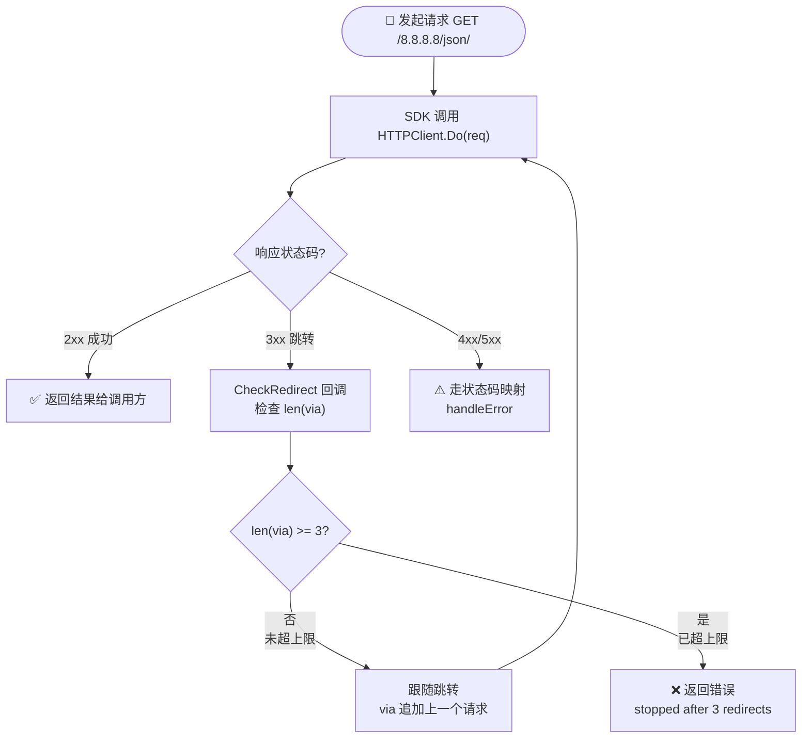

# ❓ 跳转限制是多少

## 问题

ipapi.co-skills Go SDK 在请求 ipapi.co 时，最多允许几次 HTTP 跳转（redirect）？能改吗？

## 简答

默认最多 **3 次跳转**，由常量 `maxRedirects = 3` 控制，超出即返回 `stopped after 3 redirects` 错误。

::: tip 🎨 一图抵千言
下面的流程图展示了 `CheckRedirect` 在每次跳转前检查 `len(via)`，超过 3 次即终止请求链。
:::



## 详解

SDK 在 [`NewClient`](../api/new-client) 内部构造默认 `*http.Client` 时，通过 `CheckRedirect` 回调对跳转次数做了上限保护：

```go
// pkg/ipapi/client.go
const maxRedirects = 3

HTTPClient: &http.Client{
	Timeout: 10 * time.Second,
	CheckRedirect: func(req *http.Request, via []*http.Request) error {
		if len(via) >= maxRedirects {
			return fmt.Errorf("stopped after %d redirects", maxRedirects)
		}
		return nil
	},
},
```

- 🔢 **`via` 是已访问的请求链**：`net/http` 每发生一次跳转就把上一个请求追加进 `via`，因此 `len(via)` 就是已经跳过的次数。`len(via) >= 3` 即在第 4 次跳转被发起前终止。
- 🛡️ **防止跳转死循环**：上限主要是安全网。ipapi.co 正常查询几乎不跳转，但若上游异常（如 CDN 把 `/8.8.8.8/json/` 反复重定向）或被中间代理劫持，没有上限会无限递归直至资源耗尽。
- 📦 **常量不导出**：`maxRedirects` 是包内私有常量，没有对应的 `WithMaxRedirects` 选项，无法通过选项函数单独调它。

::: info 📊 跳转次数决策表
| 跳转场景 | `len(via)` 值 | 行为 | 是否终止 |
| --- | --- | --- | --- |
| 首次请求 | 0 | 正常发出 | 否 |
| 第 1 次跳转 | 1 | `1 < 3`，跟随 | 否 |
| 第 2 次跳转 | 2 | `2 < 3`，跟随 | 否 |
| 第 3 次跳转 | 3 | `3 >= 3`，返回错误 | ✅ 终止 |
:::

### 想改跳转上限？整个替换 `*http.Client`

由于没有独立选项，调整跳转次数的正确做法是用 [`WithCustomHTTPClient`](../api/with-custom-http-client) 传入一个自定义客户端，在其中写自己的 `CheckRedirect`：

```go
package main

import (
	"context"
	"fmt"
	"log"
	"net/http"
	"strconv"
)

// 自定义跳转上限
const myMaxRedirects = 5

func main() {
	client := ipapi.NewClient(
		ipapi.WithAPIKey(os.Getenv("IPAPI_KEY")),
		ipapi.WithCustomHTTPClient(&http.Client{
			Timeout: 10 * time.Second,
			CheckRedirect: func(req *http.Request, via []*http.Request) error {
				if len(via) >= myMaxRedirects {
					return fmt.Errorf("stopped after %d redirects", myMaxRedirects)
				}
				return nil
			},
		}),
	)

	info, err := client.GetIPInfo(context.Background(), "8.8.8.8")
	if err != nil {
		log.Fatalf("查询失败: %v", err)
	}
	fmt.Printf("国家: %s\n", info.CountryName)
}
```

### 完全禁用跳转

把跳转上限设为 `0`，并在 `CheckRedirect` 里直接返回 `http.ErrUseLastResponse`，SDK 就会拿到首个 `3xx` 响应而不再跟随：

::: details 🔍 三种跳转策略对照
| 策略 | `CheckRedirect` 返回 | 效果 | 适用场景 |
| --- | --- | --- | --- |
| 默认上限 3 | `nil` 或达到上限时返回 error | 最多跟 3 跳 | 正常查询（推荐） |
| 自定义上限 N | 同上，阈值改 N | 最多跟 N 跳 | 走自建代理/网关 |
| 完全禁用 | `http.ErrUseLastResponse` | 拿首个 3xx 原样响应 | 调试 CDN 行为 |
:::

```go
client := ipapi.NewClient(
	ipapi.WithCustomHTTPClient(&http.Client{
		Timeout: 10 * time.Second,
		CheckRedirect: func(req *http.Request, via []*http.Request) error {
			return http.ErrUseLastResponse // 不跟随任何跳转
		},
	}),
)
```

::: tip 💡 什么时候需要动它？
- 正常查询 → ✅ 用默认 `3` 即可，无需改动。
- 走自建代理 / 内网网关，链路里固定多一跳 → 把上限提到 `5` 左右更稳。
- 想拿到 ipapi.co 的 `3xx` 原始响应（如调试 CDN 行为）→ 用 `http.ErrUseLastResponse` 禁跳转。
:::

::: warning ⚠️ 替换客户端会覆盖默认值
一旦传了 `WithCustomHTTPClient`，默认的 **10s 超时**和 **3 次跳转**会一起被你的客户端取代。别忘了在新客户端里显式设置 `Timeout`，否则会变成无超时（可能挂死请求）。
:::

## 相关

- 🛠 [自定义 HTTP 客户端](../guide/custom-http) — 用 `WithCustomHTTPClient` 替换底层 `*http.Client` 的完整说明
- 🧩 [`WithCustomHTTPClient`](../api/with-custom-http-client) — 替换 HTTP 客户端的选项签名与示例
- 🏗 [`NewClient`](../api/new-client) — 默认客户端的构造逻辑（含 `CheckRedirect`）
- 🔢 [`maxRedirects`](../reference/internal/max-redirects) — 跳转上限常量的内部参考
- ⏱ [默认超时](../reference/internal/default-timeout) — 与跳转上限一同配置的 10s 超时
- 📖 [工作原理](../guide/how-it-works) — SDK 请求链路全貌
