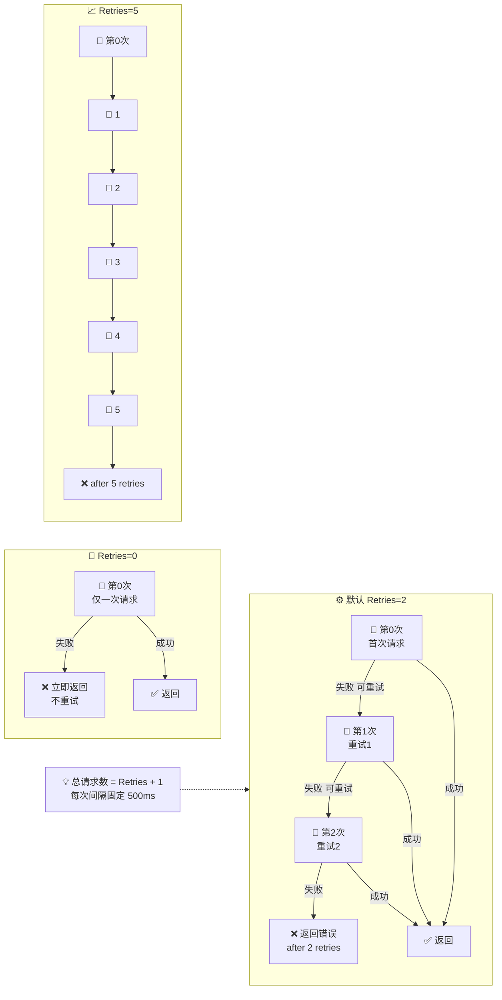

# ❓ 重试几次

## 问题

SDK 默认会重试几次请求？怎么修改重试次数？

## 简答

🏗️ 默认重试 **2 次**（共发起 3 次请求），直接改 `client.Retries` 即可调整。

::: tip 🎨 一图抵千言
`Retries` 字段值与「实际发起的请求总数」是什么关系？看这张图就懂。
:::



## 详解

ipapi.co-skills Go SDK 在 [`NewClient`](../api/new-client) 中将 `Retries` 字段初始化为 `2`。每次请求时，底层 `doRequest` 会按 `for i := 0; i <= c.Retries; i++` 的方式循环：

- 🔄 **第 0 次**：首次请求（不算重试）
- 🔁 **第 1、2 次**：默认的 2 次重试
- 📦 合计：最多 **3 次请求**

### 什么情况会重试？

并不是所有错误都会重试，SDK 只对**可恢复**的错误重试：

- 🌐 网络错误（DNS 解析失败、连接超时、连接被拒等）
- 🖥️ 服务端 `5xx` 错误（如 500、502、503）
- 🚫 **不**重试 `4xx` 客户端错误（如 401 鉴权失败、404 资源不存在），这类错误重试也不会成功

可以借助 [`IsRetryableError`](../api/is-retryable) 判断某个错误是否可重试。

### 📊 可重试性对照

| 错误类型 | 是否重试 | 说明 |
| --- | --- | --- |
| 🌐 网络错误（DNS/连接超时/拒连） | ✅ 重试 | 瞬时性，恢复后可成功 |
| 🖥️ 5xx 服务端错误（500/502/503） | ✅ 重试 | 服务端临时故障 |
| ⚡ 429 限流 | ❌ SDK 不重试 | 需业务层退避，见 [触发 429 怎么办](./rate-limit-429) |
| 🔒 4xx 客户端错误（401/403/404） | ❌ 不重试 | 重试也不会成功 |
| 🚫 ErrInvalidIP / ErrReservedIP | ❌ 不重试 | 输入本身有问题 |

::: details 🧮 重试耗时怎么算？
最坏情况下一次调用的总耗时 ≈ `Retries × defaultRetryDelay(500ms)` + 各次请求的网络耗时。

| Retries | 最大重试等待 | 总请求数 |
| --- | --- | --- |
| 0（关闭） | 0ms | 1 |
| 2（默认） | 1000ms | 3 |
| 5 | 2500ms | 6 |

对延迟敏感的场景，请把 `Retries` 调小，并配合 [`HTTPClient.Timeout`](../api/client) 与 [`RateLimiter`](../api/options) 一起评估。
:::

### 退避策略

每次重试之间固定等待 `500ms`（常量 `defaultRetryDelay`）。目前为固定退避，暂不支持指数退避。

### 修改重试次数

最直接的方式是构造好客户端后给 `Retries` 字段赋值：

```go
package main

import "github.com/cyberspacesec/ipapi-go/pkg/ipapi"

func main() {
    client := ipapi.NewClient()
    client.Retries = 5 // 重试 5 次（共 6 次请求）

    info, err := client.GetIPInfo("8.8.8.8")
    if err != nil {
        // 超过重试上限后会返回类似：
        // request failed after 5 retries: ...
        panic(err)
    }
    _ = info
}
```

### 关闭重试

把 `Retries` 设为 `0` 即可只发一次请求、不重试：

```go
client := ipapi.NewClient()
client.Retries = 0 // 不重试，失败立即返回
```

### 错误信息

当所有重试用尽后仍失败，返回的错误会包含重试次数，便于排查：

- 网络错误：`request failed after N retries: <原错误>`
- 服务端错误：`server error after N retries (status: <code>)`

> 💡 提示：调大重试次数会增加单次调用的最坏耗时（每次重试间隔 500ms），在对延迟敏感的场景请配合 [`HTTPClient.Timeout`](../api/client) 和限流 [`RateLimiter`](../api/options) 一起评估。

## 相关

- 📖 [重试与限流概念](../guide/retry-concept) — 重试机制与限流的整体说明
- 🏠 [Client 客户端](../api/client) — `Retries` 字段所在的客户端结构体定义
- 🛠️ [NewClient](../api/new-client) — 构造函数，含 `Retries` 的默认值
- ✅ [IsRetryableError](../api/is-retryable) — 判断错误是否值得重试
- ⚙️ [配置选项 Options](../api/options) — `RateLimiter`、`WithErrorHandler` 等可选项
- 🚨 [错误处理](../guide/error-concept) / [Errors API](../api/errors) — 重试用尽后返回的错误类型
