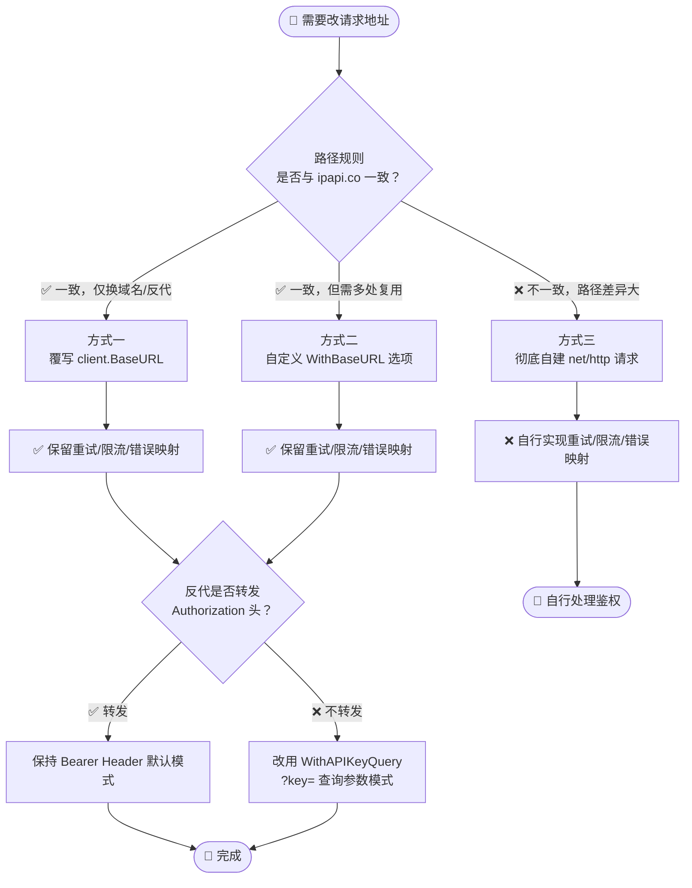

# ❓ 能改基地址吗

## 问题

能改基地址吗？默认请求都打到 `https://ipapi.co/`，如果想换成自建反代、内网镜像或其它兼容服务，能不能改？

## 简答

能 —— 直接改 `client.BaseURL` 字段即可，所有 `Get*` 方法都会用新地址；也可以彻底绕过 Client 自建请求。

::: tip 🎨 一图抵千言
下图展示了三种改地址策略的决策路径与能力保留情况。
:::



## 详解

🧭 SDK 的默认基地址是 `https://ipapi.co/`，定义在 `NewClient` 里。它被存放在 `Client` 结构体的 **导出字段** `BaseURL` 上，因此你可以在创建后随时覆写，无需额外的构造选项。

### 方式一：覆写 `BaseURL` 字段 ✏️

最简单的做法 —— 创建 Client 后直接给 `BaseURL` 赋新值：

```go
package main

import (
    "context"
    "fmt"
    "log"

    "github.com/cyberspacesec/ipapi.co-skills/pkg/ipapi"
)

func main() {
    client := ipapi.NewClient(ipapi.WithAPIKey("your-api-key"))

    // 改成你自己的反代或镜像地址
    client.BaseURL = "https://ipapi-proxy.example.com/"

    info, err := client.GetIPInfo(context.Background(), "8.8.8.8", "json")
    if err != nil {
        log.Fatal(err)
    }
    fmt.Println(info.IP, info.City, info.CountryName)
}
```

此后所有 `GetIPInfo`、`GetField`、`GetClientIPInfo` 等方法的请求 URL，都会基于新的 `BaseURL` 拼接。例如上面会请求 `https://ipapi-proxy.example.com/8.8.8.8/json/`。

::: tip 注意末尾斜杠
`BaseURL` 建议以 `/` 结尾。SDK 内部用 `path.Join` 拼接路径段并补齐尾斜杠，若你的基地址本身就带路径（如 `https://host/api/v1/`），保留尾斜杠能避免路径被意外吞掉。
:::

### 方式二：用选项函数封装 🔧

如果你希望把基地址封装成可复用的选项，可以自定义一个 `ClientOption`：

```go
func WithBaseURL(baseURL string) ipapi.ClientOption {
    return func(c *ipapi.Client) {
        if baseURL != "" {
            c.BaseURL = baseURL
        }
    }
}

client := ipapi.NewClient(
    ipapi.WithAPIKey("your-api-key"),
    WithBaseURL("https://ipapi-proxy.example.com/"),
)
```

### 方式三：彻底自建请求 🛠️

当你的目标服务路径规则与 ipapi.co 不同（比如多了一层 `/api/` 前缀、或字段端点路径不一致），单改 `BaseURL` 可能不够。这时可以完全绕过 SDK 的 Client，用标准库 `net/http` 直接发起请求，再手动解析返回：

```go
package main

import (
    "context"
    "encoding/json"
    "fmt"
    "io"
    "net/http"
)

func main() {
    // 自定义 URL，完全不走 SDK 的拼接逻辑
    url := "https://my-service.example.com/api/lookup/8.8.8.8"

    req, _ := http.NewRequestWithContext(context.Background(), "GET", url, nil)
    req.Header.Set("Authorization", "Bearer your-api-key")
    req.Header.Set("User-Agent", "my-app/1.0")

    resp, err := http.DefaultClient.Do(req)
    if err != nil {
        panic(err)
    }
    defer resp.Body.Close()

    body, _ := io.ReadAll(resp.Body)

    // 复用 SDK 的 IPInfo 结构体来解析
    var info struct {
        IP          string `json:"ip"`
        City        string `json:"city"`
        CountryName string `json:"country_name"`
    }
    _ = json.Unmarshal(body, &info)

    fmt.Println(info.IP, info.City, info.CountryName)
}
```

这种方式你完全掌控 URL、Header、超时与重试策略，代价是失去 SDK 内置的**重试**、**限流**、**错误映射**（`APIError` / `ErrRateLimited` 等）能力，需要自行实现。

::: danger ⚠️ 自建请求的隐性成本
绕过 Client 后，以下 SDK 能力**全部失效**，需自行补齐：
- 🔁 **重试退避**：仅网络错误和 5xx 重试、4xx（含 429）不重试的内置策略
- 🚦 **限流保护**：并发请求自带的节流逻辑
- 🗺️ **错误映射**：HTTP 状态码 → `ErrInvalidIP` 等 10 个哨兵错误的自动转换
- 📦 **结构体解析**：`IPInfo` 28 字段的反序列化与 `Postal *string` 指针语义

建议优先尝试方式一/二，仅当目标服务路径规则确实无法兼容时再用方式三。
:::

::: details 🔍 BaseURL 与路径拼接的内幕
SDK 内部 `newGetRequest` 使用 `path.Join` 拼接 `BaseURL` 与 IP/格式路径段，并自动补齐尾斜杠。以 `BaseURL = https://ipapi-proxy.example.com/`、查询 `8.8.8.8` 的 `json` 格式为例，最终 URL 为：

```
https://ipapi-proxy.example.com/8.8.8.8/json/
```

若 `BaseURL` 带额外路径前缀（如 `https://host/api/v1/`），保留尾斜杠可避免 `api/v1` 被 `path.Join` 当作单段吞掉。
:::

### 三种方式怎么选？🤔

| 方式 | 适用场景 | 是否保留 SDK 能力 |
| --- | --- | --- |
| 改 `BaseURL` | 仅仅是换域名/反代，路径规则不变 | ✅ 全部保留 |
| 自定义选项 | 多处复用、想统一配置 | ✅ 全部保留 |
| 自建请求 | 路径规则差异大、需要非标准行为 | ❌ 需自行实现 |

::: warning 别忘了鉴权
若你的反代不转发 `Authorization` 头，可改用 `ipapi.WithAPIKeyQuery()` 让 SDK 把 key 放进 `?key=` 查询参数。详见 [.](./reference/ 鉴权参考](../reference/)。
:::

::: info 💡 反代部署的常见模式
自托管反代时，推荐以下两种鉴权转发模式：

| 模式 | 客户端配置 | 反代行为 | 适用 |
| --- | --- | --- | --- |
| **透传 Header** | `WithAPIKey()`（默认 Bearer） | 转发 `Authorization: Bearer xxx` | 通用，最推荐 |
| **Query 注入** | `WithAPIKeyQuery()` | 由反代把 key 拼到 `?key=` | 反代无法透传 Header 时 |

两种模式下 SDK 的 `applyAuth` 分支会自动选择 Header 或 Query 路径，无需改业务代码。
:::

## 相关

- 📖 [快速上手](../guide/intro —— 创建 Client 的标准流程
- 🧩 [Client 配置项](../api/methods) —— `WithAPIKey`、`WithCustomHTTPClient` 等选项说明
- 📚 [API 参考](../reference/) —— `BaseURL`、`APIKeyMode`、错误类型一览
