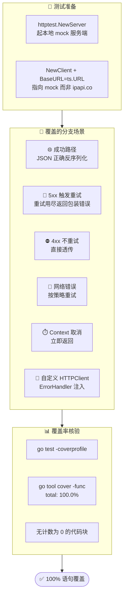

# ❓ 测试覆盖

## 问题

ipapi.co-skills Go SDK 的单元测试覆盖率达到多少？怎么跑测试、怎么生成覆盖率报告？

## 简答

✅ 核心包 `pkg/ipapi` 达到 **100.0% 单元测试覆盖率**，使用 `httptest` 模拟真实 API 服务端，无需联网即可全量跑通。

::: tip 🎨 一图抵千言
下图说明 SDK 测试如何用 httptest 隔离外部依赖，并覆盖全部分支。
:::



SDK 把所有与外部网络相关的逻辑都用 `net/http/httptest` 起一个本地 mock 服务器来验证，因此测试**不依赖 ipapi.co 真实服务**，也不会消耗免费额度，可以离线、可重复地在 CI 中运行。

实际执行 `go test ./pkg/ipapi/ -cover` 的输出为：

```text
ok  	github.com/cyberspacesec/ipapi.co-skills/pkg/ipapi	3.146s	coverage: 100.0% of statements
```

### 🧪 测试规模一览

| 📁 源文件 | 🧩 函数数 | ✅ 对应测试 |
|---|---|---|
| `pkg/ipapi/api.go` | 12 | `api_test.go`（112 个测试函数） |
| `pkg/ipapi/client.go` | 6 | `client_test.go`（7 个测试函数） |
| `pkg/ipapi/errors.go` | 3 | 含于上述测试 |
| `pkg/ipapi/models.go` | 5 | 含于上述测试 |

合计 119 个测试函数，覆盖请求构造、字段映射、重试、错误处理、JSONP、自定义 `HTTPClient`、`context` 取消等全部路径。

::: info 📊 测试与源码的对应关系
SDK 的测试遵循 Go 惯例——`xxx_test.go` 与 `xxx.go` 同包同名前缀，方便定位：

| 源文件 | 测试文件 | 重点覆盖点 |
| --- | --- | --- |
| [`api.go`](https://github.com/cyberspacesec/ipapi.co-skills/blob/main/pkg/ipapi/api.go) | `api_test.go` | 6 方法、5 格式、重试、状态码映射、字段解析 |
| [`client.go`](https://github.com/cyberspacesec/ipapi.co-skills/blob/main/pkg/ipapi/client.go) | `client_test.go` | Client 配置、选项注入、HTTPClient 替换 |
| [`errors.go`](https://github.com/cyberspacesec/ipapi.co-skills/blob/main/pkg/ipapi/errors.go) | 含于上述 | 哨兵错误映射、`errors.Is` 链 |
| [`models.go`](https://github.com/cyberspacesec/ipapi.co-skills/blob/main/pkg/ipapi/models.go) | 含于上述 | `IPInfo` 28 字段、`Postal *string` 语义 |
:::

### 🏃 怎么跑测试

最常用的方式——直接运行全部测试：

```bash
go test ./pkg/ipapi/ -v
```

### 📊 生成覆盖率报告

加上 `-cover` 与 `-coverprofile` 即可输出覆盖率profile文件：

```bash
# 1) 生成 coverage.out
go test ./pkg/ipapi/ -cover -coverprofile=coverage.out

# 2) 在终端查看每个函数的覆盖率
go tool cover -func=coverage.out

# 3) 生成可在浏览器查看的 HTML 报告
go tool cover -html=coverage.out -o coverage.html
```

`go tool cover -func` 会逐个函数列出覆盖百分比，结尾一行给出整体 `total: 100.0%`。

### 🛠️ 测试是怎么写的（真实示例片段）

SDK 的测试通过 `httptest.NewServer` 起一个可控的 mock 服务端，校验请求路径并返回预设 JSON，从而**完全隔离外部依赖**：

```go
package ipapi

import (
	"fmt"
	"net/http"
	"net/http/httptest"
	"testing"
)

func TestClient_GetIPInfo_Success(t *testing.T) {
	ts := httptest.NewServer(http.HandlerFunc(func(w http.ResponseWriter, r *http.Request) {
		// 校验请求路径是否符合预期
		if r.URL.Path != "/8.8.8.8/json/" {
			t.Errorf("unexpected path: %s", r.URL.Path)
		}
		w.Header().Set("Content-Type", "application/json")
		fmt.Fprint(w, `{
			"ip": "8.8.8.8",
			"city": "Mountain View",
			"country": "US",
			"latitude": 37.3860,
			"longitude": -122.0838
		}`)
	}))
	defer ts.Close()

	// 用 mock 服务端地址构造客户端，避免真实网络调用
	client := NewClient()
	client.BaseURL = ts.URL

	info, err := client.GetIPInfo("8.8.8.8")
	if err != nil {
		t.Fatalf("unexpected error: %v", err)
	}
	if info.IP != "8.8.8.8" {
		t.Errorf("expected ip 8.8.8.8, got %s", info.IP)
	}
	if info.Country != "US" {
		t.Errorf("expected country US, got %s", info.Country)
	}
}
```

同样的套路还用于覆盖以下场景，确保每条分支都不被遗漏：

- 🌐 **成功路径**：正常返回 JSON、字段正确反序列化
- 🚨 **服务端错误**：返回 `5xx` 触发重试，重试用尽后返回包装错误
- ⛔ **客户端错误**：返回 `4xx`（如 401 / 404）不重试、直接透传
- 🔁 **网络错误**：`http.Client` 返回连接/超时错误时按重试策略重试
- ⏱️ **Context 取消**：传入带超时或 `cancel()` 的 `context.Context` 时立即返回
- 🔧 **自定义 HTTPClient / ErrorHandler**：通过 [`WithOptions`](../api/options) 注入后行为符合预期

### 🧬 覆盖率怎么解读

`go test -coverprofile` 生成的 `coverage.out` 中，每条记录结尾的数字是该代码块**被执行的次数**。当这个值在所有行上都不为 `0` 时，即代表 100% 语句覆盖。SDK 当前 profile 中**不存在任何计数为 0 的代码块**，配合 `go tool cover -func` 的 `total: 100.0%` 可双重确认。

::: details 💡 100% 覆盖率 ≠ 无 bug
100% 语句覆盖保证的是**每条语句至少被一组测试执行过**，但不覆盖：
- 🧪 **边界值**：空字符串、极端经纬度等需额外断言
- ⚡ **并发竞态**：需配合 `-race` 检测数据竞争
- 🌍 **真实网络抖动**：mock 无法复现的真实超时/重置

建议定期跑以下命令做并发与回归验证：
:::

```bash
go test ./pkg/ipapi/ -race -count=10
```

::: warning ⚠️ 离线测试的边界
httptest mock 无法模拟以下真实场景，必要时需补充集成测试：
- TLS 握手失败、证书过期
- 真实的 429 Retry-After 头部延迟
- 跨地域 DNS 解析差异
:::

## 相关

- 📖 [客户端概念](../guide/client-concept) — `Client` 结构体与各字段的作用
- 🚀 [快速开始](../guide/getting-started) — 安装与第一次调用
- 🔁 [重试与限流概念](../guide/retry-concept) — 测试中重点覆盖的重试/退避逻辑
- 🚨 [错误处理概念](../guide/error-concept) / [Errors API](../api/errors) — 测试断言的错误类型
- ⚙️ [配置选项 Options](../api/options) — 自定义 `HTTPClient`、`ErrorHandler` 等可测试注入点
- 🏠 [NewClient](../api/new-client) — 测试中构造客户端的入口
- 📚 [参考索引](../reference/index) — 字段、错误等完整参考
