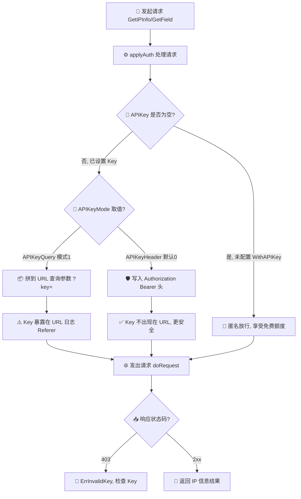
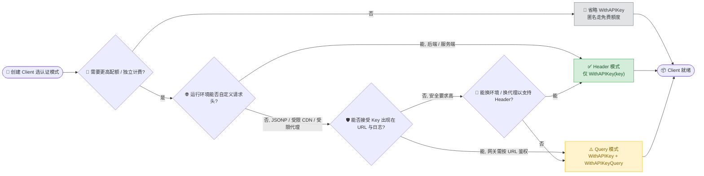
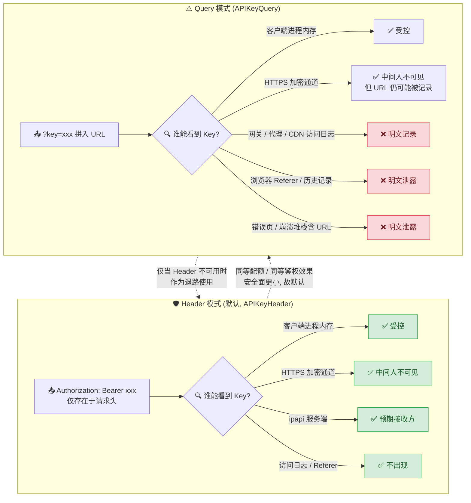

# 🔒 认证机制

> ipapi.co 的 API Key 认证，本库支持两种方式。

## 为什么需要认证

ipapi.co 提供免费额度，但**未认证请求配额低、且共享 IP 池**。生产环境强烈建议申请 API Key：

- 📈 更高配额
- 🧮 独立计费
- 🛡 稳定可用性

在 [ipapi.co](https://ipapi.co) 注册后在控制台获取 Key。

## 两种认证方式

### 方式 1：Bearer Header（默认）

Key 放在 `Authorization` 头：

```go
client := ipapi.NewClient(
	ipapi.WithAPIKey("your_api_key"),
)
// 内部发送: Authorization: Bearer your_api_key
```

✅ 推荐。Key 不出现在 URL/日志中，更安全。

### 方式 2：Query Parameter

Key 放在 `?key=` 查询参数：

```go
client := ipapi.NewClient(
	ipapi.WithAPIKey("your_api_key"),
	ipapi.WithAPIKeyQuery(),  // 切换为 query 模式
)
// 内部发送: https://ipapi.co/8.8.8.8/json/?key=your_api_key
```

⚠️ Key 会出现在 URL、访问日志、Referer 中。仅在 Header 不可用时用（如某些受限代理、CDN）。

## 内部实现

[`applyAuth`](/api/with-api-key) 根据字段 `APIKeyMode` 分支：

```go
switch c.APIKeyMode {
case APIKeyQuery:
	q.Set("key", c.APIKey)        // 查询参数
default:
	req.Header.Set("Authorization", "Bearer "+c.APIKey) // 头
}
```

`APIKeyMode` 是 `int` 枚举：

```go
const (
	APIKeyHeader APIKeyMode = iota // 0，默认
	APIKeyQuery                    // 1
)
```

::: tip 🎨 一图抵千言
下面的流程图展示了 [`applyAuth`](/api/with-api-key) 在每次请求时如何根据 `APIKey` 与 `APIKeyMode` 选择认证方式。
:::



## 何时用哪种

| 场景 | 推荐 |
|------|------|
| 一般后端服务 | Header ✅ |
| 需要在 CDN/网关层按 URL 鉴权 | Query |
| 前端 JSONP（无法设 Header） | Query |
| 安全要求高 | Header（避免日志泄露） |

::: tip 🎨 选型决策树
上面的表格给出了场景与推荐的对应关系。下面这张决策图从**使用者创建 [`Client`](./getting-started) 时的选型视角**出发，引导你一步步判断该用 Header 还是 Query（与上一节运行时 [`applyAuth`](/api/with-api-key) 分支互补）。
:::



## 安全最佳实践

::: danger 🔐 切勿硬编码 Key
**不要**把 Key 写进源码或提交进 Git。用环境变量：

```go
client := ipapi.NewClient(
	ipapi.WithAPIKey(os.Getenv("IPAPI_KEY")),
)
```

`.env` / `.gitignore` 中排除敏感文件。
:::

- 🗝 Key 当作密码保管，定期轮换
- 📋 服务端 403 时检查 Key（[`ErrInvalidKey`](/api/errors)）
- 🚫 不要把带 Key 的 URL 打到日志

::: warning 🎨 安全权衡一览
两种认证模式在 Key 的**暴露面**上有本质差异。下图对比 Key 从发出到落地各环节的可观测性，帮助理解为何默认推荐 Header。
:::



## 不认证也能用

省略 `WithAPIKey` 即可，享受免费额度：

```go
client := ipapi.NewClient() // 匿名
```

## 下一步

- 📖 看 [`WithAPIKey`](/api/with-api-key)、[`WithAPIKeyQuery`](/api/with-api-key-query)
- 🧪 看 [带 API Key 示例](/examples/with-api-key)
- 🛡 学 [错误处理](./error-concept)
