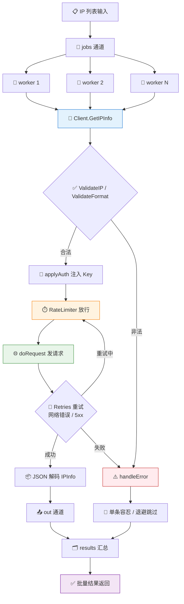
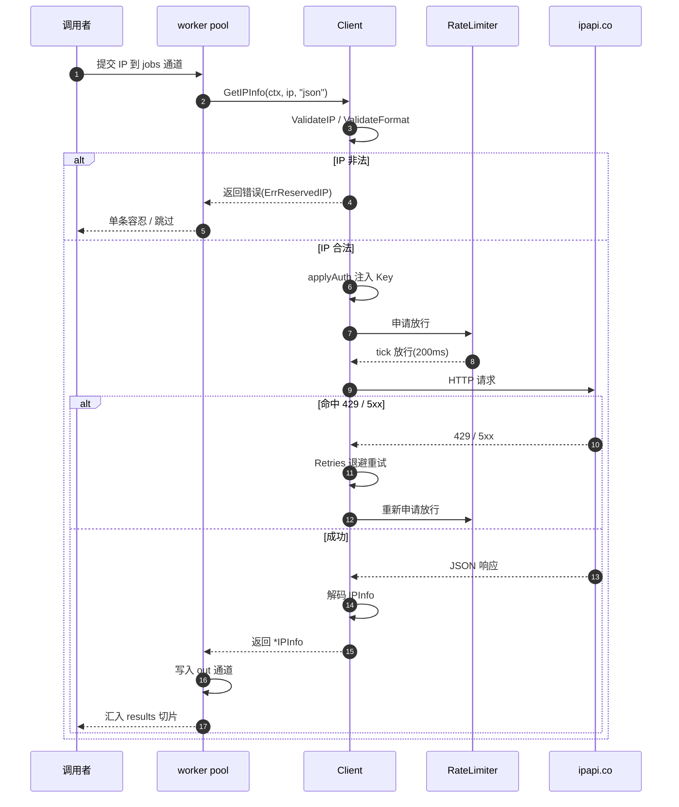

# 🔄 批量查询

> 需要查很多 IP？正确做法是并发 + 限流 + 复用 Client。

## ipapi.co 无批量端点

ipapi.co **没有**原生批量查询端点，每次查询一个 IP。因此「批量」= 多次单查，靠并发提速、靠限流防封。

## 基础串行

```go
func batchLookup(client *ipapi.Client, ips []string) {
	for _, ip := range ips {
		info, err := client.GetIPInfo(context.Background(), ip, "json")
		if err != nil {
			continue
		}
		fmt.Printf("%s | %s | %s\n", info.IP, info.CountryCode, info.ASN)
	}
}
```

简单但慢。适合几十个 IP。

## 并发 + 限流

```go
func batchLookup(client *ipapi.Client, ips []string) []*ipapi.IPInfo {
	// 限流：每秒 5 个
	client.RateLimiter = time.Tick(200 * time.Millisecond)

	var wg sync.WaitGroup
	results := make([]*ipapi.IPInfo, len(ips))

	for i, ip := range ips {
		wg.Add(1)
		go func(idx int, addr string) {
			defer wg.Done()
			info, err := client.GetIPInfo(context.Background(), addr, "json")
			if err == nil {
				results[idx] = info
			}
		}(i, ip)
	}
	wg.Wait()
	return results
}
```

关键点：
- ✅ **复用同一个 Client**（连接池）
- ✅ **设 RateLimiter**（避免触发 429）
- ✅ **goroutine + WaitGroup** 并发
- ✅ **预分配 results 切片**，按 index 写，无锁

## worker pool 模式

大量 IP（千级）时用 worker pool 控制并发数：

```go
func batchLookup(client *ipapi.Client, ips []string, workers int) []*ipapi.IPInfo {
	jobs := make(chan string, len(ips))
	out := make(chan *ipapi.IPInfo, len(ips))

	for w := 0; w < workers; w++ {
		go func() {
			for ip := range jobs {
				if info, err := client.GetIPInfo(context.Background(), ip, "json"); err == nil {
					out <- info
				}
			}
		}()
	}
	for _, ip := range ips {
		jobs <- ip
	}
	close(jobs)

	var results []*ipapi.IPInfo
	for i := 0; i < len(ips); i++ {
		select {
		case info := <-out:
			results = append(results, info)
		default:
		}
	}
	return results
}
```

::: tip 🎨 一图抵千言
worker pool + RateLimiter + 复用 Client 三件套如何协作，看这张图就懂。
:::



::: tip 🎨 一图抵千言
换成时序视角，看单个 IP 从提交到结果汇总的全过程：调用者、worker pool、Client、RateLimiter 与 ipapi.co 之间的往返交互。
:::



## 错误处理

批量场景对单条失败要容忍：

```go
if errors.Is(err, ipapi.ErrRateLimited) {
	time.Sleep(time.Minute) // 整体退避
}
if errors.Is(err, ipapi.ErrReservedIP) {
	continue // 私有地址跳过
}
```

## 配额规划

免费额度约 1000/天。批量查询前先估算：

| 数量 | 建议 |
|------|------|
| < 100 | 默认配置 |
| 100-1000 | 限流 + 申请 Key |
| > 1000 | 必须付费 Key |

## 下一步

- 🔄 学 [重试与限流](./retry-concept)
- 🧪 看 [批量查询示例](/examples/batch-lookup)
- 📡 学 [客户端 IP](./client-ip)
