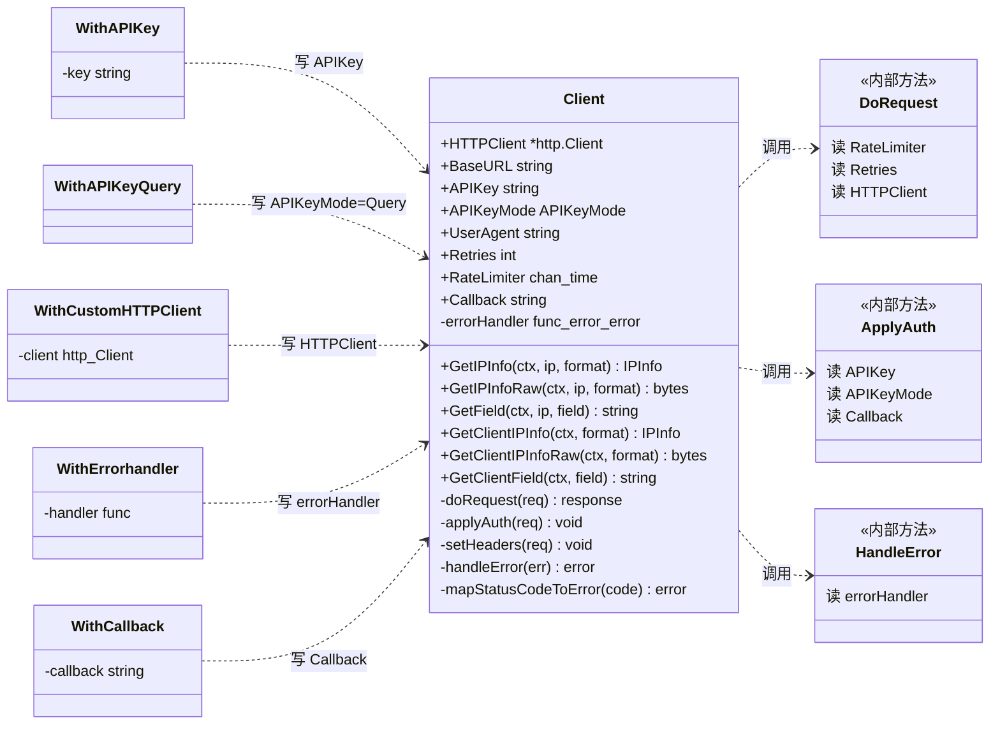

# 🧭 Client 客户端

> `Client` 是整个 SDK 的核心，所有查询都通过它发起。

## 它是什么

[`Client`](/api/client) 是一个**线程安全**的 HTTP 客户端封装，持有调用 ipapi.co 所需的全部状态：

```go
type Client struct {
	HTTPClient   *http.Client          // 底层 HTTP 客户端
	BaseURL      string                // API 基地址，默认 https://ipapi.co/
	APIKey       string                // API 密钥
	APIKeyMode   APIKeyMode            // 认证方式（Header / Query）
	UserAgent    string                // User-Agent 头
	Retries      int                   // 重试次数，默认 2
	RateLimiter  <-chan time.Time      // 速率限制通道
	Callback     string                // JSONP 回调名
	errorHandler func(error) error     // 自定义错误处理
}
```

::: tip 🎨 一图抵千言
下面这张类图展示了 `Client` 各字段、`WithXxx` 函数式选项与内部辅助方法之间的装配关系——选项负责写字段，方法负责读字段。
:::



::: tip 🧩 依赖视角
上面那张图看的是「谁写字段」；下面这张看的是运行时 `Client` 依赖哪些协作者、各自承担什么职责。`http.Client` 负责网络传输，`RateLimiter` 通道负责节流，`errorHandler` 回调负责错误改写——三者皆可替换，这正是函数式选项的意义。
:::

```mermaid
classDiagram
    direction LR

    class Client {
        <<协调者>>
        持有配置 + 编排请求
    }

    class HTTPClient {
        <<可替换>>
        标准库 *http.Client
        连接池 / 超时 / 重定向
    }

    class RateLimiter {
        <<可替换>>
        <-chan time.Time
        节流令牌
    }

    class ErrorHandler {
        <<可替换>>
        func(error) error
        错误改写/日志/metrics
    }

    class SentinelErrors {
        <<不可替换>>
        ErrInvalidIP
        ErrRateLimited
        ErrServerError
        ErrNotFound
        ...
    }

    Client o--> HTTPClient : 持有/委托
    Client o--> RateLimiter : 等待令牌
    Client o--> ErrorHandler : 委托错误处理

    ErrorHandler ..> SentinelErrors : 映射/判断
    Client ..> SentinelErrors : mapStatusCodeToError

    note for Client "WithCustomHTTPClient 替换 HTTPClient\nWithAPIKey 不改协作者,只改配置"
    note for RateLimiter "无选项直接注入;\n高并发场景外部构造后赋值"
``

## 创建客户端

用 [`NewClient`](/api/new-client) + 函数式选项：

```go
// 最简：全部默认值
client := ipapi.NewClient()

// 带配置
client := ipapi.NewClient(
	ipapi.WithAPIKey("your_key"),
	ipapi.WithCustomHTTPClient(&http.Client{Timeout: 30 * time.Second}),
)
```

## 线程安全

`Client` 内部**无共享可变状态**（请求都新建 `*http.Request`），可以安全地在多个 goroutine 间复用：

```go
var client = ipapi.NewClient()

func handler(w http.ResponseWriter, r *http.Request) {
	// 多个请求并发调用，安全
	info, _ := client.GetClientIPInfo(r.Context(), "json")
	// ...
}
```

::: tip 🚀 性能建议
**复用同一个 Client 实例**，不要每次请求都 `NewClient()`。复用能复用底层连接池，减少 TCP/TLS 握手开销。
:::

## 默认值

| 字段 | 默认值 | 来源 |
|------|--------|------|
| `BaseURL` | `https://ipapi.co/` | `defaultBaseURL` |
| `HTTPClient.Timeout` | `10s` | `defaultTimeout` |
| `UserAgent` | `ipapi-go-client/1.0` | 硬编码 |
| `Retries` | `2` | 硬编码 |
| `APIKeyMode` | `APIKeyHeader` | iota 零值 |
| `CheckRedirect` | 最多 3 次跳转 | `maxRedirects` |

## 六个查询方法

`Client` 暴露 6 个方法，构成「**指定IP / 客户端IP** × **完整/单字段** × **解析/raw**」的矩阵：

| 方法 | 目标 | 返回 | 文档 |
|------|------|------|------|
| `GetIPInfo` | 指定 IP | `*IPInfo` | [→](/api/get-ip-info) |
| `GetIPInfoRaw` | 指定 IP | `[]byte` | [→](/api/get-ip-info-raw) |
| `GetField` | 指定 IP 单字段 | `string` | [→](/api/get-field) |
| `GetClientIPInfo` | 客户端 IP | `*IPInfo` | [→](/api/get-client-ip-info) |
| `GetClientIPInfoRaw` | 客户端 IP | `[]byte` | [→](/api/get-client-ip-info-raw) |
| `GetClientField` | 客户端 IP 单字段 | `string` | [→](/api/get-client-field) |

## 配置项一览

| 选项 | 作用 | 文档 |
|------|------|------|
| `WithAPIKey` | 设置 API Key | [→](/api/with-api-key) |
| `WithAPIKeyQuery` | 改用 query 参数认证 | [→](/api/with-api-key-query) |
| `WithCustomHTTPClient` | 替换底层 `*http.Client` | [→](/api/with-custom-http-client) |
| `WithErrorHandler` | 注入错误处理回调 | [→](/api/with-error-handler) |
| `WithCallback` | 设置 JSONP 回调名 | [→](/api/with-callback) |

## 何时该自定义

| 场景 | 推荐配置 |
|------|----------|
| 本地开发/小流量 | `NewClient()` 默认即可 |
| 生产服务 | `WithAPIKey` + `WithCustomHTTPClient`(更长超时) |
| 高并发 | 设 `RateLimiter` 通道 + 复用 Client |
| 跨域前端（JSONP） | `WithCallback` |
| 审计/监控 | `WithErrorHandler` 做日志/metrics |
| 受限网络 | `WithCustomHTTPClient` 注入代理 |

## 下一步

- 📖 看 [`Client` API 参考](/api/client)
- 🔧 学 [认证机制](./auth-concept)
- 🔄 学 [重试与限流](./retry-concept)
