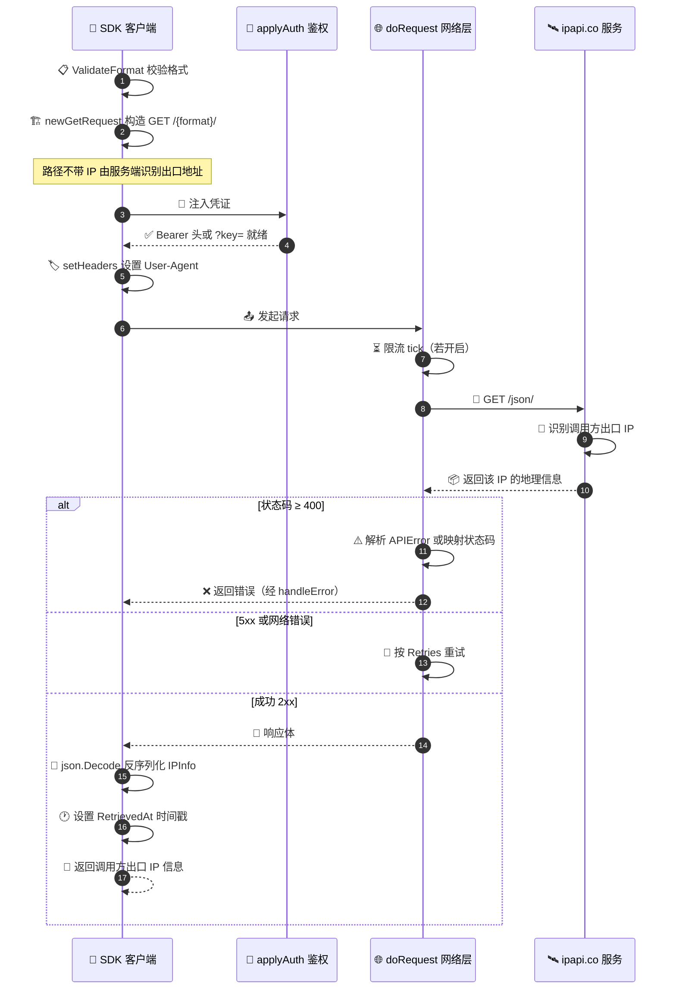
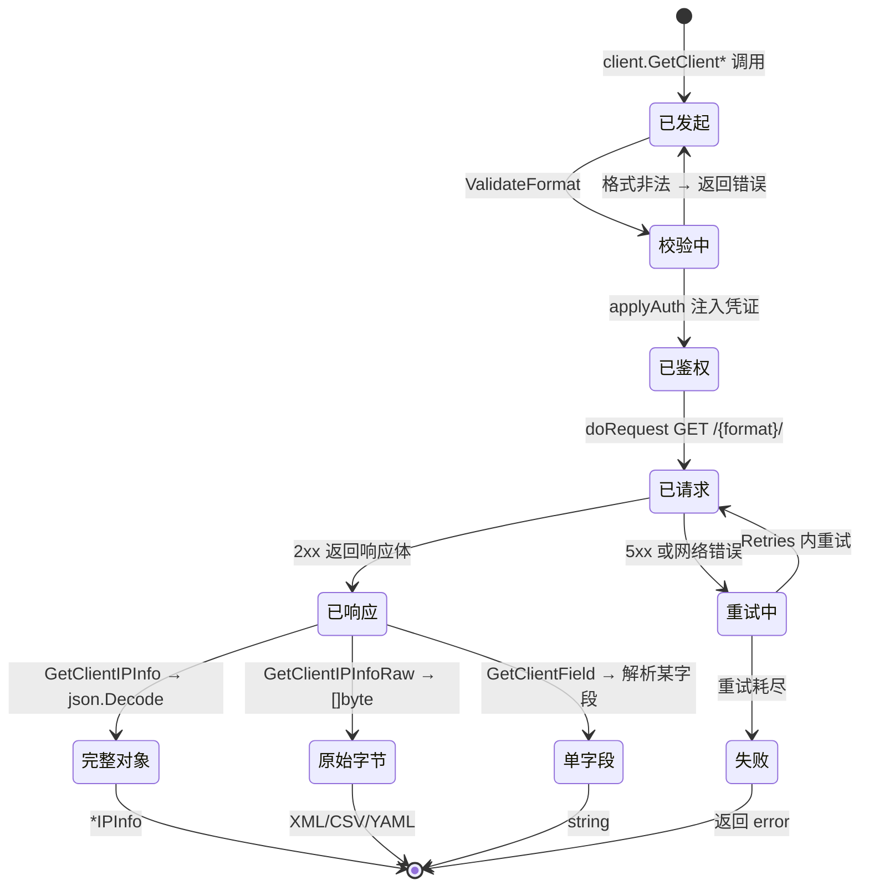

# 📡 客户端 IP 检测

> 不知道要查哪个 IP？查询「发起请求的这台机器」的公网 IP。

## 客户端 IP 端点

ipapi.co 提供 `GET /{format}/` 端点（路径里没有 IP），自动返回**调用方出口 IP** 的信息。本库封装为 [`GetClientIPInfo`](/api/get-client-ip-info)：

```go
info, err := client.GetClientIPInfo(ctx, "json")
fmt.Printf("我的公网 IP: %s\n位置: %s\n", info.IP, info.City)
```

::: tip 🎨 一图抵千言
下面这张时序图展示了 `GetClientIPInfo` 内部的完整调用链：从格式校验、构造请求、鉴权，到 ipapi.co 识别调用方出口 IP 并返回结果。
:::



## 系列方法

| 方法 | 返回 | 用途 |
|------|------|------|
| `GetClientIPInfo` | `*IPInfo` | 拿自己完整信息 |
| `GetClientIPInfoRaw` | `[]byte` | 拿自己原始响应（XML/CSV/YAML） |
| `GetClientField` | `string` | 拿自己单个字段 |

```go
// 只想知道自己公网 IP
myIP, _ := client.GetClientField(ctx, "ip")
fmt.Println("我的 IP:", myIP)
```

::: tip 🎨 一图抵千言
三种系列方法对应不同的「取结果」状态：完整结构化对象、原始字节、单个字段。下面用状态图展示一次客户端 IP 检测从发起到拿到所需形态的流转。
:::



## 典型场景

### 🌐 「我的 IP 是什么」

```go
info, _ := client.GetClientIPInfo(ctx, "json")
fmt.Println(info.IP)
```

### 📍 服务部署位置自检

服务器调用 `GetClientIPInfo`，看返回的城市是否是预期机房位置。

### 🔄 出口 IP 探测

多出口/CDN 环境下，探测实际出口 IP 用于调试。

## ⚠ 注意事项

::: warning 🚧 这是「调用方的出口 IP」
`GetClientIPInfo` 返回的是 **SDK 所在机器** 看到的出口 IP，**不是**终端用户的 IP。

如果你的服务在网关/代理后，要查终端用户 IP，应从 `X-Forwarded-For` 等头取出真实 IP，再用 `GetIPInfo` 查询：
:::

```go
// 从请求头取真实用户 IP
userIP := r.Header.Get("X-Forwarded-For")
info, _ := client.GetIPInfo(ctx, userIP, "json")
```

## 下一步

- 📖 看 [`GetClientIPInfo` API](/api/get-client-ip-info)
- 🧪 看 [获取客户端 IP 示例](/examples/lookup-client-ip)
- 🌐 学 [IPv4](./ipv4) / [IPv6](./ipv6)
