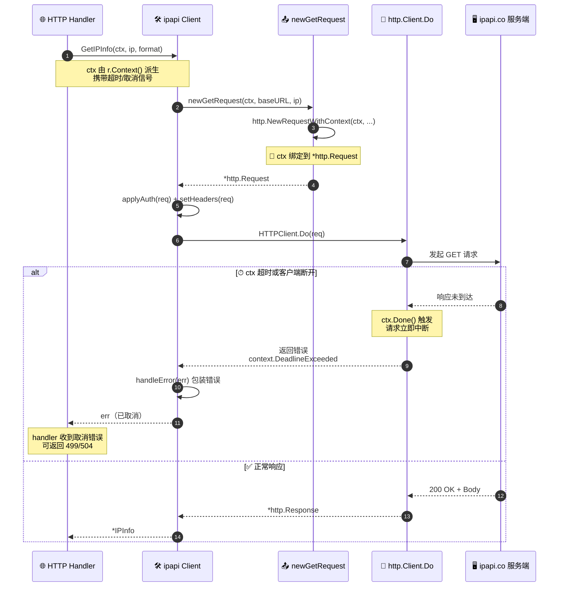
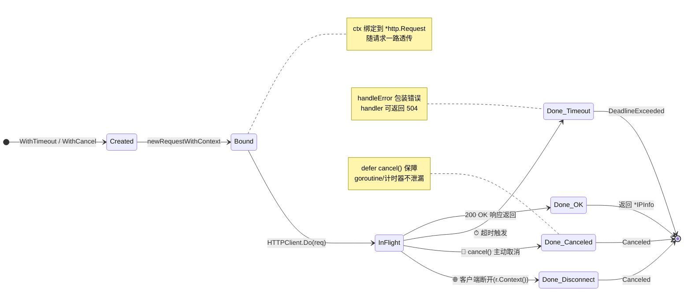

# 🛠 上下文 Context

> 所有查询方法的第一个参数都是 `context.Context`，用于超时与取消控制。

## 为什么用 Context

Go 的 `context.Context` 是控制请求生命周期的标准方式：

- ⏱ 超时控制
- 🚫 主动取消
- 🔗 跨服务传播截止时间

本库所有方法把 ctx 透传进 `http.NewRequestWithContext`，因此 ctx 取消会立即中断 HTTP 请求。

## 设置超时

```go
ctx, cancel := context.WithTimeout(context.Background(), 5*time.Second)
defer cancel()

info, err := client.GetIPInfo(ctx, "8.8.8.8", "json")
```

5 秒内未返回，ctx 超时，请求被中断，返回 `context.DeadlineExceeded` 包装的错误。

::: warning ⚠️ 别忘 defer cancel()
`WithTimeout` / `WithCancel` 创建的 ctx 必须 `cancel`，否则会泄漏 goroutine/计时器。
:::

## HTTP 服务中传播

在 HTTP handler 中，应从 `r.Context()` 派生，让客户端断开时自动取消上游查询：

```go
func handler(w http.ResponseWriter, r *http.Request) {
	ctx := r.Context() // 客户端断开 → ctx 取消 → ipapi 请求取消
	info, err := client.GetIPInfo(ctx, r.URL.Query().Get("ip"), "json")
	// ...
}
```

::: tip 🎨 一图抵千言
下图展示 ctx 超时/取消信号如何在 handler → Client → HTTP 请求之间逐层传播，最终中断正在进行的网络请求。
:::



## 主动取消

```go
ctx, cancel := context.WithCancel(context.Background())
go func() {
	time.Sleep(100 * time.Millisecond)
	cancel() // 主动取消
}()
client.GetIPInfo(ctx, "8.8.8.8", "json") // 会因取消而中断
```

::: tip 🎨 一图抵千言
下图从状态机视角展示一个 `context.Context` 在整个请求生命周期里经历的状态迁移——与上方序列图互补，关注的是 ctx 自身的状态而非调用链。
:::



## 超时分层

可以分层设置：HTTP 客户端超时（兜底）+ Context 超时（单次）：

```go
client := ipapi.NewClient(
	ipapi.WithCustomHTTPClient(&http.Client{
		Timeout: 30 * time.Second, // HTTP 层兜底
	}),
)

ctx, cancel := context.WithTimeout(context.Background(), 3*time.Second)
defer cancel()
client.GetIPInfo(ctx, "8.8.8.8", "json") // ctx 3s 先生效
```

## 下一步

- 📖 看 [`GetIPInfo`](/api/get-ip-info) 等方法签名
- 🛠 学 [自定义 HTTP 客户端](./custom-http)
