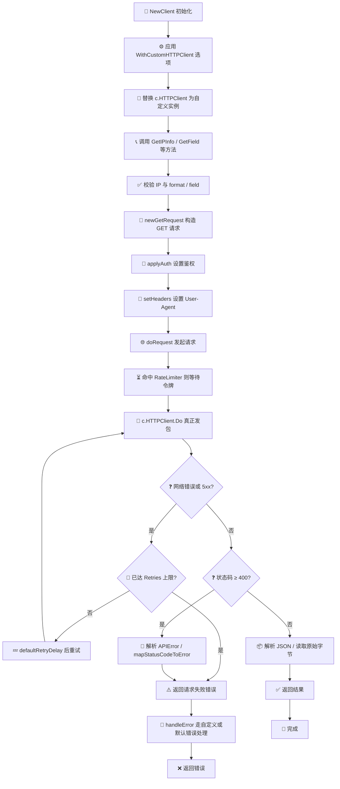
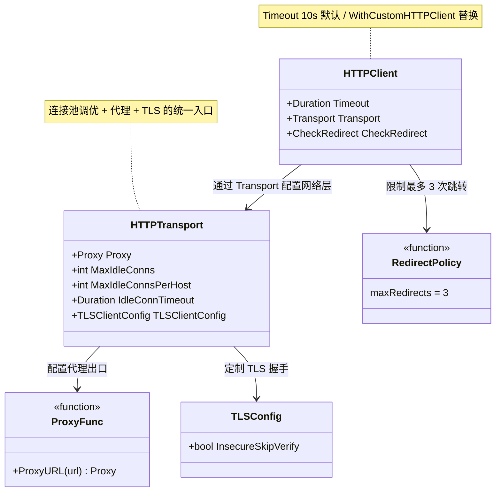

# 🛠 自定义 HTTP 客户端

> 用 `WithCustomHTTPClient` 替换底层 `*http.Client`，实现超时、代理、连接池等定制。

::: tip 🎨 一图抵千言
下图展示自定义 HTTP 客户端在 SDK 请求链路中的位置：`WithCustomHTTPClient` 注入的 `*http.Client` 会被 `doRequest` 用于真正的网络发包，前置的鉴权与重试、后置的错误处理则由 SDK 内部统一完成。
:::



## 默认 HTTP 客户端

[`NewClient`](/api/new-client) 默认创建：

```go
&http.Client{
	Timeout: 10 * time.Second, // 默认超时
	CheckRedirect: func(req *http.Request, via []*http.Request) error {
		if len(via) >= maxRedirects { // 最多 3 次跳转
			return fmt.Errorf("stopped after %d redirects", maxRedirects)
		}
		return nil
	},
}
```

## 替换它

[`WithCustomHTTPClient`](/api/with-custom-http-client) 接受任意 `*http.Client`：

```go
client := ipapi.NewClient(
	ipapi.WithCustomHTTPClient(&http.Client{
		Timeout:   15 * time.Second,
		Transport: &http.Transport{MaxIdleConns: 10},
	}),
)
```

## 常见定制场景

> 下面的 classDiagram 从结构视角拆解 `*http.Client` 可定制的组件：`Timeout` 直接挂在 Client 上，而代理、连接池、TLS 等都通过 `Transport` 配置，多个 Client 还可共享同一个 Transport 复用连接。



### ⏱ 调整超时

```go
&http.Client{Timeout: 30 * time.Second}
```

### 🌐 配置代理

```go
&http.Client{
	Transport: &http.Transport{
		Proxy: http.ProxyURL(must(url.Parse("http://proxy:8080"))),
	},
}
```

### 🔗 连接池调优

```go
&http.Client{
	Transport: &http.Transport{
		MaxIdleConns:        100,
		MaxIdleConnsPerHost: 20,
		IdleConnTimeout:     90 * time.Second,
	},
}
```

### 🔒 自定义 TLS

```go
&http.Client{
	Transport: &http.Transport{
		TLSClientConfig: &tls.Config{
			InsecureSkipVerify: false, // 生产别跳过校验
		},
	},
}
```

### 📦 复用 Transport

```go
transport := &http.Transport{MaxIdleConns: 100}
// 多个 Client 共享 transport，复用连接
c1 := ipapi.NewClient(ipapi.WithCustomHTTPClient(&http.Client{Transport: transport, Timeout: 10 * time.Second}))
c2 := ipapi.NewClient(ipapi.WithCustomHTTPClient(&http.Client{Transport: transport, Timeout: 30 * time.Second}))
```

## 完整示例

来自 [`examples/advanced_usage`](/examples/advanced-usage)：

```go
client := ipapi.NewClient(
	ipapi.WithAPIKey("your_api_key"),
	ipapi.WithCustomHTTPClient(&http.Client{
		Timeout:   15 * time.Second,
		Transport: &http.Transport{MaxIdleConns: 10},
	}),
	ipapi.WithErrorHandler(customErrorHandler),
)
```

## 下一步

- 📖 看 [`WithCustomHTTPClient`](/api/with-custom-http-client)
- 🧪 看 [高级示例](/examples/advanced-usage)
- ⏱ 学 [Context 超时](./context)
