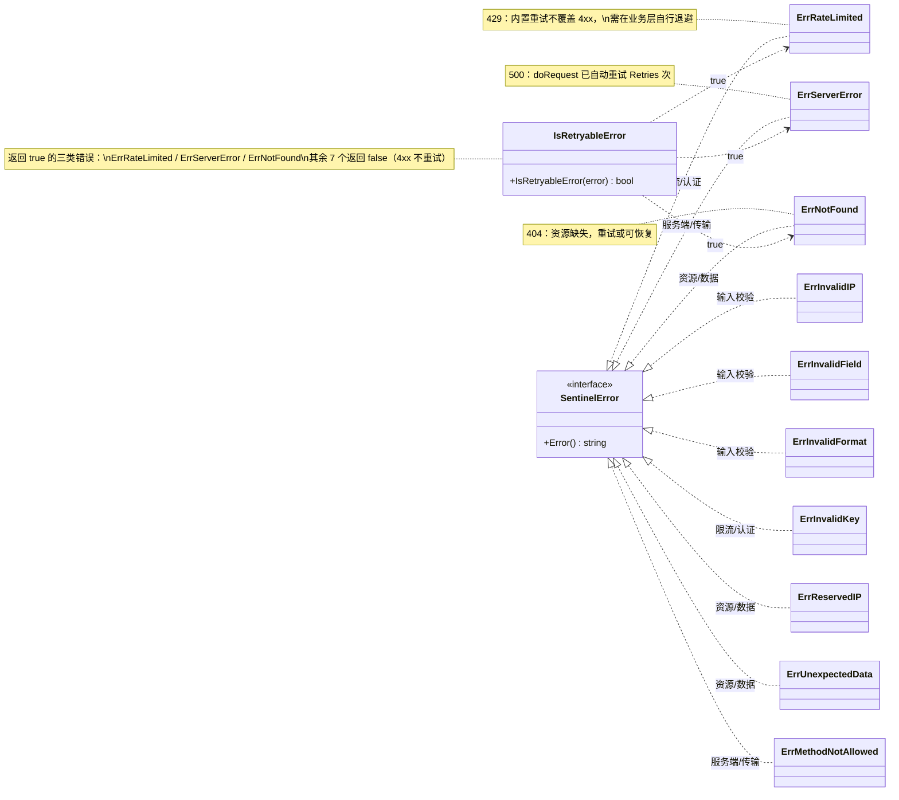

# 🛡 错误处理

> 本库提供 10 个哨兵错误 + 结构化 `APIError`，让错误分支清晰可控。

## 错误体系

### 哨兵错误值

定义在 [`client.go`](/api/client)：

```go
var (
	ErrInvalidIP        = errors.New("invalid IP address")
	ErrInvalidField     = errors.New("invalid field name")
	ErrInvalidFormat    = errors.New("invalid response format")
	ErrRateLimited      = errors.New("API rate limit exceeded")
	ErrReservedIP       = errors.New("reserved IP address")
	ErrNotFound         = errors.New("resource not found")
	ErrServerError      = errors.New("server error")
	ErrUnexpectedData   = errors.New("unexpected response data")
	ErrMethodNotAllowed = errors.New("method not allowed")
	ErrInvalidKey       = errors.New("invalid API key")
)
```

### 结构化 APIError

服务端返回的错误包成 [`APIError`](/api/models)：

```go
type APIError struct {
	HasError bool   `json:"error"`
	Reason   string `json:"reason"`
	Message  string `json:"message"`
	IP       string `json:"ip"`
	Reserved bool   `json:"reserved"`
	Version  string `json:"version"`
}
```

## 用 errors.Is 分支

Go 惯用的哨兵匹配：

```go
info, err := client.GetIPInfo(ctx, "invalid.ip", "json")
if err != nil {
	switch {
	case errors.Is(err, ipapi.ErrInvalidIP):
		fmt.Println("→ 无效 IP")
	case errors.Is(err, ipapi.ErrRateLimited):
		time.Sleep(time.Minute) // 退避
	case errors.Is(err, ipapi.ErrReservedIP):
		fmt.Println("→ 保留地址，无地理信息")
	case errors.Is(err, ipapi.ErrInvalidKey):
		fmt.Println("→ API Key 错误")
	default:
		log.Println(err)
	}
}
```

## 用 errors.As 取上下文

需要 `Reason`、`IP` 等细节时：

```go
var apiErr *ipapi.APIError
if errors.As(err, &apiErr) {
	log.Printf("reason=%s ip=%s reserved=%v", apiErr.Reason, apiErr.IP, apiErr.Reserved)
}
```

## 错误映射关系

::: tip 🎨 一图抵千言
下图展示一个错误从产生到被业务层分支命中的完整流转：`doRequest` 把 4xx/5xx 或网络错误包成 `APIError`，`handleError` 按 `Reason` 或状态码映射到哨兵值并经 `fmt.Errorf("%w", ...)` 保留包装链，最终调用方用 `errors.Is` 命中具体分支。
:::

```mermaid
stateDiagram-v2
    direction TB
    [*] --> doRequest: Client.GetIPInfo 调用
    doRequest --> NetErr: 网络错误或5xx
    doRequest --> APIError: 4xx 且 body 含 error 字段
    doRequest --> StatusErr: 4xx 无 error body
    doRequest --> OK: 状态码小于400

    NetErr --> HandleErr: 重试 Retries 次仍失败
    APIError --> HandleErr: errors.As 解包
    StatusErr --> MapStatus: mapStatusCodeToError

    state MapStatus {
        [*] --> S400
        S400 --> ErrServerError
        S403 --> ErrInvalidKey
        S404 --> ErrNotFound
        S405 --> ErrMethodNotAllowed
        S429 --> ErrRateLimited
        S500 --> ErrServerError2: ErrServerError
    }

    HandleErr --> SentinelMap: 按 APIError.Reason 映射

    state SentinelMap {
        [*] --> R1
        R1: RateLimited 转为 ErrRateLimited
        R2: Reserved IP Address 转为 ErrReservedIP
        R3: Invalid IP Address 转为 ErrInvalidIP
        R4: Invalid Key 转为 ErrInvalidKey
    }

    SentinelMap --> WrappedErr: fmt.Errorf 百分号w 保留包装链
    MapStatus --> WrappedErr
    OK --> [*]

    WrappedErr --> ErrorsIs: 调用方 errors.Is
    ErrorsIs --> Branch1: 命中 ErrInvalidIP
    ErrorsIs --> Branch2: 命中 ErrRateLimited
    ErrorsIs --> Branch3: 命中 ErrReservedIP
    ErrorsIs --> Branch4: 命中 ErrInvalidKey
    ErrorsIs --> Default: default 兜底
    Branch1 --> [*]
    Branch2 --> [*]
    Branch3 --> [*]
    Branch4 --> [*]
    Default --> [*]
```

[`handleError`](/api/errors) 把 `APIError.Reason` 映射到哨兵值：

| `APIError.Reason` | 哨兵错误 |
|-------------------|----------|
| `"RateLimited"` | `ErrRateLimited` |
| `"Reserved IP Address"` | `ErrReservedIP` |
| `"Invalid IP Address"` | `ErrInvalidIP` |
| `"Invalid Key"` | `ErrInvalidKey` |

HTTP 状态码映射（[`mapStatusCodeToError`](/api/errors)）：

| 状态码 | 错误 |
|--------|------|
| 400 | `ErrServerError` |
| 403 | `ErrInvalidKey` |
| 404 | `ErrNotFound` |
| 405 | `ErrMethodNotAllowed` |
| 429 | `ErrRateLimited` |
| 500 | `ErrServerError` |

## 哨兵错误分类树

::: info 🗂 互补视角：分类与可重试关系
上图按"流转过程"看错误，下图按"语义分类"看错误。10 个哨兵错误划入四个簇：**输入校验**（调用方参数错）、**限流/认证**（凭证与配额）、**资源/数据**（服务端语义结果）、**服务端/传输**（基础设施层）。`IsRetryableError` 以虚线箭头标注其命中范围——恰好落在"服务端/传输"与"资源/数据"交界，呼应"重试仅对网络错误与 5xx，4xx 不重试"的设计。
:::



四簇语义与典型诱因：

| 分类 | 哨兵错误 | 典型诱因 | 可重试 |
|------|----------|----------|--------|
| 输入校验 | `ErrInvalidIP` `ErrInvalidField` `ErrInvalidFormat` | 调用方传入非法 IP / 字段名 / 响应格式 | 否 |
| 限流/认证 | `ErrRateLimited` `ErrInvalidKey` | 超出免费配额、Key 无效或未授权 | `ErrRateLimited` 是 |
| 资源/数据 | `ErrReservedIP` `ErrNotFound` `ErrUnexpectedData` | 保留地址、404、响应体不可解析 | `ErrNotFound` 是 |
| 服务端/传输 | `ErrServerError` `ErrMethodNotAllowed` | 5xx、405 方法不允许 | `ErrServerError` 是 |

::: warning ⚠ 可重试边界
`IsRetryableError` 命中的三个错误中，`ErrServerError` 与 `ErrNotFound` 在 `doRequest` 内已对网络错误和 5xx 自动重试 `Retries` 次；`ErrRateLimited` 属 4xx，内置重试不覆盖，需在业务层自行实现退避（如指数退避 + 抖动）。
:::

## 可重试错误

[`IsRetryableError`](/api/is-retryable) 判断错误是否值得重试：

```go
if ipapi.IsRetryableError(err) {
	// 自己实现更复杂的退避策略
}
```

返回 `true` 的错误：`ErrRateLimited`、`ErrServerError`、`ErrNotFound`。

::: tip 🔄 内置重试
`doRequest` 已对网络错误和 5xx 自动重试 `Retries` 次。`IsRetryableError` 适用于你想在业务层再做一层退避的场景。
:::

## 自定义错误处理

[`WithErrorHandler`](/api/with-error-handler) 注入全局错误回调：

```go
client := ipapi.NewClient(
	ipapi.WithErrorHandler(func(err error) error {
		sentry.CaptureException(err) // 上报监控
		return err                   // 继续向上抛
	}),
)
```

回调可以返回 `nil` 吞掉错误，或返回新错误做转换。

## 错误包装

[`WrapError`](/api/wrap-error) 给错误加操作名上下文：

```go
if err := ipapi.WrapError("lookup_user_ip", err); err != nil {
	// "lookup_user_ip failed: ..."
}
```

保留 `%w` 包装链，`errors.Is` 仍能匹配。

## 下一步

- 📖 看 [错误 API 参考](/api/errors)
- 🧪 看 [错误处理示例](/examples/error-handling)
- 🛠 学 [自定义错误处理](/examples/custom-error)
