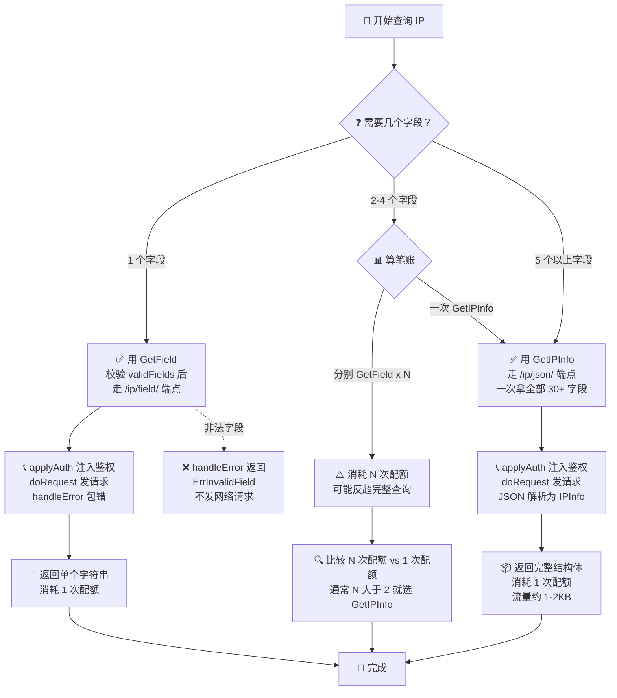

# 🎯 字段查询 Field

> 只需要某个字段？用单字段端点，省流量、更快。

## 单字段端点

ipapi.co 提供 `GET /{ip}/{field}/` 端点，只返回该字段的值（纯文本）。本库封装为 [`GetField`](/api/get-field)：

```go
country, _ := client.GetField(ctx, "8.8.8.8", "country_code")
fmt.Println(country) // US
```

查询**客户端 IP** 的单字段用 [`GetClientField`](/api/get-client-field)：

```go
city, _ := client.GetClientField(ctx, "city")
```

## 合法字段清单

定义在 [`api.go`](/api/methods) 的 `validFields`，共 28 个：

| 类别 | 字段 |
|------|------|
| 🌐 网络 | `ip` `network` `version` |
| 🏙 地理 | `city` `region` `region_code` `postal` |
| 🌍 国家 | `country` `country_name` `country_code` `country_code_iso3` `country_capital` `country_tld` `continent_code` `in_eu` |
| 🧭 坐标 | `latitude` `longitude` `latlong` |
| ⏰ 时间 | `timezone` `utc_offset` |
| 🗣 语言 | `languages` `country_calling_code` |
| 💱 货币 | `currency` `currency_name` |
| 📊 统计 | `country_area` `country_population` |
| 📡 ASN | `asn` `org` `hostname` |

字段含义详见 [字段总览](/api/fields)。

## 校验

传非法字段会返回 [`ErrInvalidField`](/api/errors)：

```go
_, err := client.GetField(ctx, "8.8.8.8", "nonexistent")
// err 满足 errors.Is(err, ipapi.ErrInvalidField)
```

校验在客户端完成，**不发网络请求**。

::: tip 🎨 一图抵千言
决策树看的是“选哪个端点”的分支，下面这张时序图则把一次 `GetField` 调用从入参到返回的完整时间线摊开：本地校验先行、不发网络，校验通过后才依次走鉴权、请求、解析、计费。
:::

```mermaid
sequenceDiagram
    autonumber
    participant Caller as 调用方
    participant Client as ipapi.Client
    local participant validFields as validFields 集合
    participant Net as ipapi.co 服务端
    participant Bucket as 配额计数

    Caller->>Client: GetField(ctx, ip, field)
    Client->>validFields: 查询 field 是否合法
    alt field 非法
        validFields-->>Client: 未命中
        Client-->>Caller: 返回 ErrInvalidField<br/>（未触网）
    else field 合法
        validFields-->>Client: 命中
        Client->>Client: applyAuth 注入鉴权头
        Client->>Net: GET /{ip}/{field}/
        Net-->>Client: 纯文本字段值<br/>或错误状态码
        Client->>Client: handleError 处理状态码
        Client->>Bucket: 消耗 1 次配额
        Client-->>Caller: 返回 string
    end
```

## 完整 vs 单字段，怎么选

::: tip 🎨 一图抵千言
下面的决策树帮你快速判断该用 `GetIPInfo` 还是 `GetField`，关键在配额权衡：两者每次调用各消耗 1 次配额，所以需要的字段越多，单字段查询越不划算。
:::



| 维度 | `GetIPInfo`（完整） | `GetField`（单字段） |
|------|---------------------|----------------------|
| 返回 | 30+ 字段的 `*IPInfo` | 单个字符串 |
| 流量 | 大（约 1-2KB） | 小（几十字节） |
| 用途 | 需要多字段 | 只需一两个字段 |
| 端点 | `/{ip}/json/` | `/{ip}/{field}/` |
| 计费 | 占一次配额 | 占一次配额 |

::: warning 💡 配额注意
无论完整还是单字段，每次调用都消耗 **1 次配额**。若需要 5 个以上字段，直接用 `GetIPInfo` 更划算。
:::

## 批量取多个字段

需要 3 个字段时，建议一次 `GetIPInfo` 取全部：

```go
info, _ := client.GetIPInfo(ctx, "8.8.8.8", "json")
// 一次拿到 city、country、asn
fmt.Println(info.City, info.CountryCode, info.ASN)
```

## 下一步

- 📖 看 [`GetField` API](/api/get-field)
- 📋 看 [字段总览](/api/fields)
- 🧪 看 [单字段示例](/examples/single-field)
