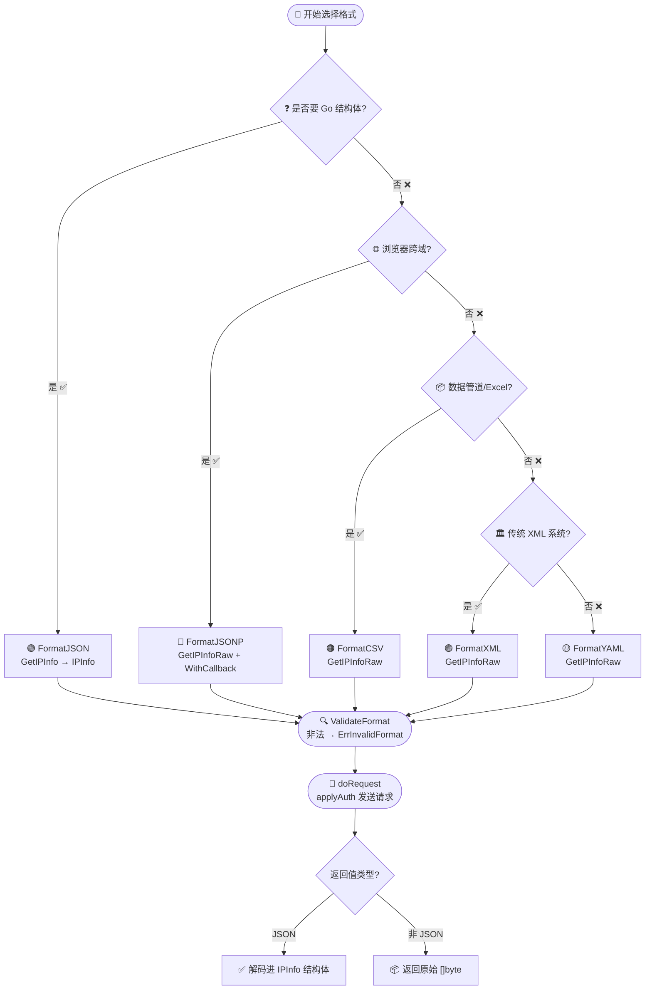
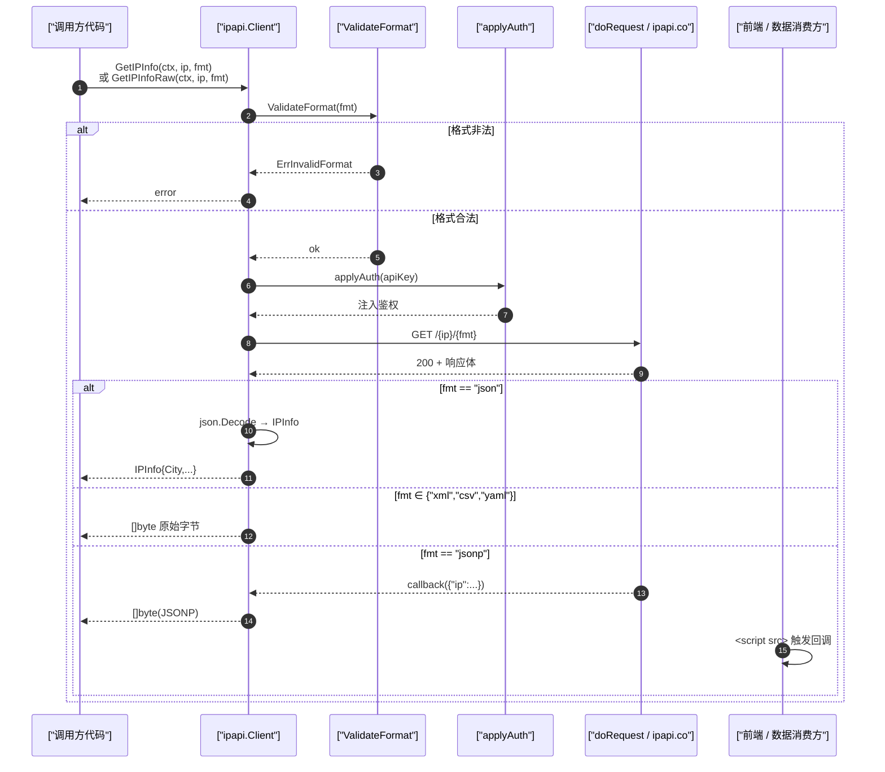

# 🎨 响应格式 Format

> ipapi.co 支持 5 种响应格式，本库用 `Format` 类型和常量统一管理。

## 五种格式

定义在 [`client.go`](/api/client)：

```go
type Format string

const (
	FormatJSON  Format = "json"
	FormatJSONP Format = "jsonp"
	FormatXML   Format = "xml"
	FormatCSV   Format = "csv"
	FormatYAML  Format = "yaml"
)
```

| 常量 | 值 | 适用场景 | 解析方法 |
|------|----|----------|----------|
| 🟢 `FormatJSON` | `"json"` | Go 后端、结构化处理 | `GetIPInfo` / `GetClientIPInfo` |
| 🔵 `FormatJSONP` | `"jsonp"` | 浏览器跨域 `<script>` | `GetIPInfoRaw` + `WithCallback` |
| 🟣 `FormatXML` | `"xml"` | 传统系统、SOAP 集成 | `GetIPInfoRaw` |
| 🟠 `FormatCSV` | `"csv"` | 数据管道、Excel 导入 | `GetIPInfoRaw` |
| 🟡 `FormatYAML` | `"yaml"` | 配置文件、可读性 | `GetIPInfoRaw` |

## JSON：解析成结构体

只有 JSON 格式能被直接解码进 [`IPInfo`](/api/models)：

```go
info, err := client.GetIPInfo(ctx, "8.8.8.8", string(ipapi.FormatJSON))
fmt.Println(info.City)
```

::: tip 💡 为什么传 `string(ipapi.FormatJSON)`
方法签名接受 `string` 而非 `Format`，方便直接传字面量 `"json"`。用常量更安全、可读性更好。
:::

## 非 JSON：拿原始字节

XML/CSV/YAML/JSONP 没有统一 Go 结构体，用 raw 方法拿 `[]byte`：

```go
xmlData, _ := client.GetIPInfoRaw(ctx, "8.8.8.8", string(ipapi.FormatXML))
fmt.Println(string(xmlData))
```

CSV 示例输出：

```
8.8.8.8,8.8.8.8/32,IPv4,Mountain View,...,US,United States,...
```

## JSONP：带回调

JSONP 会把 JSON 包进回调函数调用：

```go
client := ipapi.NewClient(ipapi.WithCallback("myCallback"))
data, _ := client.GetIPInfoRaw(ctx, "8.8.8.8", string(ipapi.FormatJSONP))
// 返回: myCallback({"ip":"8.8.8.8",...})
```

配合前端 `<script>` 标签可绕过同源限制。详见 [JSONP 指南](./jsonp)。

## 格式校验

[`ValidateFormat`](/api/validate-format) 在请求前校验格式合法性：

```go
if err := ipapi.ValidateFormat("yaml"); err != nil {
	// 非法格式
}
```

传非法格式会返回 [`ErrInvalidFormat`](/api/errors)。

## 如何选择

::: tip 🎨 一图抵千言
下面这张决策流程图把上方文字版翻译成可视化版本，顺着箭头走就能定到合适的 `Format` 常量与调用方法。两条路径都先经过 `ValidateFormat` 校验，非法格式会返回 `ErrInvalidFormat`。
:::



```
你的需求
│
├─ Go 内部用、要强类型字段 ──→ FormatJSON + GetIPInfo
│
├─ 浏览器跨域 <script> ───────→ FormatJSONP + GetIPInfoRaw + WithCallback
│
├─ 灌入数据管道/Excel ────────→ FormatCSV + GetIPInfoRaw
│
├─ 与 XML 系统集成 ──────────→ FormatXML + GetIPInfoRaw
│
└─ 需要人读/配置 ────────────→ FormatYAML + GetIPInfoRaw
```

::: tip 🎨 一图抵千言
上面是"选哪条路"的决策视角，下面这张时序图换成"一次请求怎么走"的运行时视角：从调用方法、`ValidateFormat` 校验、`applyAuth` 鉴权、`doRequest` 发包，到按 `Format` 分流返回 `IPInfo` 结构体或原始 `[]byte`，最后 JSONP 再被前端 `<script>` 包一层回调。
:::



## 下一步

- 📖 看 [`Format` 常量](/api/client#格式常量)
- 🌐 学 [JSONP 回调](./jsonp)
- 🧪 看 [多格式示例](/examples/raw-formats)
