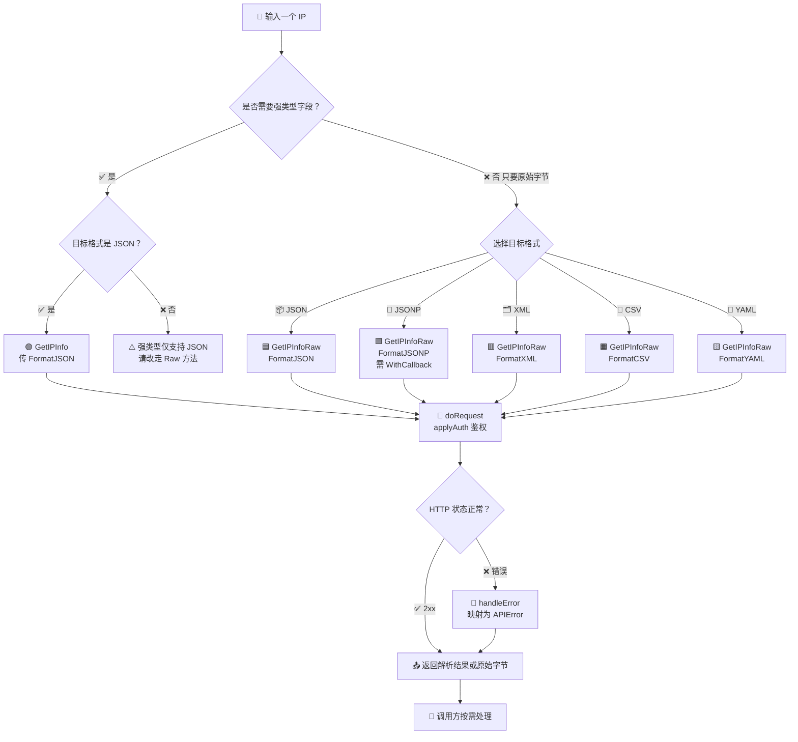
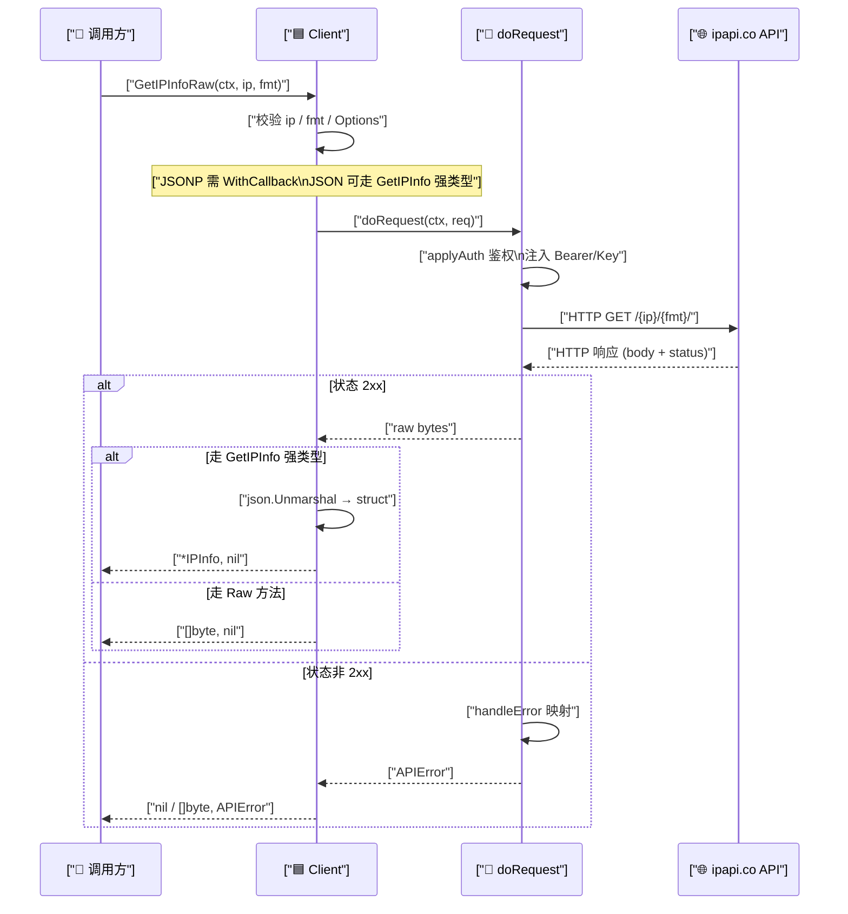

# 🌐 多格式响应

> 同一个 IP，5 种格式任你选。

::: tip 🎨 一图抵千言
下面这张流程图展示了从「拿到一个 IP」到「得到目标格式响应」的完整选择路径：先决定走强类型解析还是原始字节，再按格式分流到对应的 `Client` 方法。
:::



## 5 种格式

详见 [响应格式概念](./format-concept)。这里聚焦实际用法。

## JSON（结构化）

```go
info, _ := client.GetIPInfo(ctx, "8.8.8.8", string(ipapi.FormatJSON))
fmt.Println(info.City) // 强类型字段
```

## XML

```go
data, _ := client.GetIPInfoRaw(ctx, "8.8.8.8", string(ipapi.FormatXML))
// <Ip>8.8.8.8</Ip><City>Mountain View</City>...
```

用 `encoding/xml` 自行解析：

```go
type Response struct {
	XMLName xml.Name `xml:"Response"`
	IP      string   `xml:"Ip"`
	City    string   `xml:"City"`
}
var r Response
xml.Unmarshal(data, &r)
```

## CSV

```go
data, _ := client.GetIPInfoRaw(ctx, "8.8.8.8", string(ipapi.FormatCSV))
// 8.8.8.8,8.8.8.8/32,IPv4,Mountain View,...
```

用 `encoding/csv` 解析：

```go
reader := csv.NewReader(strings.NewReader(string(data)))
rows, _ := reader.ReadAll()
fmt.Println(rows[0]) // 第一行字段
```

## YAML

```go
data, _ := client.GetIPInfoRaw(ctx, "8.8.8.8", string(ipapi.FormatYAML))
// ip: 8.8.8.8
// city: Mountain View
```

用 `gopkg.in/yaml.v3` 解析（需自行引入依赖）。

## JSONP

```go
client := ipapi.NewClient(ipapi.WithCallback("cb"))
data, _ := client.GetIPInfoRaw(ctx, "8.8.8.8", string(ipapi.FormatJSONP))
// cb({"ip":"8.8.8.8",...})
```

详见 [JSONP 指南](./jsonp)。

## 客户端 IP 的多格式

::: tip 🎨 一图抵千言
上面那张图看的是「怎么选」，下面这张时序图看的是「一次请求在内部经历了什么」——从调用方发起 `GetIPInfoRaw`，到 `doRequest` 鉴权、发 HTTP、判状态码，最终把原始字节或 `APIError` 交回调用方。
:::



`GetClientIPInfoRaw` 同样支持 5 格式：

```go
yamlData, _ := client.GetClientIPInfoRaw(ctx, string(ipapi.FormatYAML))
```

## 格式常量表

| 常量 | 值 | raw 方法 |
|------|----|----------|
| `FormatJSON` | `"json"` | 可用 `GetIPInfo` 直接解析 |
| `FormatJSONP` | `"jsonp"` | `GetIPInfoRaw` |
| `FormatXML` | `"xml"` | `GetIPInfoRaw` |
| `FormatCSV` | `"csv"` | `GetIPInfoRaw` |
| `FormatYAML` | `"yaml"` | `GetIPInfoRaw` |

## 下一步

- 🎨 学 [格式概念](./format-concept)
- 🧪 看 [多格式示例](/examples/raw-formats)
- 📖 看 [`Format` 常量](/api/client#格式常量)
