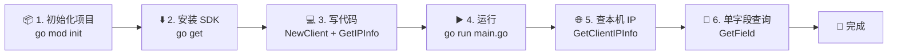
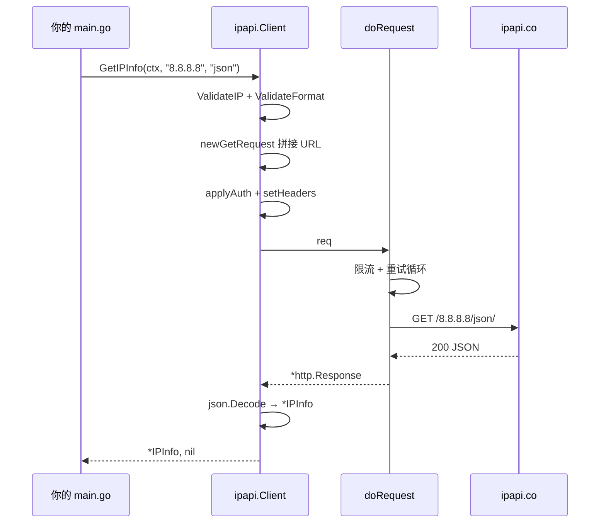

# 🚀 快速开始

> 5 分钟内完成安装并发起第一次 IP 查询。

::: tip 🎨 一图抵千言：本指南的学习路径

:::

## 前置要求

- 🐹 **Go 1.23.4 或更高版本**
- 🌐 可访问 `https://ipapi.co` 的网络

::: tip 💡 关于 API Key
ipapi.co 提供免费额度（约 1000 次/天，无需注册即可用）。生产环境建议在 [ipapi.co](https://ipapi.co) 申请 API Key 以获得更高配额。本指南的示例无需 Key 即可运行。
:::

## 1. 初始化项目

如果你已有 Go 项目，跳到第 2 步。否则新建一个：

```bash
mkdir myapp && cd myapp
go mod init myapp
```

## 2. 安装 SDK

```bash
go get github.com/cyberspacesec/ipapi.co-skills
```

## 3. 写第一段代码

新建 `main.go`：

```go
package main

import (
	"context"
	"fmt"
	"log"
	"time"

	"github.com/cyberspacesec/ipapi.co-skills/pkg/ipapi"
)

func main() {
	// 创建默认客户端（无需 API Key）
	client := ipapi.NewClient()

	// 设置 5 秒超时上下文
	ctx, cancel := context.WithTimeout(context.Background(), 5*time.Second)
	defer cancel()

	// 查询 Google DNS 的地理位置
	info, err := client.GetIPInfo(ctx, "8.8.8.8", "json")
	if err != nil {
		log.Fatalf("查询失败: %v", err)
	}

	fmt.Printf("🌐 IP: %s\n", info.IP)
	fmt.Printf("🏙 城市: %s, %s\n", info.City, info.CountryName)
	fmt.Printf("🧭 经纬度: %s\n", info.LatLong)
	fmt.Printf("⏰ 时区: %s (UTC%s)\n", info.Timezone, info.UTCOffset)
	fmt.Printf("📡 ASN: %s (%s)\n", info.ASN, info.Org)
}
```

## 4. 运行

```bash
go run main.go
```

预期输出类似：

```
🌐 IP: 8.8.8.8
🏙 城市: Mountain View, United States
🧭 经纬度: 37.4056,-122.0775
⏰ 时区: America/Los_Angeles (UTC-07:00)
📡 ASN: AS15169 (Google LLC)
```

🎉 恭喜！你已经完成了第一次查询。

::: details 🔍 这一次调用内部发生了什么？

详见 [工作原理](./how-it-works)。
:::

## 5. 查询自己的公网 IP

省略 `ip` 参数即可查询**当前出口 IP**：

```go
info, err := client.GetClientIPInfo(ctx, "json")
fmt.Printf("我的公网 IP: %s (%s)\n", info.IP, info.City)
```

对应端点 `GET https://ipapi.co/json/`，详见 [`GetClientIPInfo`](/api/get-client-ip-info)。

## 6. 只查一个字段

只想知道某个 IP 的国家代码？用 [`GetField`](/api/get-field)：

```go
country, _ := client.GetField(ctx, "8.8.8.8", "country_code")
fmt.Println("国家代码:", country) // US
```

省流量、更快速。

## 下一步

- 📖 读 [项目介绍](./intro) 理解全貌
- 🧭 看 [核心概念](./client-concept) 深入理解 Client
- 🧪 跑 [基础示例](/examples/basic-usage)
- 🔧 学 [安装细节](./installation)
