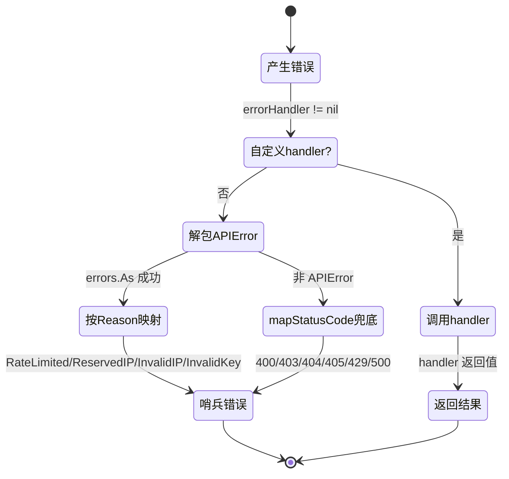
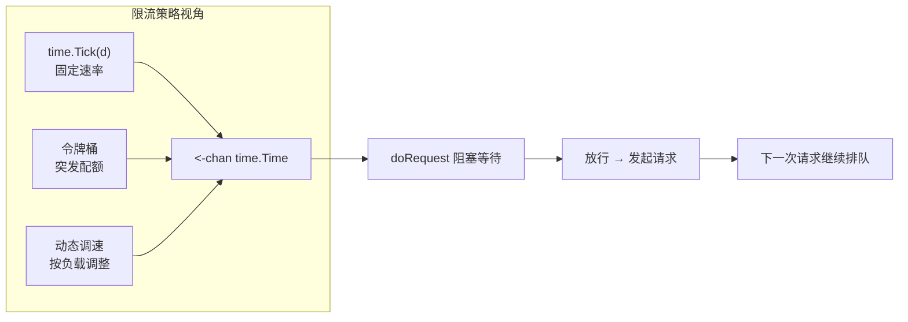

# ⚙️ 工作原理

> 一次 `client.GetIPInfo(ctx, "8.8.8.8", "json")` 调用，内部究竟发生了什么？

## 🧱 整体架构

```mermaid
flowchart TD
    App["🧑‍💻 你的应用代码"] -->|"client.GetIPInfo(ctx, ip, format)"| Validate

    subgraph Client["pkg/ipapi.Client"]
        Validate["✅ 入参校验<br/>ValidateIP / ValidateFormat"]
        URL["🔗 URL 构建<br/>newGetRequest"]
        Auth["🔒 认证注入<br/>applyAuth"]
        DoReq["🚦 doRequest 核心调度<br/>· 限流 RateLimiter<br/>· 重试 网络错误/5xx ×2<br/>· 状态码→错误映射<br/>· APIError 解析"]
        Decode["📦 JSON 解码 → *IPInfo"]
        Raw["📤 raw body → []byte<br/>非 JSON 格式"]
        HandleErr["🛡 handleError<br/>统一错误出口 + 自定义 handler"]

        Validate --> URL --> Auth --> DoReq
        DoReq -->|JSON| Decode
        DoReq|"xml/csv/yaml/jsonp"| Raw
        Decode --> HandleErr
        Raw --> HandleErr
    end

    DoReq -.->|"HTTPS GET"| API["🌐 ipapi.co/{ip}/{format}/"]
    HandleErr -.->|"返回 *IPInfo 或 error"| App
```

::: tip 💡 一图抵千言
上面这张 Mermaid 流程图展示了从调用到返回的完整链路。鼠标悬停节点可看说明，支持缩放。
:::

## 🔁 一次调用的完整流程

以 `GetIPInfo` 为例（[源码](/api/get-ip-info)）：

### 步骤 1：前置校验

```go
if err := ValidateIP(ip); err != nil {
    return nil, c.handleError(err)   // 非法 IP，不发请求
}
if err := ValidateFormat(format); err != nil {
    return nil, c.handleError(err)   // 非法格式，不发请求
}
```

[`ValidateIP`](/api/validate-ip) 用 `net.ParseIP` 判断；[`ValidateFormat`](/api/validate-format) 查 `validFormats` 白名单。**校验失败直接返回，省一次网络往返。**

### 步骤 2：构建请求

```go
req, err := newGetRequest(ctx, c.BaseURL, ip, format)
```

[`newGetRequest`](/api/methods) 把 `BaseURL` + 路径段用 `path.Join` 拼成 `https://ipapi.co/8.8.8.8/json/`，并附上 `context`。

### 步骤 3：注入认证与回调

```go
c.applyAuth(req)
c.setHeaders(req)
```

[`applyAuth`](/api/with-api-key) 根据 `APIKeyMode` 决定：
- `APIKeyHeader`（默认）→ `Authorization: Bearer <key>`
- `APIKeyQuery` → `?key=<key>`

若有 `Callback`，追加 `?callback=<name>`（用于 JSONP）。

[`setHeaders`](/api/client) 设置 `User-Agent`。

### 步骤 4：执行请求（核心）

```go
resp, err := c.doRequest(req)
```

[`doRequest`](/api/methods) 做三件事：

1. **限流**：若 `RateLimiter` 通道非空，阻塞等待令牌。
2. **重试**：循环 `0..Retries`，仅在网络错误或 `StatusCode >= 500` 时重试，间隔 `defaultRetryDelay`（500ms）。
3. **错误映射**：若 `StatusCode >= 400`，尝试解码 `APIError`；否则用 `mapStatusCodeToError` 兜底。

### 步骤 5：解析响应

```go
var info IPInfo
json.NewDecoder(resp.Body).Decode(&info)
info.RetrievedAt = time.Now().UTC()
return &info, nil
```

JSON 解码进强类型 [`IPInfo`](/api/models)，并盖上 `RetrievedAt` 时间戳。

若是 raw 方法（`GetIPInfoRaw` 等），则 `io.ReadAll` 返回原始 `[]byte`。

### 步骤 6：统一错误出口

所有错误都经过 [`handleError`](/api/errors)：
- 若设了自定义 `errorHandler`，先调用它。
- 否则用 `errors.As` 解包 `APIError`，按 `Reason` 映射到哨兵错误。



::: info 🎯 错误出口的设计意图
所有 6 个查询方法的错误**都汇入 `handleError` 这一个出口**。好处是：调用方只需学一套 `errors.Is` 判别逻辑，不论调哪个方法；自定义 `errorHandler` 能在统一位置插桩日志、上报、脱敏，无需改每个调用点。
:::

## 🔑 关键设计决策

### 为什么用函数式选项？

`NewClient(opts ...ClientOption)` 让默认值与覆盖分离：

- 想用默认 → `NewClient()`
- 想配 API Key → `NewClient(WithAPIKey(k))`
- 想换 HTTP 客户端 → 再加一个 `WithCustomHTTPClient(...)`

可组合、可扩展，不破坏向后兼容。

### 为什么错误用哨兵值 + `errors.Is`？

Go 惯用法。调用方可以：

```go
switch {
case errors.Is(err, ipapi.ErrRateLimited): // 限流
case errors.Is(err, ipapi.ErrInvalidIP):   // 非法 IP
}
```

同时 `APIError` 携带 `Reason`、`IP`、`Reserved` 等上下文，需要细节时用 `errors.As` 取出。

### 为什么限流用 `<-chan time.Time`？

通道天然支持并发安全阻塞。塞一个 `time.Tick(...)` 进去就是固定速率；塞自定义通道就能做令牌桶、动态调速。比锁简单，比接口轻量。



::: tip 📐 通道 vs 锁 vs 接口
| 方案 | 并发安全 | 灵活度 | 复杂度 |
|------|----------|--------|--------|
| `<-chan time.Time` ✅ | 天然 | 高（任意生产者） | 低 |
| `sync.Mutex` | 需手写 | 中 | 中 |
| `Limiter` 接口 | 需实现 | 高 | 高 |
通道方案同时拿到并发安全与可替换性，是 stdlib-only 下的最优解。
:::

### 为什么 raw 方法返回 `[]byte`？

XML/CSV/YAML/JSONP 没有统一的 Go 结构体，强行解析反而丢失信息。返回原始字节让调用方按需处理，最灵活。

## 🧩 模块划分

| 文件 | 职责 |
|------|------|
| [`client.go`](/api/client) | `Client` 结构体、构造、选项、常量 |
| [`api.go`](/api/methods) | 6 个查询方法、请求构建、重试、状态码映射 |
| [`models.go`](/api/models) | `IPInfo`、`APIError` 数据模型与辅助方法 |
| [`errors.go`](/api/errors) | `handleError`、`IsRetryableError`、`WrapError` |

## 下一步

- 跟着 [快速开始](./getting-started) 实际跑一遍 →
- 深入 [Client 概念](./client-concept) →
