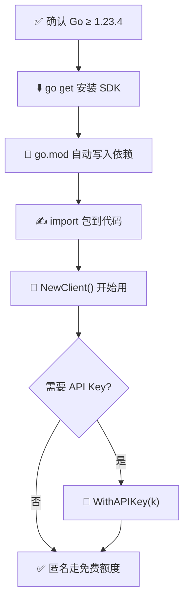
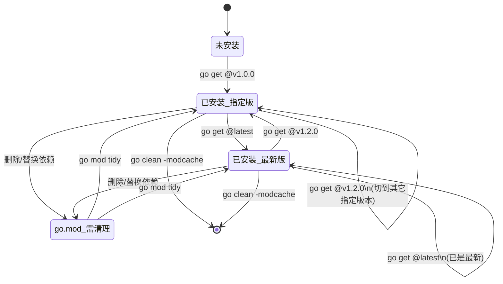

# 📦 安装

> 详细说明如何安装、升级与引入 ipapi.co-skills。

::: tip 🎨 一图抵千言：安装与引入流程

:::

## 系统要求

| 项目 | 要求 |
|------|------|
| 🐹 Go 版本 | `1.23.4` 或更高 |
| 💻 操作系统 | 任意（Linux / macOS / Windows） |
| 🌐 网络 | 能访问 `proxy.golang.org` 与 `ipapi.co` |

::: warning ⚠️ Go 版本
本库 `go.mod` 声明 `go 1.23.4`。若你的 Go 低于此版本，请先升级：
```bash
# macOS
brew install go
# 或访问 https://go.dev/dl/
```
:::

## 安装

在你的项目根目录执行：

```bash
go get github.com/cyberspacesec/ipapi.co-skills
```

这会把依赖写入 `go.mod`：

```
require github.com/cyberspacesec/ipapi.co-skills v1.0.0
```

## 引入包

```go
import "github.com/cyberspacesec/ipapi.co-skills/pkg/ipapi"
```

包名是 `ipapi`，调用时写 `ipapi.NewClient()` 等。

## 验证安装

写个最小程序确认能编译：

```go
package main

import (
	"fmt"
	"github.com/cyberspacesec/ipapi.co-skills/pkg/ipapi"
)

func main() {
	client := ipapi.NewClient()
	fmt.Printf("客户端创建成功: %+v\n", client.BaseURL)
}
```

运行：

```bash
go run main.go
# 客户端创建成功: https://ipapi.co/
```

## 升级

```bash
go get github.com/cyberspacesec/ipapi.co-skills@latest
go mod tidy
```

指定版本：

```bash
go get github.com/cyberspacesec/ipapi.co-skills@v1.2.0
```

::: tip 🎨 一图抵千言：依赖版本状态流转

:::

## 模块代理（中国大陆）

若拉取慢，配置国内代理：

```bash
go env -w GOPROXY=https://goproxy.cn,direct
go env -w GOSUMDB=sum.golang.google.cn
```

## 私有仓库

若 fork 到私有仓库，添加：

```bash
go env -w GOPRIVATE=github.com/yourorg/*
```

## Go module tidy

添加/删除依赖后养成习惯：

```bash
go mod tidy
```

它会同步 `go.mod` 与 `go.sum`，移除无用依赖。

## 下一步

- 🚀 跟着 [快速开始](./getting-started) 写代码
- 🧭 理解 [Client 概念](./client-concept)
