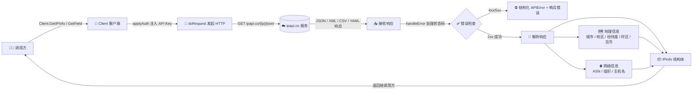
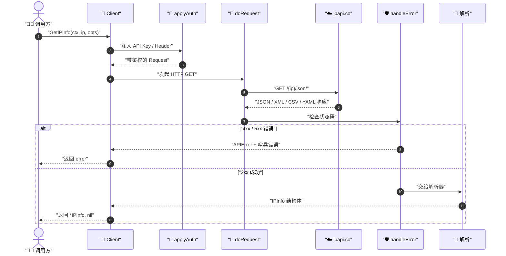

# 📍 什么是 ipapi.co-skills

::: tip 🖥 命令行优先
本项目同时提供 **CLI 命令行工具**（`ipapi`，AI Agent 友好，默认 JSON 输出）和 **Go SDK 库**。本页及后续"库指南"面向想在 Go 程序中嵌入的开发者。如果你只想在终端查 IP，见 [CLI 快速开始](../cli/quickstart)。
:::

> 一个用 Go 语言编写的 [ipapi.co](https://ipapi.co) IP 地理位置查询 API 客户端库。

## 一句话介绍

`ipapi.co-skills` 是 [cyberspacesec](https://github.com/cyberspacesec) 团队开源的 Go SDK，它把 ipapi.co 的 REST API 封装成符合 Go 习惯的、类型安全的客户端库，让你在 Go 项目中以**最少的样板代码**完成 IP 地理位置查询。

## 🧩 它是什么

ipapi.co 是一个提供 IP 地理定位（IP geolocation）的在线服务。给定一个 IPv4 或 IPv6 地址，它能返回该地址关联的：

- 🏙 城市、地区、邮政编码
- 🌍 国家（名称、代码、ISO3、首都、顶级域）
- 🧭 经纬度坐标
- ⏰ 时区、UTC 偏移
- 💱 货币、语言
- 📡 ASN、组织、主机名
- 📊 国家面积、人口

`ipapi.co-skills` 把这些能力包装成一个 Go 包 `github.com/cyberspacesec/ipapi.co-skills/pkg/ipapi`，提供：

| 能力 | 说明 |
|------|------|
| `Client` | 线程安全的 HTTP 客户端，可复用 |
| 6 个查询方法 | 覆盖「指定 IP / 客户端 IP」×「完整信息 / 单字段」×「解析 / 原始」 |
| 5 种格式 | JSON / JSONP / XML / CSV / YAML |
| 函数式选项 | `WithAPIKey`、`WithCustomHTTPClient` 等 |
| 错误体系 | 10 个哨兵错误 + 结构化 `APIError` |

::: tip 🎨 一图抵千言
下面这张流程图展示了 SDK 从「输入 IP」到「输出结构化信息」的完整能力链路：用户调用 `Client` 的查询方法 → `applyAuth` 注入鉴权 → `doRequest` 发起 HTTP 请求 → `handleError` 处理错误 → 返回地理 / 网络 / ASN 三类结果。
:::



::: tip 🎨 一图抵千言
上面是能力链路，下面换一个**时序视角**，看一次完整调用中调用方、SDK 客户端、ipapi.co 服务三者之间的消息往返顺序与异步边界。
:::



## 🎯 谁适合使用

- 📦 需要在 Go 后端做 IP 定位的 Web 服务
- 🛡 需要识别访问者地理位置的安全/风控系统
- 📊 需要按国家/城市做统计分析的数据管道
- 🌐 需要根据用户时区/语言本地化内容的 CDN 或网关
- 🔍 需要快速查 ASN、组织归属的网络运维工具

## 📦 包信息

```go
import "github.com/cyberspacesec/ipapi.co-skills/pkg/ipapi"
```

- **模块路径**：`github.com/cyberspacesec/ipapi.co-skills`
- **Go 版本**：`1.23.4+`
- **许可证**：MIT
- **当前状态**：生产就绪，100% 单元测试覆盖

## 🗺 文档导航

| 你想…… | 去哪看 |
|--------|--------|
| 5 分钟跑起来 | [快速开始](./getting-started) |
| 理解它解决什么问题 | [它解决什么问题](./problem) |
| 理解内部原理 | [工作原理](./how-it-works) |
| 查某个方法签名 | [API 参考](/api/client) |
| 看可运行的示例 | [示例](/examples/basic-usage) |

## 下一步

- 了解 [它具体解决了什么问题](./problem) →
- 跟着 [快速开始](./getting-started) 写第一段代码 →
