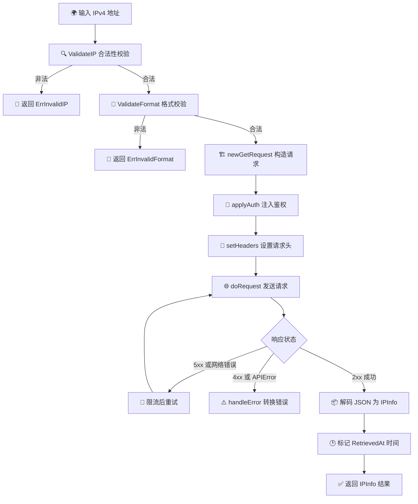
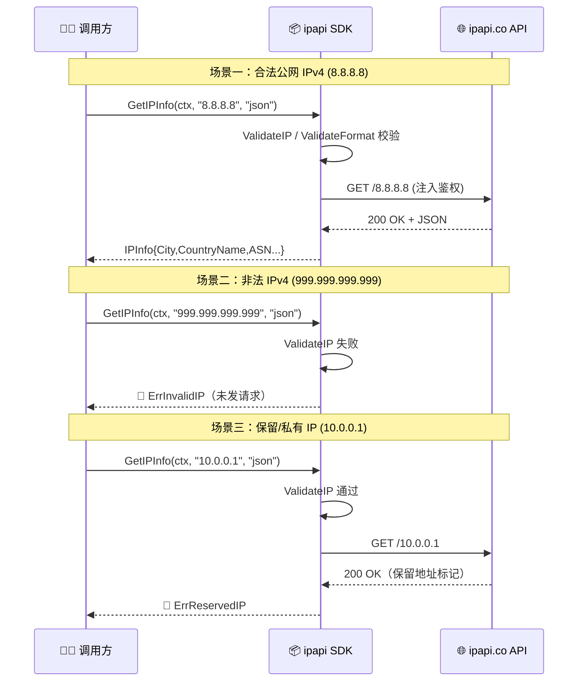

# 🌐 IPv4 查询

> 查询 IPv4 地址的地理位置，最常见用法。

## 什么是 IPv4

IPv4 是 32 位地址，形如 `8.8.8.8`，是互联网最普及的地址格式。本库完全支持。

## 基本查询

```go
info, err := client.GetIPInfo(ctx, "8.8.8.8", "json")
if err != nil {
	log.Fatal(err)
}
fmt.Printf("%s 位于 %s, %s\n", info.IP, info.City, info.CountryName)
```

::: tip 🎨 一图抵千言
下方流程图展示了 `GetIPInfo` 从输入到结果的完整调用链路，含校验、鉴权、请求与错误处理。
:::



## 校验

[`ValidateIP`](/api/validate-ip) 用 `net.ParseIP` 判断合法性：

```go
if err := ipapi.ValidateIP("8.8.8.8"); err != nil {
	// 合法
}
if err := ipapi.ValidateIP("999.999.999.999"); err != nil {
	// err == ErrInvalidIP
}
```

`GetIPInfo` 内部已调用，非法 IP 直接返回 [`ErrInvalidIP`](/api/errors)，不发请求。

## 单字段

```go
city, _ := client.GetField(ctx, "8.8.8.8", "city")
asn, _ := client.GetField(ctx, "8.8.8.8", "asn")
```

## 常见 IPv4 示例

| IP | 说明 |
|----|------|
| `8.8.8.8` | Google Public DNS |
| `1.1.1.1` | Cloudflare DNS |
| `208.67.222.222` | OpenDNS |

## 错误场景

- 🚫 `999.999.999.999` → `ErrInvalidIP`
- 🚫 `10.0.0.1` / `192.168.x.x` → `ErrReservedIP`（保留/私有地址）
- 🚫 `0.0.0.0` → `ErrReservedIP`

私有地址无地理意义，详见 [保留 IP](./reserved-ip)。

下面的时序图从客户端与 ipapi.co 服务端交互的视角，对比了合法 IPv4、非法 IPv4、保留 IP 三种典型场景下各自的调用时序与返回点：

::: tip 🎨 一图抵千言
:::



## 下一步

- 🌍 学 [IPv6 查询](./ipv6)
- 🧪 看 [查询指定 IP 示例](/examples/lookup-specific-ip)
