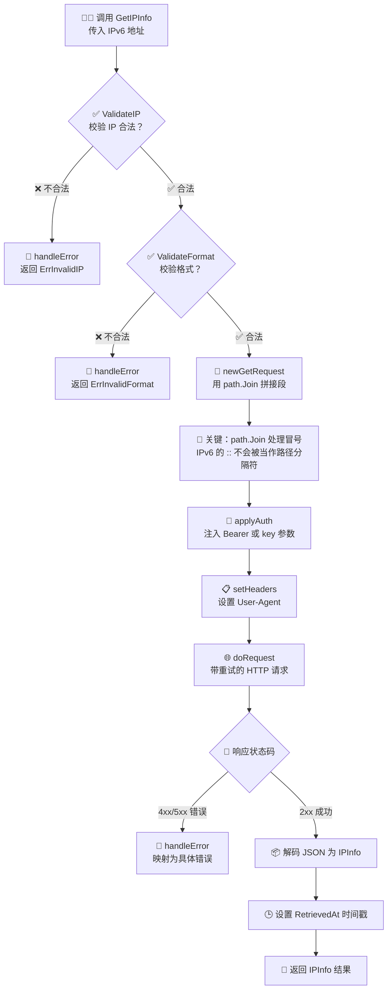
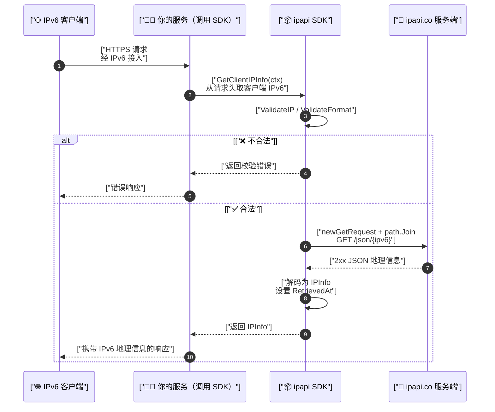

# 🌍 IPv6 查询

> 本库完整支持 IPv6 地址查询。

## 什么是 IPv6

IPv6 是 128 位地址，形如 `2001:4860:4860::8888`，旨在解决 IPv4 枯竭。ipapi.co 同样支持。

## 基本查询

```go
info, err := client.GetIPInfo(ctx, "2001:4860:4860::8888", "json")
if err != nil {
	log.Fatal(err)
}
fmt.Printf("%s → %s, %s\n", info.IP, info.City, info.CountryName)
```

URL 构建由 [`newGetRequest`](/api/methods) 用 `path.Join` 处理，IPv6 的冒号不会破坏路径。

::: tip 🎨 一图抵千言
下图展示一次 IPv6 查询的完整流程，重点突出冒号由 `path.Join` 安全处理这一关键环节。
:::



## 常见 IPv6 示例

| IP | 说明 |
|----|------|
| `2001:4860:4860::8888` | Google Public DNS (IPv6) |
| `2606:4700:4700::1111` | Cloudflare DNS (IPv6) |
| `::1` | 本地回环（保留） |

## 校验

`ValidateIP` 同样适用于 IPv6：

```go
ipapi.ValidateIP("2001:4860:4860::8888") // nil，合法
ipapi.ValidateIP("::1")                   // nil，合法（但查询会返回保留错误）
ipapi.ValidateIP("not::an::ipv6")         // ErrInvalidIP
```

## 为什么要支持 IPv6

- 📈 移动网络、物联网大量使用 IPv6
- 🌐 部分用户只有 IPv6 连接
- 🛡 完整覆盖需要同时支持 v4/v6

## 自动检测客户端 IPv6

若用户经 IPv6 访问你的服务，[`GetClientIPInfo`](/api/get-client-ip-info) 会自动返回其 IPv6 信息。

::: tip 🎨 一图抵千言
下图以时序视角展示自动检测客户端 IPv6 的交互过程，重点呈现 SDK 与 ipapi.co 服务端之间的请求/响应编排。
:::



## 下一步

- 🌐 学 [IPv4 查询](./ipv4)
- 🧪 看 [IPv6 示例](/examples/ipv6)
- 📡 学 [客户端 IP 检测](./client-ip)
