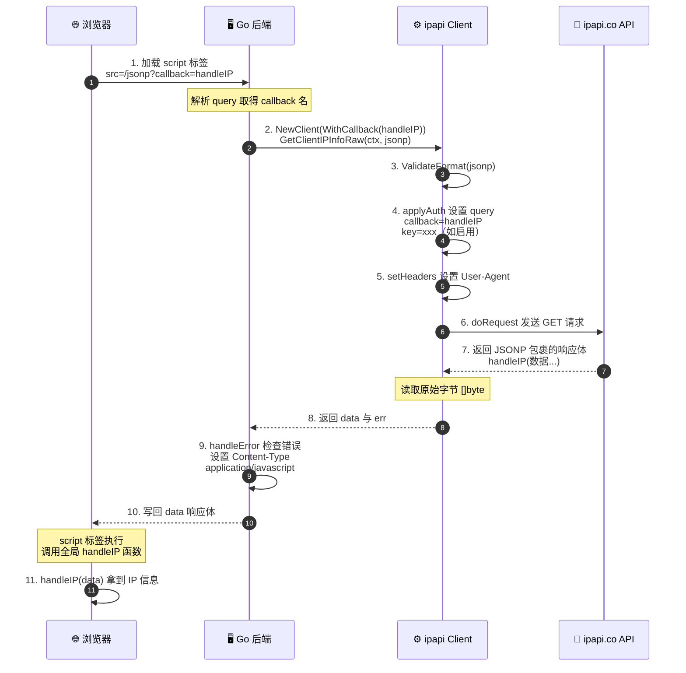
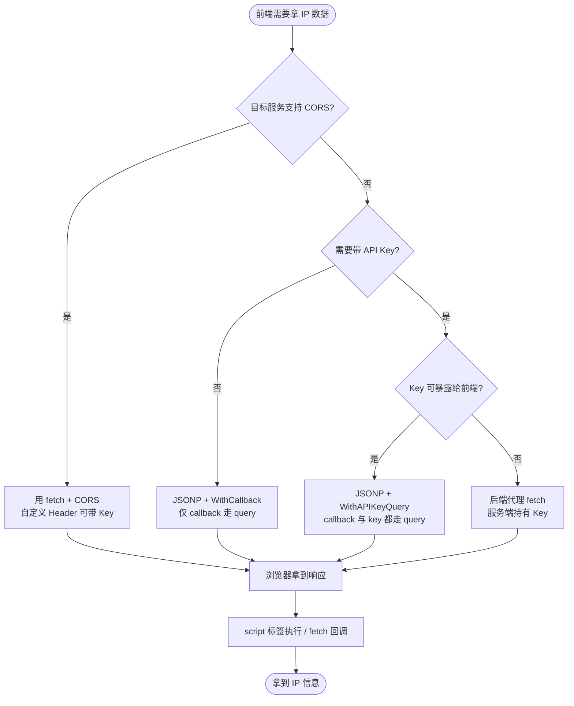

# 📞 JSONP 回调

> 用 `WithCallback` 启用 JSONP，便于浏览器跨域 `<script>` 调用。

## 什么是 JSONP

JSONP（JSON with Padding）把 JSON 响应包进一个回调函数调用，绕过浏览器同源策略：

```
普通 JSON:   {"ip":"8.8.8.8","city":"Mountain View"}
JSONP:       myCallback({"ip":"8.8.8.8","city":"Mountain View"})
```

浏览器用 `<script src="...">` 加载，回调函数被调用，拿到数据。

## 启用 JSONP

[`WithCallback`](/api/with-callback) 设置回调名，配合 `FormatJSONP`：

```go
client := ipapi.NewClient(
	ipapi.WithCallback("handleIP"),
)
data, err := client.GetIPInfoRaw(ctx, "8.8.8.8", string(ipapi.FormatJSONP))
fmt.Println(string(data))
// 输出: handleIP({"ip":"8.8.8.8",...})
```

内部 [`applyAuth`](/api/with-callback) 把 `?callback=handleIP` 加到 URL。

## 跨域时序

::: tip 🎨 一图抵千言
下图展示一次 JSONP 跨域请求的完整时序：浏览器 `<script>` 发起请求 → Go 后端用 SDK 拉取数据 → 回调函数把结果交回浏览器。
:::



## 完整服务端示例

Go 后端把 JSONP 响应直接写回浏览器：

```go
func jsonpHandler(w http.ResponseWriter, r *http.Request) {
	callback := r.URL.Query().Get("callback")
	client := ipapi.NewClient(ipapi.WithCallback(callback))
	data, _ := client.GetClientIPInfoRaw(r.Context(), string(ipapi.FormatJSONP))
	w.Header().Set("Content-Type", "application/javascript")
	w.Write(data)
}
```

浏览器端：

```html
<script>
function handleIP(data) {
	console.log(data.ip, data.city);
}
</script>
<script src="https://your-api.com/jsonp?callback=handleIP"></script>
```

## 何时用 JSONP

| 场景 | 用 JSONP? |
|------|-----------|
| 现代 SPA + CORS 已配置 | ❌ 用 fetch 即可 |
| 老旧浏览器/无 CORS 的服务 | ✅ |
| 需要在 `<script>` 标签里直接拿到结构化数据 | ✅ |

::: tip 💡 现代 Web 优先 CORS
JSONP 是 CORS 普及前的方案，只读、易受 XSS。能用 CORS 就用 CORS。JSONP 在与老系统/第三方平台集成时仍有用。
:::

## 与认证的关系

JSONP 用 `<script>` 加载，**无法设自定义 Header**。若需带 API Key，必须用 [`WithAPIKeyQuery`](/api/with-api-key-query)（query 参数方式）：

```go
client := ipapi.NewClient(
	ipapi.WithAPIKey(os.Getenv("IPAPI_KEY")),
	ipapi.WithAPIKeyQuery(), // Key 走 query，前端可见
	ipapi.WithCallback("cb"),
)
```

⚠️ Query 方式 Key 会暴露在前端，仅适用于受限环境或临时 Key。

::: tip 🎨 一图抵千言
下图把「何时选 JSONP、何时退回后端代理、何时直接用 CORS」的决策路径画出来，重点呼应上面关于 API Key 暴露的取舍。
:::



## 下一步

- 📖 看 [`WithCallback`](/api/with-callback)
- 🎨 学 [响应格式](./format-concept)
- 🧪 看 [JSONP 示例](/examples/jsonp)
