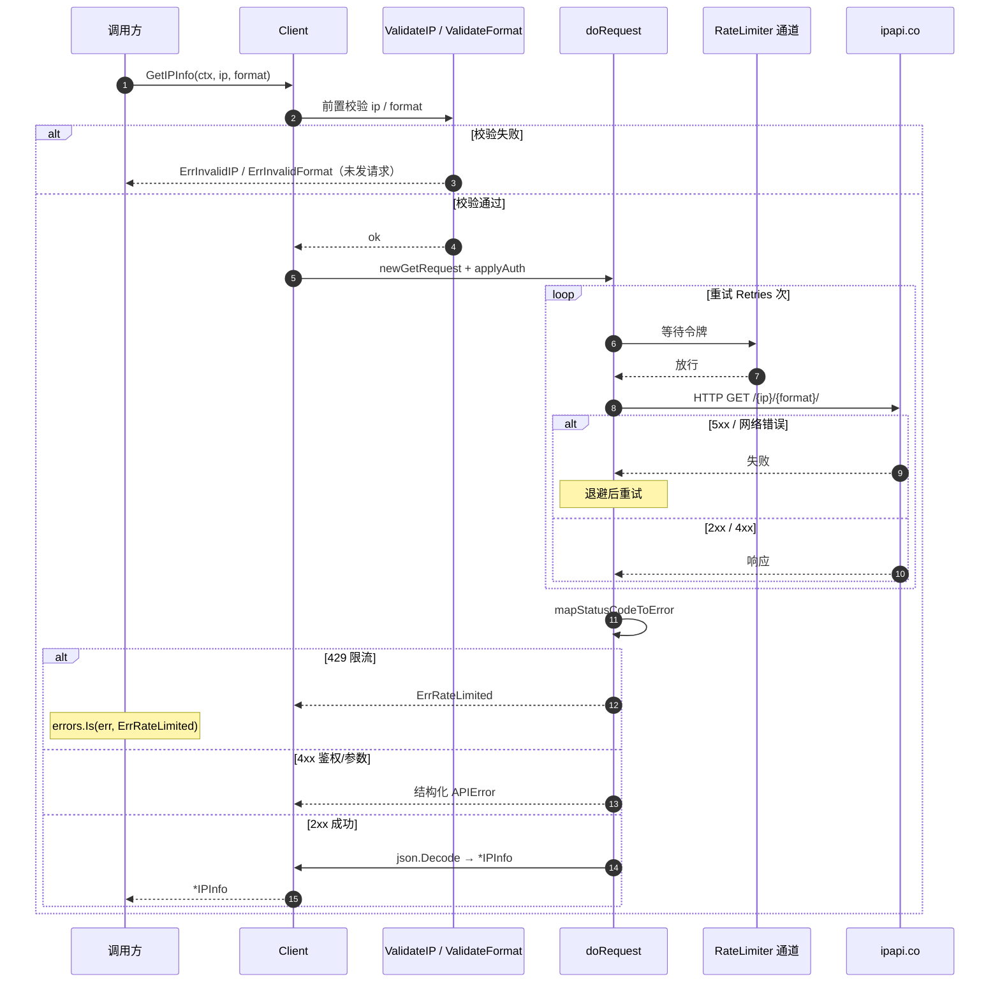
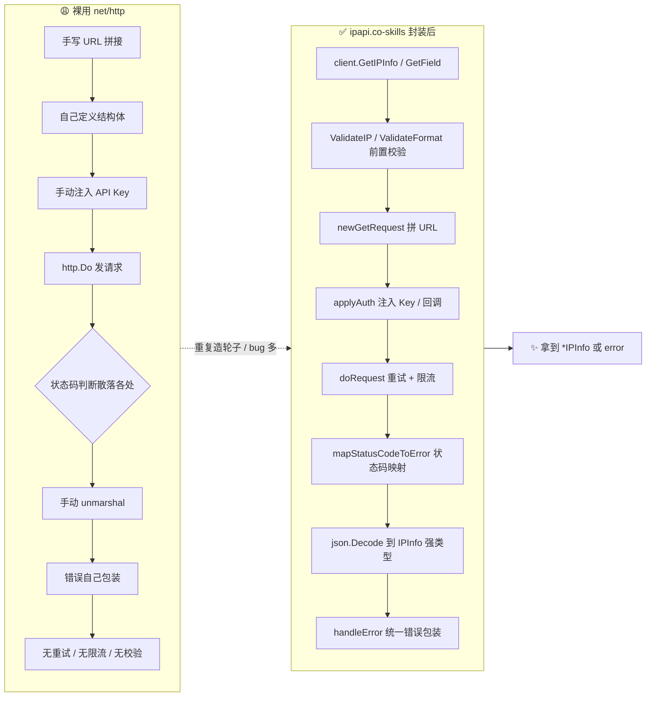

# 🎯 它解决什么问题

> 没有这个库，你会怎么查 IP 地理位置？为什么需要一个专门的 SDK？

## 😩 裸用 `net/http` 的痛点

ipapi.co 是一个 HTTP REST API。你完全可以用标准库 `net/http` 直接调用：

```go
resp, _ := http.Get("https://ipapi.co/8.8.8.8/json/")
body, _ := io.ReadAll(resp.Body)
// 然后……手动 unmarshal、手动处理错误、手动重试、手动限流……
```

但很快你会遇到一连串问题：

| 痛点 | 后果 |
|------|------|
| 🔁 每次都要手写 URL 拼接 | 容易拼错，IPv6 还要小心转义 |
| 📋 30+ 字段的结构体要自己定义 | 漏字段、JSON tag 写错 |
| ⚠ HTTP 状态码到错误的映射散落各处 | 429 限流、403 鉴权失败没人统一处理 |
| 🔂 5xx / 网络抖动没有重试 | 生产环境偶发失败 |
| 🚫 没有字段校验 | 传了非法 `field` 才在服务端报错 |
| 🔑 API Key 注入方式（Header / Query）每次手写 | 容易漏、容易泄露到日志 |
| 🌐 JSONP / XML / CSV / YAML 要分别处理 | raw body 管理混乱 |
| 🧵 速率限制没有抽象 | 高并发时被封 |

这些「胶水代码」在每个使用方里重复一遍，维护成本高、bug 多。

## ✅ ipapi.co-skills 如何解决

本库把这些重复劳动集中成 **一个可复用的、经过测试的 `Client`**：

### 1. URL 构建封装在内部

```go
// 你不用关心 https://ipapi.co/{ip}/{format}/ 怎么拼
info, _ := client.GetIPInfo(ctx, "8.8.8.8", "json")
```

内部用 [`newGetRequest`](/api/get-ip-info) 统一拼接路径段，IPv6 也能正确处理。

### 2. 类型安全的结构体

[`IPInfo`](/api/models) 已定义全部 30+ 字段并标注 JSON tag，调用方直接拿强类型字段，告别 `map[string]any`。

### 3. 统一错误体系

10 个哨兵错误值（[`ErrInvalidIP`](/api/errors)、[`ErrRateLimited`](/api/errors) 等）+ 结构化 [`APIError`](/api/models)，用 `errors.Is` 精准分支：

```go
if errors.Is(err, ipapi.ErrRateLimited) {
    time.Sleep(time.Minute) // 统一的限流处理
}
```

状态码到错误的映射集中在 [`mapStatusCodeToError`](/api/errors)。

### 4. 自动重试

[`doRequest`](/api/methods) 对网络错误和 5xx 自动重试 `Retries` 次（默认 2），带退避。

### 5. 入参校验前置

[`ValidateIP`](/api/validate-ip) 和 [`ValidateFormat`](/api/validate-format) 在发请求前就拦截非法输入，省一次网络往返。

### 6. 认证与格式抽象成选项

```go
client := ipapi.NewClient(
    ipapi.WithAPIKey(key),
    ipapi.WithAPIKeyQuery(),   // 切换为 query 参数认证
    ipapi.WithCallback("cb"),  // JSONP 回调
)
```

### 7. 速率限制可插拔

`Client.RateLimiter` 是一个 `<-chan time.Time`，塞一个 ticker 就能全局控速。

::: tip 🎨 一图抵千言
上面讲的是「裸用 vs SDK」的结构对比；下面这张时序图从**一次调用的生命周期**视角，把调用方、`Client`、校验层、网络层和 ipapi.co 之间的交互顺序画出来，方便看清重试、限流、状态码映射在哪一拍发生。
:::



## 📊 对比一览

| 维度 | 裸用 net/http | ipapi.co-skills |
|------|--------------|-----------------|
| URL 拼接 | 手写 | 内部封装 |
| 结构体 | 自己定义 | 内置 `IPInfo` |
| 错误处理 | 散落 | 哨兵值 + `APIError` |
| 重试 | 无 | 自动 |
| 入参校验 | 无 | 前置校验 |
| 多格式 | 手动处理 raw | `GetIPInfoRaw` |
| 认证 | 手写 Header/Query | 选项函数 |
| 限流 | 无 | `RateLimiter` 通道 |
| 测试 | 各自为战 | 100% 覆盖 |

## 🧭 解决路径总览

::: tip 🎨 一图抵千言
下面这张流程图把「裸用 net/http」和「用 SDK 封装」两条路径并排画出来，一眼就能看出 SDK 把哪些脏活脏活累活揽走了。
:::



```
你的代码  →  Client.GetIPInfo()  →  ValidateIP / ValidateFormat（前置校验）
                                    →  newGetRequest（拼 URL）
                                    →  applyAuth（注入 Key/回调）
                                    →  doRequest（重试 + 限流 + 状态码映射）
                                    →  json.Decode → IPInfo（强类型）
                                    →  handleError（统一错误包装）
            ←  *IPInfo 或 error
```

更详细的内部流程见 [工作原理](./how-it-works)。

## 下一步

- 理解 [内部工作原理](./how-it-works) →
- 直接 [安装并跑起来](./getting-started) →
