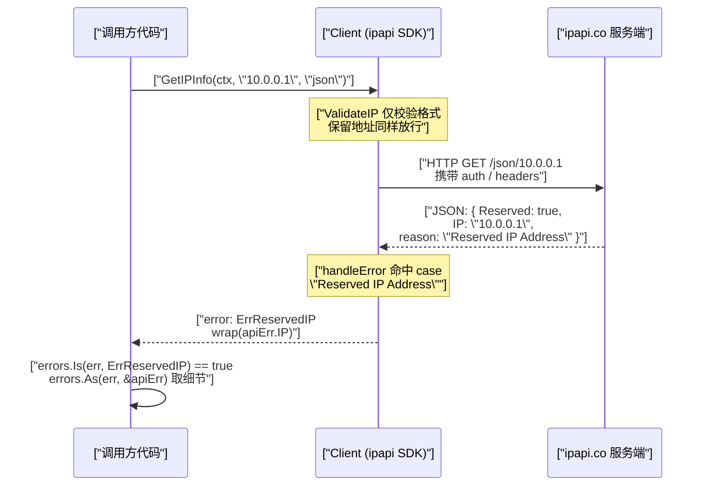
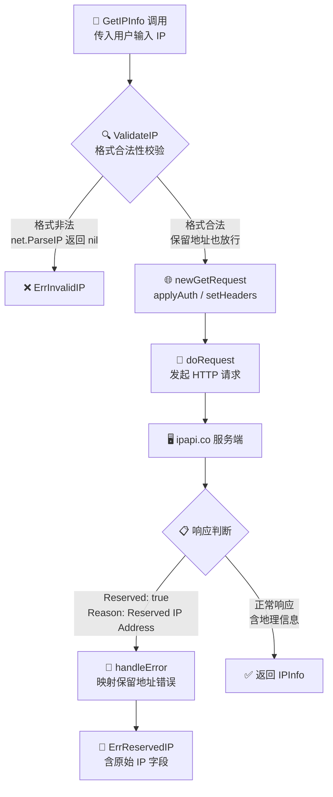

# 🚫 保留 IP 地址

> 私有、回环、组播等保留地址没有地理意义，查询会返回特定错误。

## 什么是保留 IP

保留地址（reserved IP）是 IANA 规定**不分配给公网设备**的特殊地址段，例如：

| 段 | 用途 |
|----|------|
| `10.0.0.0/8` | 私有网络 |
| `172.16.0.0/12` | 私有网络 |
| `192.168.0.0/16` | 私有网络 |
| `127.0.0.0/8` | 回环（localhost） |
| `0.0.0.0` | 未指定 |
| `169.254.0.0/16` | 链路本地 |
| `::1` | IPv6 回环 |

这些地址**没有真实的地理归属**。

## 查询保留 IP 会怎样

ipapi.co 对保留 IP 返回特殊错误响应，本库映射为 [`ErrReservedIP`](/api/errors)：

```go
_, err := client.GetIPInfo(ctx, "10.0.0.1", "json")
if errors.Is(err, ipapi.ErrReservedIP) {
	fmt.Println("保留地址，无地理信息")
}
```

## 错误结构

服务端返回的 `APIError` 会带 `Reserved: true` 和 `IP` 字段，[`handleError`](/api/errors) 据此映射：

```go
case "Reserved IP Address":
	return fmt.Errorf("%w: %s", ErrReservedIP, apiErr.IP)
```

用 `errors.As` 取细节：

```go
var apiErr *ipapi.APIError
if errors.As(err, &apiErr) {
	fmt.Println("保留地址:", apiErr.IP, "Reserved:", apiErr.Reserved)
}
```

::: tip 🎨 一图抵千言
下面用时序图展示客户端与 ipapi.co 服务端在一次保留 IP 查询中的交互过程，重点呈现 `APIError` 携带 `Reserved: true` 的回传时机。
:::



## 如何处理

```go
info, err := client.GetIPInfo(ctx, userInput, "json")
switch {
case errors.Is(err, ipapi.ErrReservedIP):
	// 内网地址，跳过或用默认值
	info = &ipapi.IPInfo{CountryCode: "XX"}
case err != nil:
	return err
}
```

## 校验前置

[`ValidateIP`](/api/validate-ip) **不会**拦截保留地址——它只判断格式合法性（`net.ParseIP` 能解析即合法）。保留判断在服务端完成。

::: tip 🎨 一图抵千言
下图展示保留 IP 的判断链路：本地校验放行后，请求到达服务端，最终由 `handleError` 映射为 `ErrReservedIP`。
:::



```go
ipapi.ValidateIP("10.0.0.1") // nil，格式合法
// 但 GetIPInfo 会返回 ErrReservedIP
```

::: tip 💡 想本地预判保留地址？
用 `net.IP.IsPrivate()`、`IsLoopback()` 等：
```go
ip := net.ParseIP("10.0.0.1")
if ip.IsPrivate() { /* 跳过 */ }
```
:::

## 下一步

- 🛡 学 [错误处理](./error-concept)
- 📖 看 [`ErrReservedIP`](/api/errors)
- 🧪 看 [错误处理示例](/examples/error-handling)
