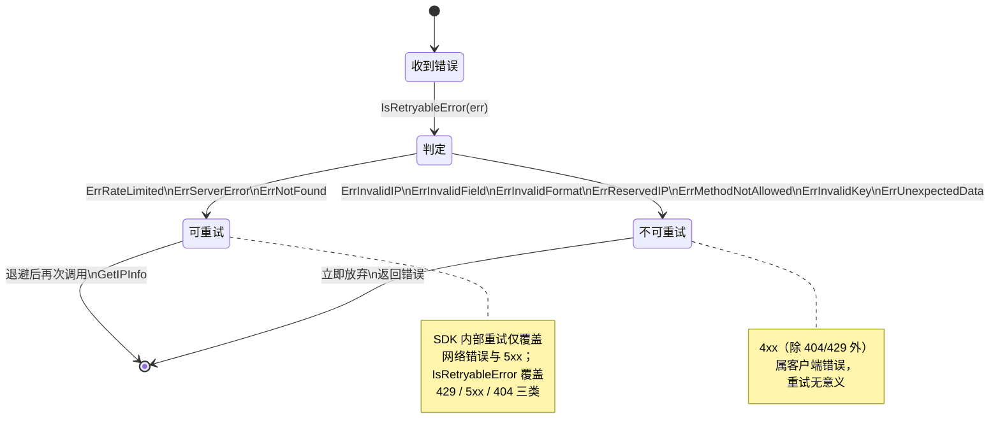

# 🔄 重试与限流

> 网络不稳？限流触发？本库内置重试，并提供可插拔限流。

## 自动重试

[`doRequest`](/api/methods) 对**网络错误**和 **5xx 服务端错误**自动重试：

```go
for i := 0; i <= c.Retries; i++ {
	resp, err = c.HTTPClient.Do(req)
	if err == nil && resp.StatusCode < 500 {
		break  // 成功
	}
	// ... 关闭 body，等待，重试
	time.Sleep(defaultRetryDelay) // 500ms
}
```

- 🔄 默认重试 **2 次**（共 3 次请求）
- ⏱ 固定退避 `500ms`（`defaultRetryDelay`）
- 🚫 只重试网络错误与 5xx，**不**重试 4xx（客户端错误不可恢复）

## 配置重试次数

```go
client := ipapi.NewClient()
client.Retries = 5 // 改成 5 次
```

::: tip 💡 直接改字段
`Retries` 是导出字段，创建后直接赋值即可。也可在 `NewClient` 后调整。
:::

设为 0 则不重试：

```go
client.Retries = 0
```

## 速率限制 RateLimiter

`Client.RateLimiter` 是 `<-chan time.Time`。非空时，每次请求前阻塞等待令牌：

```go
// 每秒最多 1 次请求
client := ipapi.NewClient()
client.RateLimiter = time.Tick(time.Second)
```

### 为什么用通道

- 🧵 天然并发安全，多 goroutine 自动排队
- 🔌 可插拔：塞任意 `<-chan time.Time`
- 🪶 比锁/接口轻量

### 自定义限流策略

用 `time.Tick` 是固定速率。要做令牌桶、动态调速，自己造 channel 即可：

```go
// 漏桶：每 200ms 放一个令牌 = 5 QPS
client.RateLimiter = time.Tick(200 * time.Millisecond)

// 突发+恢复：缓冲通道
bucket := make(chan time.Time, 10) // 突发 10
go func() {
	for range time.Tick(time.Second) {
		select {
		case bucket <- time.Now():
		default:
		}
	}
}()
client.RateLimiter = bucket
```

### 限流错误处理

触发服务端限流（HTTP 429）会返回 [`ErrRateLimited`](/api/errors)：

```go
if errors.Is(err, ipapi.ErrRateLimited) {
	time.Sleep(time.Minute) // 业务层退避
}
```

## 重试 + 限流协同

::: tip 🎨 一图抵千言
下图展示一次 `GetIPInfo` 调用的完整时序：限流器先放行令牌，`doRequest` 进入重试循环，遇到网络错误或 5xx 时退避 500ms 后重试，4xx 则立即终止。
:::

```mermaid
sequenceDiagram
    participant Caller as 调用方
    participant GetIPInfo as GetIPInfo
    participant DoRequest as doRequest
    participant Limiter as RateLimiter 通道
    participant HTTP as HTTPClient.Do
    participant Loop as 重试循环

    Caller->>GetIPInfo: GetIPInfo(ctx, ip, format)
    GetIPInfo->>GetIPInfo: ValidateIP / ValidateFormat
    GetIPInfo->>DoRequest: newGetRequest + applyAuth + setHeaders
    Note over DoRequest: 检查 RateLimiter 是否为空
    alt 限流器非空
        DoRequest->>Limiter: 等待令牌 ⏱
        Limiter-->>DoRequest: 放行
    end
    loop i 从 0 到 Retries
        DoRequest->>HTTP: 发送 HTTP 请求 🚀
        HTTP-->>Loop: resp, err
        alt 无错误且状态码小于 500
            Loop-->>DoRequest: 跳出循环 ✅
        else 网络错误或 5xx
            Note over Loop: 关闭 Body, sleep 500ms ⏳
            alt 已达最大重试次数
                Loop-->>DoRequest: 返回失败错误 ❌
            else 还有重试机会
                Loop->>HTTP: 再次发送请求 🔄
            end
        else 4xx 客户端错误
            Note over DoRequest: 不重试, 进入状态码映射 🚫
            Loop-->>DoRequest: 跳出循环
        end
    end
    alt 状态码大于等于 400
        DoRequest->>DoRequest: mapStatusCodeToError (429 返回 ErrRateLimited)
        DoRequest-->>GetIPInfo: 返回错误
        GetIPInfo->>GetIPInfo: handleError 包装
        GetIPInfo-->>Caller: 返回 error 🛑
    else 请求成功
        DoRequest-->>GetIPInfo: 返回 resp
        GetIPInfo->>GetIPInfo: json.Decode → IPInfo
        GetIPInfo-->>Caller: 返回 IPInfo 🎉
    end
```

下面是等价的文字版流程，便于复制粘贴：

```
请求 → RateLimiter 阻塞拿令牌 → 发请求 → 成功？
                                          │ No
                                          ├─ 网络错误/5xx → sleep 500ms → 重试
                                          └─ 4xx → 立即返回错误
```

### 重试循环展开时序

下图聚焦 `for i := 0; i <= c.Retries; i++` 循环内部，逐轮展开网络错误/5xx 重试与 4xx 立即终止的对照：

```mermaid
sequenceDiagram
    autonumber
    participant Loop as 重试循环 (i=0..Retries)
    participant HTTP as HTTPClient.Do
    participant Map as mapStatusCodeToError

    Note over Loop: i=0（首次请求）
    Loop->>HTTP: Do(req)
    HTTP-->>Loop: resp, err

    alt err == nil 且 StatusCode < 500
        Note over Loop: break ✅ 成功返回
    else err != nil（网络错误）
        Note over Loop: 关闭 Body, sleep 500ms ⏳
    else StatusCode >= 500（5xx 服务端错误）
        Note over Loop: 关闭 Body, sleep 500ms ⏳
    else 4xx（含 429）
        Note over Loop: 不重试 🚫，跳出循环
    end

    Note over Loop: i=1（第一次重试，仅网络错误/5xx 路径）
    Loop->>HTTP: Do(req) 🔄
    HTTP-->>Loop: resp, err

    alt 成功
        Note over Loop: break ✅
    else 仍可重试且 i < Retries
        Note over Loop: sleep 500ms，继续 🔄
    else i == Retries（已达上限）
        Loop->>Map: 网络错误 → ErrServerError<br/>5xx → 对应服务端错误
        Map-->>Loop: 返回最终错误 ❌
    end

    Note over Loop: 4xx 路径跳出后
    Loop->>Map: 429 → ErrRateLimited<br/>404 → ErrNotFound<br/>其他 4xx → 对应错误
    Map-->>Loop: 返回错误（业务层可按 IsRetryableError 判断）
```

## 可重试错误判断

业务层判断是否值得重试，用 [`IsRetryableError`](/api/is-retryable)：

```go
for attempt := 0; attempt < 3; attempt++ {
	info, err := client.GetIPInfo(ctx, ip, "json")
	if err == nil {
		break
	}
	if !ipapi.IsRetryableError(err) {
		break // 不可重试，放弃
	}
	time.Sleep(time.Duration(1<<attempt) * time.Second) // 指数退避
}
```

### 哨兵错误重试分类

下图用状态图展示 [`IsRetryableError`](/api/is-retryable) 的判定视角：错误被归入「可重试」或「不可重试」终态，业务层据此决定是否继续。



## 配额规划建议

| 流量级 | 建议配置 |
|--------|----------|
| 偶发 | 默认 |
| 中等 | `RateLimiter` = `time.Tick` |
| 高并发 | 令牌桶 + `Retries` 适当降低 |
| 生产 | 申请付费 Key 提升配额 |

## 下一步

- 📖 看 [`IsRetryableError`](/api/is-retryable)
- 🛡 学 [错误处理](./error-concept)
- 📖 看 [`Client` 字段](/api/client)
