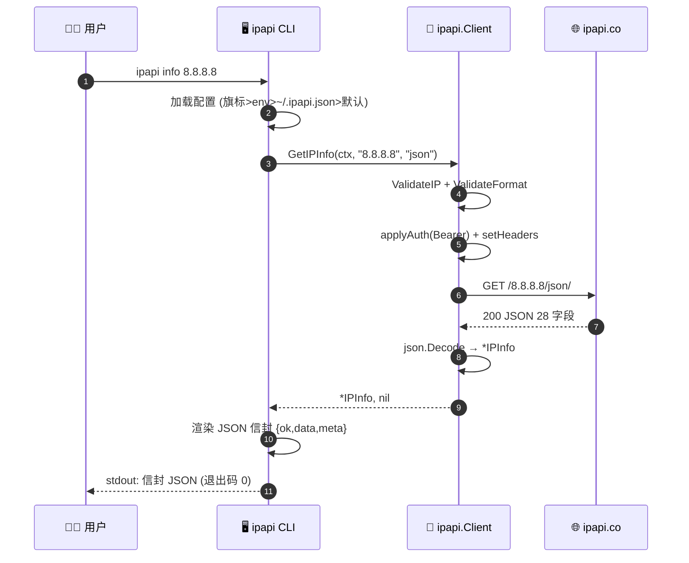

<script setup>
</script>

# 🌐 一图看懂 ipapi.co-skills 全栈架构

从 AI Agent / 终端用户发起命令，到 SDK 调用 ipapi.co API 返回结构化数据，整条链路一目了然。

```mermaid
flowchart TD
    subgraph 调用方["👨‍💻 调用方"]
        Agent["🤖 AI Agent<br/>读 JSON 信封 + 退出码"]
        Human["🧑‍💻 终端用户<br/>--human 人类可读"]
        Script["📜 Shell 脚本<br/>$? 分支 + pipe"]
    end

    subgraph CLI层["🖥️ CLI 层（cmd/ipapi · cobra）"]
        Root["ipapi 根命令<br/>PersistentPreRunE 加载配置"]
        Sub["9 个子命令<br/>info / me / field / raw / fields / version..."]
        Envelope["JSON 信封渲染<br/>{ok,command,data|error,meta}"]
        Exit["退出码映射<br/>0/2-12/70 · retryable 标记"]
    end

    subgraph SDK层["🧩 SDK 层（pkg/ipapi · 零依赖）"]
        Client["ipapi.Client<br/>BaseURL/APIKey/Retries/RateLimiter"]
        Methods["6 个查询方法<br/>GetIPInfo / GetField / GetRaw..."]
        DoReq["doRequest 内核<br/>限流 → 重试 → 状态码映射 → APIError 解析"]
        Errors["10 个哨兵错误<br/>errors.Is 精准匹配"]
    end

    subgraph 服务端["🌐 ipapi.co API"]
        API["GET /{ip}/{format}/<br/>JSON/JSONP/XML/CSV/YAML"]
    end

    Agent --> Root
    Human --> Root
    Script --> Root
    Root --> Sub --> Envelope
    Envelope --> Exit
    Sub -.调用.-> Methods
    Methods --> DoReq
    DoReq -.错误.-> Errors
    DoReq -->|HTTPS| API
    API -->|响应| DoReq
    DoReq -->|*IPInfo / []byte / string| Methods
    Methods --> Envelope

    classDef call fill:#e0f2fe,stroke:#0284c7
    classDef cli fill:#fef3c7,stroke:#d97706
    classDef sdk fill:#dcfce7,stroke:#16a34a
    classDef api fill:#fce7f3,stroke:#db2777
    class Agent,Human,Script call
    class Root,Sub,Envelope,Exit cli
    class Client,Methods,DoReq,Errors sdk
    class API api
```

::: tip 🚀 30 秒上手
```bash
# 安装
go install github.com/cyberspacesec/ipapi.co-skills/cmd/ipapi@latest

# 查询（默认 JSON 信封，Agent 友好）
ipapi info 8.8.8.8

# 人类可读
ipapi info 8.8.8.8 -H

# 单字段（shell pipe 友好）
ipapi field 8.8.8.8 country
```
:::

::: info 📊 数据流：一次 `ipapi info 8.8.8.8` 的旅程

:::

::: details 🔍 28 个可查字段一览（ipapi fields 自描述）
按语义分 7 组，`ipapi fields --group geo` 只看地理组。

| 分组 | 字段 | 示例值 |
| --- | --- | --- |
| 🆔 identity | ip · network · version · hostname | 8.8.8.8 |
| 🌍 geo | city · region · country · country_name · country_code · country_code_iso3 · country_capital · country_tld · continent_code · in_eu · postal · latitude · longitude · latlong · region_code | Mountain View |
| ⏰ time | timezone · utc_offset | America/Los_Angeles |
| 📡 network | asn · org | AS15169 (Google LLC) |
| 🗣 culture | languages · country_calling_code | en |
| 💰 economy | currency · currency_name | USD |
| 📊 stats | country_area · country_population | 9833520 |
:::

::: tip 💡 接下来
- 🚀 [快速开始](/cli/quickstart) — 5 分钟跑通第一次查询
- 🤖 [Agent 接入指南](/cli/agent) — 把 ipapi 接进你的 AI 工作流
- 📖 [CLI 命令速查](/cli/commands) — 9 个子命令一览
- 🧩 [SDK 与 CLI 关系](/cli/sdk-bridge) — 何时用 CLI，何时嵌入 SDK
:::
