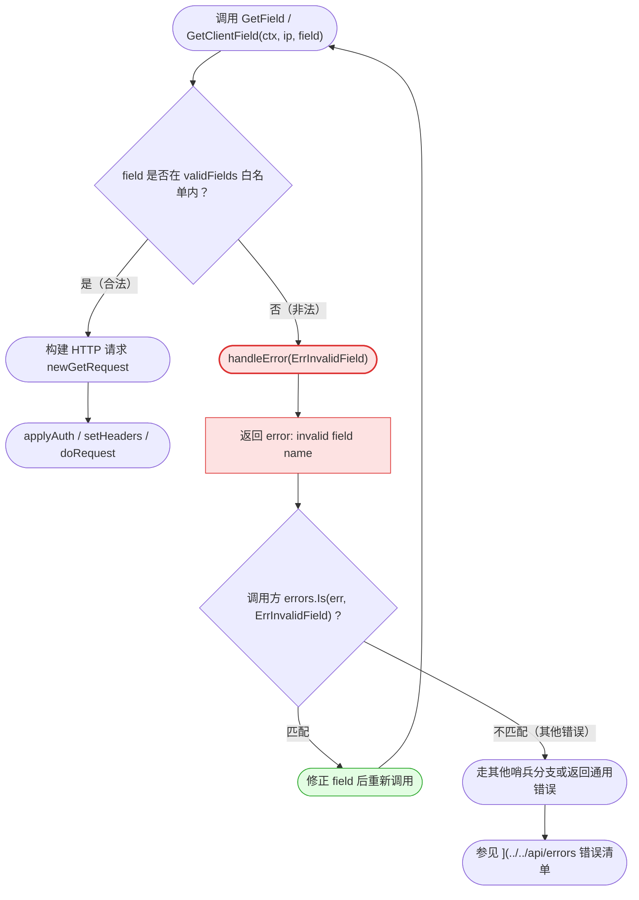
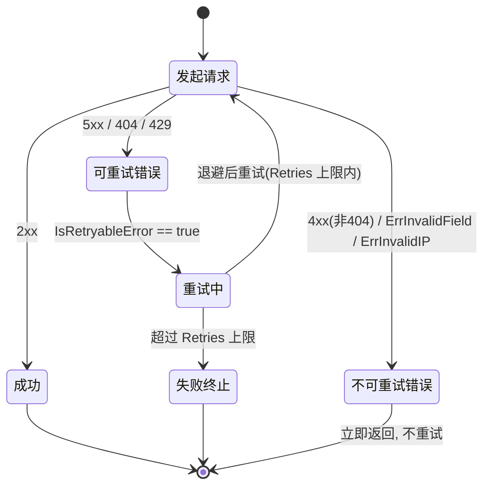

# 🚫 ErrInvalidField —— 无效字段名

> ⚠️ 客户端校验错误：传入的 `field` 不在合法白名单内，请求在本地被拦截，**不会发送到 ipapi.co 服务端**。

::: tip 🎨 一图抵千言
`ErrInvalidField` 属于**不可重试**的客户端校验错误，请求在抵达网络层之前即被拦截。下图展示从触发到调用方处理的完整决策流。



作为对照，可重试错误（[`ErrRateLimited`](./err-rate-limited) / [`ErrServerError`](./err-server-error) / [`ErrNotFound`](./err-not-found)）走的是另一条**状态流转**路径——它们会触发 SDK 的重试机制，而 `ErrInvalidField` 不会进入该状态机：


:::

## 📐 错误定义

```go
package ipapi

import "errors"

var ErrInvalidField = errors.New("invalid field name")
```

| 属性 | 值 |
| --- | --- |
| 🔖 符号 | `ipapi.ErrInvalidField` |
| 📝 消息 | `"invalid field name"` |
| 🌐 服务端 Reason | 无（客户端本地校验，不触发服务端 Reason） |
| 🔄 可重试 | 否 |
| 📤 是否发请求 | 否 |

## 🎯 触发场景

当调用 `GetField` / `GetClientField` 时传入的 `field` 参数**不在 SDK 维护的 `validFields` 白名单内**，SDK 会立即返回该错误，避免向服务端发送无效请求。

白名单共包含 28 个合法字段（节选）：

```go
var validFields = map[string]struct{}{
    "ip": {}, "network": {}, "version": {}, "city": {}, "region": {},
    "region_code": {}, "country": {}, "country_name": {}, "country_code": {},
    "country_code_iso3": {}, "country_capital": {}, "country_tld": {},
    "continent_code": {}, "in_eu": {}, "postal": {},
    "latitude": {}, "longitude": {}, "latlong": {}, "timezone": {},
    "utc_offset": {}, "languages": {}, "country_calling_code": {},
    "currency": {}, "currency_name": {}, "country_area": {},
    "country_population": {}, "asn": {}, "org": {}, "hostname": {},
}
```

常见误用：

- ❌ 拼写错误：`"contry"`、`"lat"`、`"lon"`
- ❌ 大小写错误：`"City"`、`"COUNTRY"`
- ❌ 完全不存在的字段：`"nonexistent"`、`"foo"`

::: warning ⚠️ 常见误用：用 `==` 而非 `errors.Is`
`ErrInvalidField` 是 `errors.New` 创建的哨兵错误，**必须用 `errors.Is(err, ipapi.ErrInvalidField)` 判等**。以下写法看似可行，实则脆弱：

```go
// ❌ 错误：字符串匹配，一旦消息文案调整即失效
if err.Error() == "invalid field name" { ... }

// ❌ 错误：直接 == 比较，若错误被 fmt.Errorf("...: %w", err) 包裹则失配
if err == ipapi.ErrInvalidField { ... }

// ✅ 正确：穿透包裹层，匹配哨兵本身
if errors.Is(err, ipapi.ErrInvalidField) { ... }
```
:::

> 💡 完整字段列表参见 [`validFields` 白名单](../../api/errors)。

::: details 🔍 字段名排查清单
遇到 `ErrInvalidField` 时按下列顺序排查：

1. **拼写**：对照 [`ValidFields()`](../../api/errors) 返回的列表逐字符比对，注意 `country` vs `contry`、`longitude` vs `longtitude`。
2. **大小写**：白名单全部为小写，`"City"` / `"COUNTRY"` 均非法；如需不区分大小写，调用前自行 `strings.ToLower`。
3. **来源**：若 `field` 来自用户输入或配置文件，先用 [`IsValidField(field)`](../../api/errors) 预校验，再决定是否调用 `GetField`。
4. **版本差异**：白名单共 28 个字段（7 组），若使用旧版 SDK 可能缺少 `hostname` 等较新字段，升级到最新版即可。
5. **调试**：`fmt.Println(ipapi.ValidFields())` 一次性打印全部合法字段，快速定位差异。
:::

## 📍 触发位置

错误在 **客户端本地校验** 阶段产生，位于 `pkg/ipapi/api.go`：

```go
func (c *Client) GetField(ctx context.Context, ip, field string) (string, error) {
    if _, valid := validFields[field]; !valid {
        return "", c.handleError(ErrInvalidField)  // ← 此处拦截，不发请求
    }
    // ...后续构建并发送 HTTP 请求
}

func (c *Client) GetClientField(ctx context.Context, field string) (string, error) {
    if _, valid := validFields[field]; !valid {
        return "", c.handleError(ErrInvalidField)  // ← 此处拦截，不发请求
    }
    // ...
}
```

由于校验发生在网络请求之前，因此：

- 🚫 不会消耗 API 配额
- 🚫 不会产生任何网络往返
- 🚫 不会触发服务端 4xx/5xx

## 🧪 示例代码

```go
package main

import (
	"context"
	"errors"
	"fmt"
	"log"

	"github.com/cyberspacesec/ipapi.co-skills/pkg/ipapi"
)

func main() {
	client := ipapi.NewClient()
	ctx := context.Background()

	// 传入白名单外的字段名
	val, err := client.GetField(ctx, "8.8.8.8", "nonexistent") // == ErrInvalidField
	if err != nil {
		fmt.Printf("err: %v\n", err) // err: invalid field name
		return
	}

	_ = val
	log.Println("此行不会执行")
}
```

## 🛠️ 错误处理

使用 `errors.Is` 进行分支判断，针对 `ErrInvalidField` 提供友好的用户提示或日志：

```go
val, err := client.GetField(ctx, "8.8.8.8", field)
switch {
case errors.Is(err, ipapi.ErrInvalidField):
	// 字段名非法：提示用户检查字段拼写，不发请求、不耗配额
	log.Printf("字段 %q 不在白名单内，请检查拼写", field)
	return
case errors.Is(err, ipapi.ErrRateLimited):
	// 参见 ./err-rate-limited
	log.Println("触发限流，稍后重试")
	return
case errors.Is(err, ipapi.ErrInvalidIP):
	// 参见 ./err-invalid-ip
	log.Println("IP 地址格式非法")
	return
case err != nil:
	log.Printf("其他错误: %v", err)
	return
}

fmt.Println("结果:", val)
```

> 🔑 由于 `ErrInvalidField` 是 `errors.New` 创建的哨兵错误，必须用 `errors.Is` 比较，切勿用 `==` 字符串匹配。

## 🔁 可重试性

**不可重试。**

该错误源于调用方传入的参数非法，重试相同的输入只会得到相同结果。`IsRetryableError` 函数亦未将其纳入可重试集合：

```go
func IsRetryableError(err error) bool {
	return errors.Is(err, ErrRateLimited) ||
		errors.Is(err, ErrServerError) ||
		errors.Is(err, ErrNotFound)
}
```

正确做法是**修正 `field` 参数**后重新调用，而非盲目重试。

## 🔗 相关错误

- [`ErrInvalidIP`](./err-invalid-ip) —— IP 地址格式非法
- [`ErrInvalidKey`](./err-invalid-key) —— API Key 无效
- [`ErrInvalidFormat`](./err-invalid-format) —— 响应格式非法
- [`ErrRateLimited`](./err-rate-limited) —— 触发限流（可重试）
- [`ErrReservedIP`](./err-reserved-ip) —— 保留 IP 地址
- [`ErrNotFound`](./err-not-found) —— 资源不存在
- [`ErrServerError`](./err-server-error) —— 服务端错误（可重试）

## ➡️ 下一步

- 📖 查阅 [完整错误清单与 `validFields` 白名单](../../api/errors) 获取所有哨兵错误与字段说明
- 🚀 阅读 [`GetField` / `GetClientField` 最佳实践](../../guide/intro) 了解字段查询的推荐用法
- 🧩 在 [错误处理完整示例](../../examples/basic-usage) 中查看 `errors.Is` 分支的实战代码
