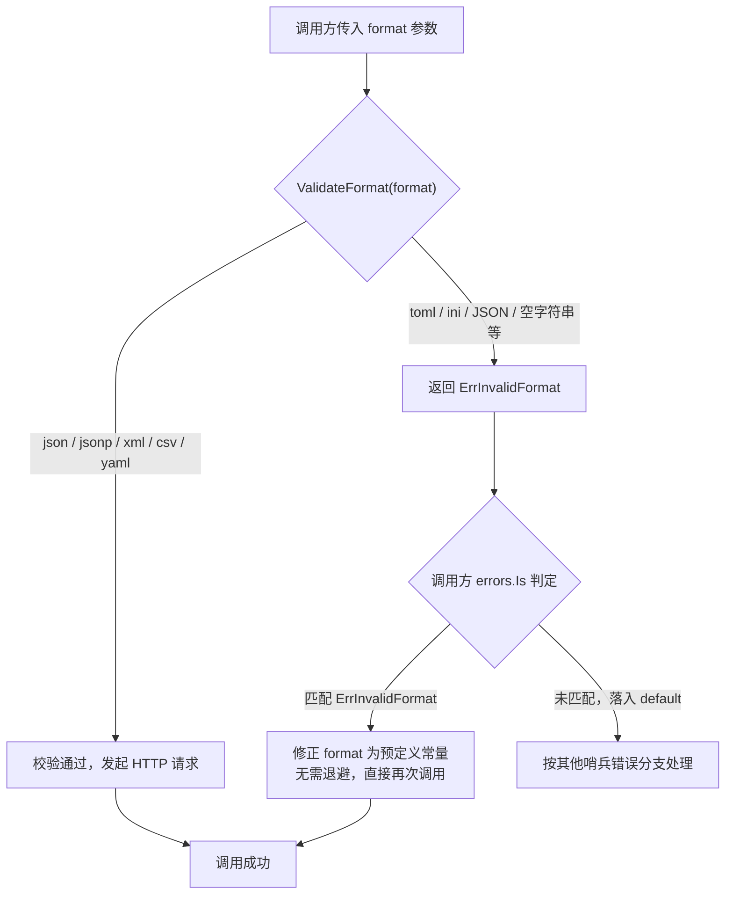
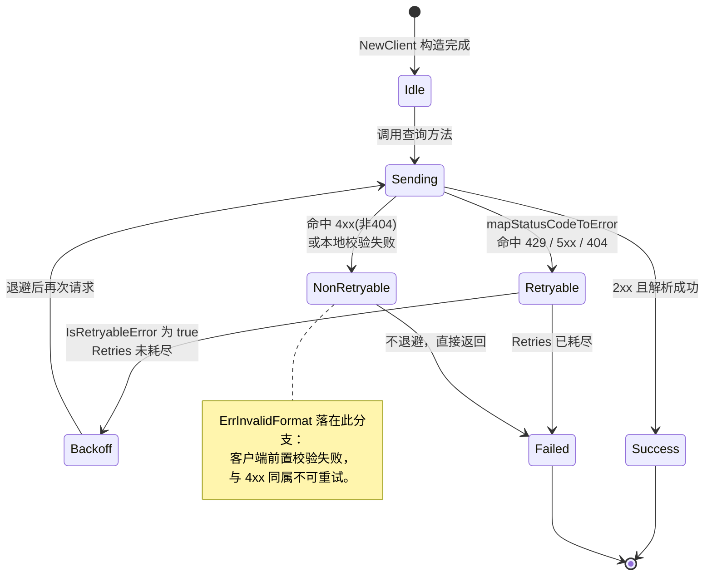

# ❌ ErrInvalidFormat

> ⚠️ 客户端前置校验错误：调用方传入的响应格式不在支持列表内，请求在发往服务端之前即被拒绝。

::: tip 🎨 一图抵千言
`ErrInvalidFormat` 属于**不可重试**的客户端校验错误。下图展示其从触发到调用方处理的完整决策流。



作为对比，下图展示**可重试错误**（[`ErrRateLimited`](./err-rate-limited)、[`ErrServerError`](./err-server-error)、[`ErrNotFound`](./err-not-found)）在 SDK 内部的状态流转。注意 `ErrInvalidFormat` 永远不会进入该状态机——它在请求发出前就被本地校验拦截。


:::

::: details 不可重试判定依据
[`IsRetryableError`](../../api/errors) 仅将 [`ErrRateLimited`](./err-rate-limited)、[`ErrServerError`](./err-server-error)、[`ErrNotFound`](./err-not-found) 判为可重试；`ErrInvalidFormat` 不在其中，因此**不应**进入退避重试循环。可重试错误的状态流转见上方 `stateDiagram-v2`，`ErrInvalidFormat` 的处理路径见上方 `flowchart TD`。
:::

## 📦 错误定义

```go
// 符号
var ErrInvalidFormat = errors.New("invalid response format")

// 消息文本
"invalid response format"
```

| 属性 | 值 |
| --- | --- |
| 🏷️ 符号 | `ipapi.ErrInvalidFormat` |
| 📝 消息 | `invalid response format` |
| 🌐 服务端 Reason | 无（客户端校验，不产生服务端 Reason） |
| 🔁 可重试 | 否 |

## 🎯 触发场景

当调用方传入的 `format` 参数不属于 SDK 支持的格式集合时触发。SDK 仅接受以下五种格式：

| 常量 | 字符串值 |
| --- | --- |
| `FormatJSON` | `json` |
| `FormatJSONP` | `jsonp` |
| `FormatXML` | `xml` |
| `FormatCSV` | `csv` |
| `FormatYAML` | `yaml` |

任何不在此列表中的值（例如 `toml`、`INI`、`""`、`JSON`（大小写不匹配）等）都会被 `ValidateFormat` 判定为非法并返回 `ErrInvalidFormat`。

该错误由 SDK 在**本地**完成校验，不会发起 HTTP 请求，因此服务端不会返回对应的 `Reason` 字段。

## 📍 触发位置

`ErrInvalidFormat` 在以下四个公开方法的入口前置校验阶段产生，校验失败立即返回，不会继续后续流程：

| 方法 | 校验点 |
| --- | --- |
| `Client.GetIPInfo` | 调用 `ValidateFormat(format)` |
| `Client.GetIPInfoRaw` | 调用 `ValidateFormat(format)` |
| `Client.GetClientIPInfo` | 调用 `ValidateFormat(format)` |
| `Client.GetClientIPInfoRaw` | 调用 `ValidateFormat(format)` |

底层校验函数：

```go
// ValidateFormat checks whether the given format string is a valid API response format.
func ValidateFormat(format string) error {
    if _, ok := validFormats[Format(format)]; !ok {
        return ErrInvalidFormat
    }
    return nil
}
```

## 💻 示例代码

```go
package main

import (
    "context"
    "errors"
    "fmt"
    "log"

    "github.com/cyberspacesec/ipapi.co-skills/pkg/ipapi"
)

func main() {
    ctx := context.Background()
    client := ipapi.NewClient()

    // 1) 直接调用 ValidateFormat 校验格式
    if err := ipapi.ValidateFormat("toml"); err != nil {
        fmt.Println("ValidateFormat:", err)
        // 输出: ValidateFormat: invalid response format
    }

    // 2) 在请求方法中传入非法格式，会在前置校验阶段被拒绝
    _, err := client.GetIPInfo(ctx, "8.8.8.8", "toml")
    if err != nil {
        fmt.Println("GetIPInfo:", err)
        // 输出: GetIPInfo: invalid response format
    }

    // 3) 客户端 IP 查询同样受前置校验保护
    _, err = client.GetClientIPInfoRaw(ctx, "ini")
    if err != nil {
        fmt.Println("GetClientIPInfoRaw:", err)
        // 输出: GetClientIPInfoRaw: invalid response format
    }

    // 4) 正确用法：使用预定义常量
    info, err := client.GetIPInfo(ctx, "8.8.8.8", string(ipapi.FormatJSON))
    if err != nil {
        log.Fatal(err)
    }
    fmt.Printf("country: %s\n", info.CountryName)
}
```

::: warning ⚠️ 常见误用
- **大小写敏感**：`FormatJSON` 的字符串值是小写 `json`，直接传 `"JSON"` 或 `"Json"` 都会触发 `ErrInvalidFormat`。
- **空字符串不是默认值**：传 `""` 不会回退到 `json`，而是被判为非法格式。
- **拼写混淆**：`jsonp` 与 `javascript`、`yaml` 与 `yml` 都是不同字符串，仅前者合法。
- **避免硬编码字符串**：推荐使用 `string(ipapi.FormatJSON)` 等预定义常量，而非手写字符串字面量，从源头杜绝拼写与大小写问题。
:::

::: details 🧰 排查清单
遇到 `ErrInvalidFormat` 时按以下顺序排查：

1. 打印实际传入的 `format` 值与类型，确认是否为预期的字符串。
2. 与 [`ValidFormats()`](../../api/errors) 返回值逐一比对（返回 `Format` 切片，逐个转 `string` 后得到 `json/jsonp/xml/csv/yaml`）。
3. 若来自用户输入或配置文件，在调用前先用 [`ValidateFormat`](../../api/errors) 做一次本地校验，给出友好提示而非直接抛错。
4. 确认未将字段名（如 `city`，受 [`ErrInvalidField`](./err-invalid-field) 约束）误当作格式参数传入。
:::

## 🛠️ 错误处理

使用 `errors.Is` 进行分支判断，将该错误与其他服务端错误区分处理：

```go
info, err := client.GetIPInfo(ctx, "8.8.8.8", format)
if err != nil {
    switch {
    case errors.Is(err, ipapi.ErrInvalidFormat):
        // 格式不合法：修正 format 后重试，无需退避
        fmt.Println("请使用 json / jsonp / xml / csv / yaml 之一")
    case errors.Is(err, ipapi.ErrInvalidIP):
        fmt.Println("IP 地址不合法")
    case errors.Is(err, ipapi.ErrRateLimited):
        fmt.Println("触发限流，稍后重试")
    case errors.Is(err, ipapi.ErrServerError):
        fmt.Println("服务端错误，稍后重试")
    default:
        fmt.Println("其他错误:", err)
    }
    return
}
```

## 🔁 可重试性

**不可重试。**

该错误源于调用方传入的参数不合法，属于确定性错误：只要 `format` 值不变，无论重试多少次结果都相同。`IsRetryableError` 也不会将其判定为可重试：

```go
func IsRetryableError(err error) bool {
    return errors.Is(err, ErrRateLimited) ||
        errors.Is(err, ErrServerError) ||
        errors.Is(err, ErrNotFound)
}
```

正确做法是修正 `format` 参数（优先使用 `ipapi.FormatJSON` 等预定义常量）后再次调用，而不是对同一入参进行退避重试。

## 🔗 相关错误

- [`❌ ErrInvalidField`](./err-invalid-field) — 字段名不在支持列表内
- [`❌ ErrInvalidIP`](./err-invalid-ip) — IP 地址不合法
- [`🔑 ErrInvalidKey`](./err-invalid-key) — API Key 无效
- [`🚫 ErrMethodNotAllowed`](./err-method-not-allowed) — HTTP 方法不被允许
- [`🛑 ErrReservedIP`](./err-reserved-ip) — 保留 IP 地址
- [`🔥 ErrServerError`](./err-server-error) — 服务端 5xx 错误
- [`🔁 ErrRateLimited`](./err-rate-limited) — 触发限流，可重试
- [`🔍 ErrNotFound`](./err-not-found) — 资源不存在，可重试
- 完整错误列表见 [`错误总览`](../../api/errors)

## ➡️ 下一步

- 📖 阅读 [`错误与处理`](../../api/errors) 了解 SDK 全部错误类型与处理范式
- 🧩 查阅 [`Client 参考`](../../api/client) 了解 `Client` 的可配置选项与 `Format` 常量
- 🚀 跳转 [`快速开始`](../../guide/getting-started) 查看完整调用示例
