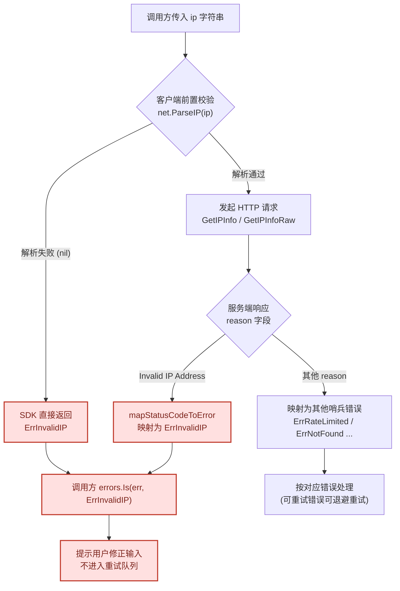
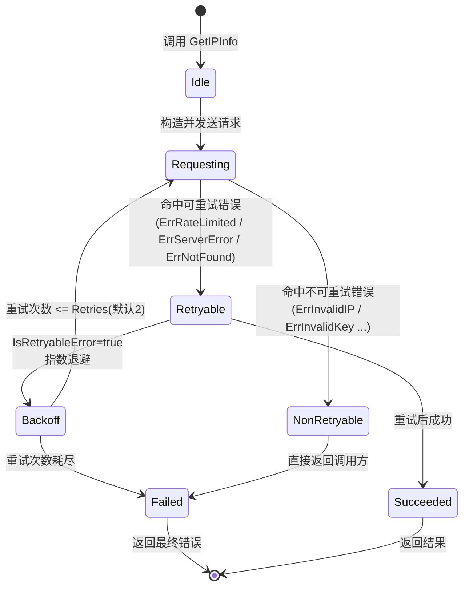

# 🚫 `ErrInvalidIP` — 非法 IP 地址错误

> 当传入的 IP 字符串格式非法、无法被 `net.ParseIP` 解析，或服务端返回 `Invalid IP Address` 时抛出。属于客户端侧前置校验错误，**不可重试**。

::: tip 🎨 一图抵千言
下图展示 `ErrInvalidIP` 从触发到调用方处理的完整决策流。本错误属于 **不可重试** 类别，因此使用 `flowchart TD` 表达「触发条件 → SDK 校验/映射 → 返回错误 → 调用方处理」的决策路径。



作为对比，下图用 `stateDiagram-v2` 展示 **可重试错误**（[`ErrRateLimited`](./err-rate-limited) / [`ErrServerError`](./err-server-error) / [`ErrNotFound`](./err-not-found)）的状态流转，帮助区分两者处理路径的差异：


:::

---

## 📦 错误定义

```go
// ErrInvalidIP 表示传入的 IP 地址格式非法
var ErrInvalidIP = errors.New("invalid IP address")
```

| 属性 | 值 |
| --- | --- |
| 🔣 符号 | `ipapi.ErrInvalidIP` |
| 💬 本地消息 | `"invalid IP address"` |
| 🌐 服务端 Reason | `"Invalid IP Address"` |
| 🔁 可重试 | ❌ 否 |

---

## 🎯 触发场景

该错误在以下两种情形下会被触发：

1. **🧪 客户端前置校验失败**
   传入的 IP 字符串不符合 IPv4 / IPv6 文本格式，`net.ParseIP` 解析返回 `nil`，SDK 在发起 HTTP 请求前即直接返回 `ErrInvalidIP`，避免无意义网络开销。

   典型非法输入：
   - `999.999.999.999`（IPv4 各段超出 0–255）
   - `not.an.ip`（非数字、非点分/冒号格式）
   - `192.168.1.`（不完整的点分十进制）
   - `:::1`（非法的 IPv6 冒号折叠）

2. **🌐 服务端返回 `Invalid IP Address`**
   即便客户端解析通过（例如某些看似合法但实际无效的边界字符串），服务端 `ipapi.co` 在校验时仍可能判定 IP 非法，并在响应中以 `reason: "Invalid IP Address"` 标识。SDK 会将其映射为本错误。

::: warning ⚠️ 常见误用
- **不要对 `ErrInvalidIP` 做重试**：输入本身非法，重试任意次数结果不变，反而浪费配额。重试逻辑应仅作用于 [`ErrRateLimited`](./err-rate-limited) / [`ErrServerError`](./err-server-error) / [`ErrNotFound`](./err-not-found)（见 [`IsRetryableError`](../../api/errors)）。
- **不要用字符串比较判断错误**：`if err.Error() == "invalid IP address"` 在消息文案变更时极易失效，务必使用 `errors.Is(err, ipapi.ErrInvalidIP)`。
- **不要把保留地址当成非法 IP**：回环 (`127.0.0.1` / `::1`)、私有段 (`192.168.x.x`) 等能被 `net.ParseIP` 解析，不会触发本错误；它们若被服务端标注为保留，返回的是 [`ErrReservedIP`](./err-reserved-ip) 而非 `ErrInvalidIP`。
- **不要混淆 `ErrInvalidIP` 与 `ErrInvalidField`**：前者校验 IP 入参，后者校验 `field` 参数（如 `city`、`asn`），见 [`ErrInvalidField`](./err-invalid-field)。
:::

---

## 📍 触发位置

| 位置 | 说明 |
| --- | --- |
| `GetIPInfo` | 进入方法后，对入参 `ip` 执行前置格式校验；不通过则直接返回 `ErrInvalidIP`，不发送请求。 |
| `GetIPInfoRaw` | 同上，在构造请求前对 `ip` 进行 `net.ParseIP` 校验。 |
| `ValidateIP` | 独立的校验工具函数，非法输入返回 `ErrInvalidIP`。 |
| 响应解析层 | 当服务端 payload 的 `reason` 字段为 `"Invalid IP Address"` 时，映射为 `ErrInvalidIP`。 |

---

## 💻 示例代码

```go
package main

import (
	"context"
	"fmt"
	"log"

	"github.com/cyberspacesec/ipapi"
)

func main() {
	// 1️⃣ 直接使用 ValidateIP 进行前置校验
	if err := ipapi.ValidateIP("999.999.999.999"); err != nil {
		fmt.Println("校验失败:", err) // 校验失败: invalid IP address
	}

	// 2️⃣ GetIPInfo 传入非法 IP 字符串，返回 ErrInvalidIP（不会发起网络请求）
	client := ipapi.NewClient()
	ctx := context.Background()

	_, err := client.GetIPInfo(ctx, "not.an.ip", "json")
	if err != nil {
		log.Printf("查询失败: %v", err) // 查询失败: invalid IP address
	}
}
```

> ✅ 合法示例：`8.8.8.8`、`1.1.1.1`、`2001:4860:4860::8888`、`::1`。

---

## 🛠️ 错误处理

使用 `errors.Is` 精准匹配本错误，避免字符串比较带来的脆弱性：

```go
result, err := client.GetIPInfo(ctx, userInput, "json")
if err != nil {
	switch {
	case errors.Is(err, ipapi.ErrInvalidIP):
		// 👉 输入格式问题：提示用户重新输入正确的 IP 地址
		fmt.Println("请输入合法的 IPv4 / IPv6 地址，例如 8.8.8.8")
		return
	case errors.Is(err, ipapi.ErrRateLimited):
		// 参见 ./err-rate-limited
		handleRateLimited()
		return
	case errors.Is(err, ipapi.ErrInvalidKey):
		// 参见 ./err-invalid-key
		handleUnauthorized()
		return
	default:
		// 其他网络或解析错误
		log.Printf("未知错误: %v", err)
		return
	}
}
```

> 💡 提示：在调用前先用 `ipapi.ValidateIP(ip)` 过滤，可显著减少此类错误进入业务流程。

---

## 🔁 可重试性

| 是否可重试 | ❌ 否 |
| --- | --- |

本错误源于 **输入数据本身非法**，而非瞬时性故障（如网络抖动、限流）。对同一个非法 IP 字符串重试任意次数，结果都将是 `ErrInvalidIP`，因此：

- ❌ 不要纳入指数退避 / 自动重试队列
- ✅ 应当返回给调用方或提示用户修正输入

::: details 🔍 排查清单：命中 `ErrInvalidIP` 时如何定位
收到本错误后，按以下顺序逐项排查：

1. **打印原始入参**：在调用 `GetIPInfo` 前输出 `ip` 的字面值，确认是否含前后空格、隐藏字符（如 `​` 零宽空格）或换行符。
2. **先用 `ValidateIP` 自检**：调用 `ipapi.ValidateIP(ip)` 复现校验失败，定位到客户端侧还是服务端侧。
3. **区分 IPv4 / IPv6**：确认输入是否符合点分十进制（IPv4）或冒号分隔的十六进制（IPv6）文本格式，`192.168.1.` 这类不完整写法会被拒绝。
4. **检查来源链路**：若 IP 来自用户表单或 URL 参数，确保已做 `strings.TrimSpace` 与字符集过滤。
5. **服务端侧映射**：若 `ValidateIP` 通过但仍报错，说明命中服务端 `reason: "Invalid IP Address"` 分支，检查输入是否为保留/特殊地址（此时可能应为 [`ErrReservedIP`](./err-reserved-ip)）。
6. **开启 ErrorHandler 调试**：通过 [`WithErrorHandler`](../../api/errors) 注入自定义处理函数，打印原始响应体辅助定位。
:::

---

## 🔗 相关错误

- ⚡ [`ErrRateLimited`](./err-rate-limited) — 请求频率超限，**可重试**
- 🔑 [`ErrInvalidKey`](./err-invalid-key) — API Key 缺失或无效
- 🚫 [`ErrInvalidKey`](./err-invalid-key) — 无权限访问目标 IP
- 📭 [`ErrNotFound`](./err-not-found) — 查询结果为空
- 🌐 [`ErrServerError`](./err-server-error) — 底层网络异常，**可重试**
- 🧾 完整错误列表参见 [`](../../api/errors`](../../api/errors)

---

## 👉 下一步

- 📖 阅读 [`](../../api/errors`](../../api/errors) 了解全部错误类型与映射关系
- 🧪 在 [示例代码](#💻-示例代码) 中替换不同输入，观察触发行为
- 🛡️ 结合 `ipapi.ValidateIP` 在表单 / CLI 入口做前置校验，从源头规避本错误
