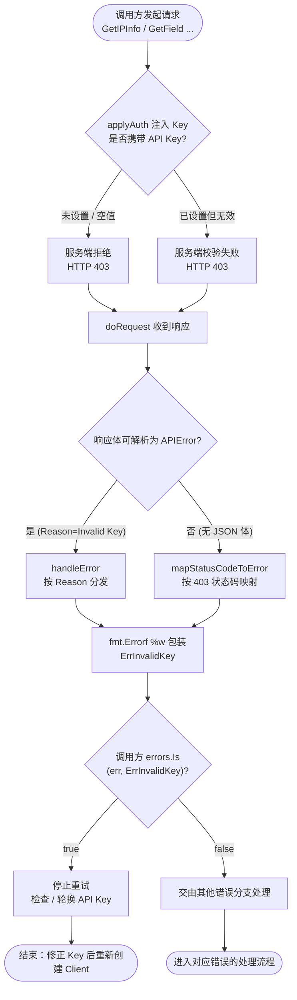
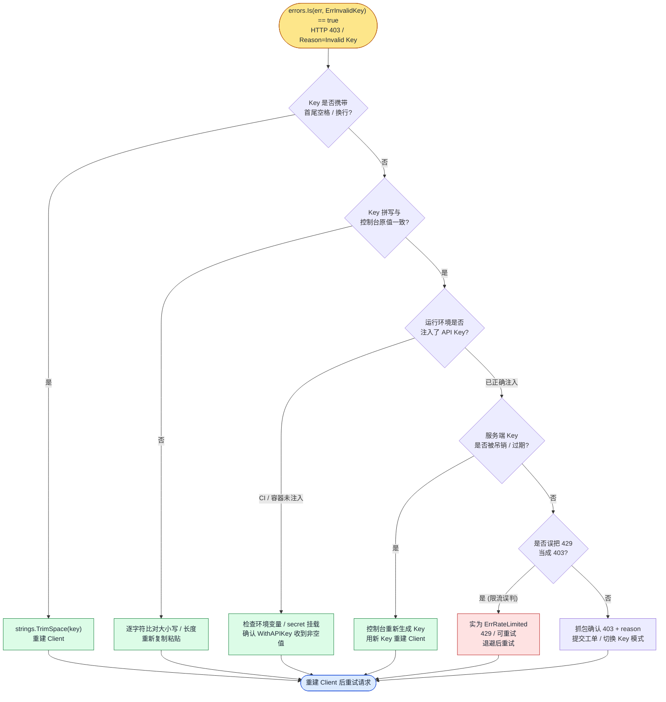

# 🔑 ErrInvalidKey - API Key 无效错误

> 🚫 当服务端返回 HTTP `403` 或响应体 `reason` 为 `"Invalid Key"` 时，SDK 会将其映射为 `ipapi.ErrInvalidKey`，表示所使用的 API Key 无效或未授权访问。

::: tip 🎨 一图抵千言
下图展示 `ErrInvalidKey` 从触发到调用方处理的完整决策流。`ErrInvalidKey` 属于**不可重试**错误，因此重试逻辑不会介入。


:::

::: tip 🧭 排查决策树
下图聚焦**调用方命中 `ErrInvalidKey` 后的根因定位**，按成本从低到高的顺序逐层排除常见诱因：拼写、吊销、CI 未注入、限流误判。注意 `ErrInvalidKey` 与 [`ErrRateLimited`](./err-rate-limited) 的边界——后者是 `429`，可重试；前者是 `403`，不可重试。


:::

---

## 📋 错误定义

```go
// pkg/ipapi/client.go
var ErrInvalidKey = errors.New("invalid API key")
```

- 🏷️ **符号**：`ipapi.ErrInvalidKey`
- 💬 **消息**：`"invalid API key"`
- 🌐 **服务端 Reason**：`"Invalid Key"`
- 📡 **HTTP 状态码**：`403 Forbidden`
- 🔁 **可重试**：否

服务端返回的错误体结构（`APIError`）如下：

```go
// pkg/ipapi/models.go
type APIError struct {
    Reason   string `json:"reason"`
    Message  string `json:"message"`
    IP       string `json:"ip"`
    Reserved bool   `json:"reserved"`
}
```

当 `Reason == "Invalid Key"` 时，SDK 会用 `fmt.Errorf("%w: %s", ErrInvalidKey, apiErr.Message)` 包装并返回原始 `Message`。

---

## 🎯 触发场景

`ErrInvalidKey` 会在以下任一情况发生时被触发：

- 🔐 **API Key 缺失**：未通过 `WithAPIKey()` 设置 Key 即发起请求。
- ❌ **API Key 错误**：Key 拼写错误、过期、被吊销，或复制时多出空格。
- 🚫 **HTTP 403**：服务端直接以 `403 Forbidden` 拒绝请求（未携带可解析的 `reason` 字段）。
- 🔄 **Key 被轮换**：旧 Key 在服务端已失效，但客户端仍使用旧值。

> 💡 该错误代表**认证失败**，与业务逻辑无关，重试同样的请求不会改变结果。

::: warning ⚠️ 常见误用
- **把 `ErrInvalidKey` 当作可重试错误处理**：它不在 [`IsRetryableError`](../../api/errors) 的可重试集合中（仅 [`ErrRateLimited`](./err-rate-limited)、[`ErrServerError`](./err-server-error)、[`ErrNotFound`](./err-not-found) 可重试）。对该错误退避重试只会反复得到 `403`。
- **用 `err == ipapi.ErrInvalidKey` 直接比较**：SDK 通过 `fmt.Errorf("%w: ...", ErrInvalidKey, ...)` 包装了原始错误，直接比较恒为 `false`，必须使用 `errors.Is(err, ipapi.ErrInvalidKey)`。
- **Key 携带首尾空格**：从配置文件或环境变量复制 Key 时常见的隐性 Bug，应先 `strings.TrimSpace` 再传入 [`WithAPIKey`](../../api/errors)。
- **轮换后未重建 Client**：[`NewClient`](../../api/errors) 在构造时固化了 Key，Key 轮换后必须用新 Key 重新创建 `*Client`，而非修改旧实例字段。
:::

---

## 📍 触发位置

`ErrInvalidKey` 有两个独立的触发路径：

### 1️⃣ `handleError` 按 Reason 匹配

当响应体可被解析为 `APIError` 时，`handleError` 通过 `errors.As` 解包后按 `Reason` 字段分发：

```go
// pkg/ipapi/errors.go
func (c *Client) handleError(err error) error {
    var apiErr *APIError
    if errors.As(err, &apiErr) {
        switch apiErr.Reason {
        // ... 其他 case
        case "Invalid Key":
            return fmt.Errorf("%w: %s", ErrInvalidKey, apiErr.Message)
        }
    }
    return err
}
```

### 2️⃣ `mapStatusCodeToError` 按 403 状态码映射

当响应体无法被解析为 `APIError`（例如纯 `403` 状态码无 JSON 体）时，`mapStatusCodeToError` 直接按状态码映射：

```go
// pkg/ipapi/api.go
func (c *Client) mapStatusCodeToError(code int) error {
    switch code {
    // ...
    case http.StatusForbidden: // 403
        return fmt.Errorf("%w: %s", ErrInvalidKey, "check API key")
    // ...
    }
}
```

> 📌 两条路径最终都包装为 `ErrInvalidKey`，因此调用方统一用 `errors.Is(err, ipapi.ErrInvalidKey)` 判定即可。

---

## 💻 示例代码

```go
package main

import (
    "errors"
    "log"

    "github.com/cyberspacesec/ipapi.co-skills/pkg/ipapi"
)

func main() {
    client, err := ipapi.NewClient(ipapi.WithAPIKey("your-api-key-here"))
    if err != nil {
        log.Fatalf("创建客户端失败: %v", err)
    }

    result, err := client.Lookup("8.8.8.8")
    if err != nil {
        if errors.Is(err, ipapi.ErrInvalidKey) {
            log.Fatal("API Key 无效")
        }
        log.Fatalf("查询失败: %v", err)
    }

    log.Printf("查询成功: %+v", result)
}
```

---

## 🛠️ 错误处理

使用 `errors.Is` 进行分支判断是推荐做法，因为 SDK 通过 `fmt.Errorf("%w: ...", ...)` 包装了原始错误：

```go
result, err := client.Lookup(ip)
if err != nil {
    if errors.Is(err, ipapi.ErrInvalidKey) {
        // API Key 无效，应立即停止并提示用户检查 Key
        log.Fatal("API Key 无效")
    }
    // 其他错误类型...
}
```

> ⚠️ 不要使用 `err == ipapi.ErrInvalidKey` 直接比较，因为返回的错误是被 `%w` 包装过的，直接比较恒为 `false`。必须使用 `errors.Is` 解包判定。

::: details 🔍 ErrInvalidKey 排查清单
命中 `ErrInvalidKey` 后，按以下顺序逐项排查：

1. **确认 Key 已设置**：检查是否调用了 [`WithAPIKey`](../../api/errors)；若未设置，服务端会直接返回 `403`。
2. **去除首尾空格**：对从环境变量 / 配置文件读取的 Key 执行 `strings.TrimSpace`，排除复制粘贴引入的空白字符。
3. **核对 Key 拼写**：与控制台原始值逐字符比对，注意大小写、长度、是否混入换行符。
4. **确认 Key 未被吊销 / 过期**：登录服务端控制台查看 Key 状态，必要时重新生成。
5. **检查 Key 轮换**：若已轮换，旧 Key 已失效，需用 [`ipapi.WithAPIKey(newKey)`](../../api/errors) 重新创建 `*Client`。
6. **排查 Key 模式冲突**：若同时使用了 [`WithAPIKeyQuery`](../../api/errors) 与默认 Header 模式，确认服务端预期的一致性。
7. **抓包确认状态码**：若问题依旧，开启 DEBUG 抓包，确认服务端确实返回 `403` 及 `reason` 字段，便于区分是 [`ErrInvalidKey`](./err-invalid-key) 还是其他错误。
:::

---

## 🔁 可重试性

| 项目 | 说明 |
| --- | --- |
| 🔁 可重试 | ❌ 否 |
| 📝 原因 | 认证失败，相同请求重试结果不变 |
| ✅ 正确做法 | 停止重试，检查并修正 API Key |

`IsRetryableError` 函数**未**将 `ErrInvalidKey` 列入可重试集合：

```go
// pkg/ipapi/errors.go
func IsRetryableError(err error) bool {
    return errors.Is(err, ErrRateLimited) ||
        errors.Is(err, ErrServerError) ||
        errors.Is(err, ErrNotFound)
}
```

对 `ErrInvalidKey` 调用 `IsRetryableError` 将返回 `false`。

---

## 🔗 相关错误

- 🚦 [ErrRateLimited - 请求频率超限](./err-rate-limited)
- 🌐 [ErrInvalidIP - IP 地址无效](./err-invalid-ip)
- 🏷️ [ErrReservedIP - 保留 IP 地址](./err-reserved-ip)
- 🔍 [ErrNotFound - 资源未找到](./err-not-found)
- 🖥️ [ErrServerError - 服务端错误](./err-server-error)
- 📦 完整错误列表：[完整错误列表](../../api/errors)

---

## 🚀 下一步

1. ✅ 检查 API Key 是否正确粘贴，去除首尾空格。
2. 🔁 若 Key 已轮换，使用 `ipapi.WithAPIKey(newKey)` 重新创建客户端。
3. 📖 阅读 [API 参考](../../api/errors) 了解全部错误类型。
4. 🧪 参考 [错误处理示例](../../examples/error-handling) 编写健壮的容错逻辑。
